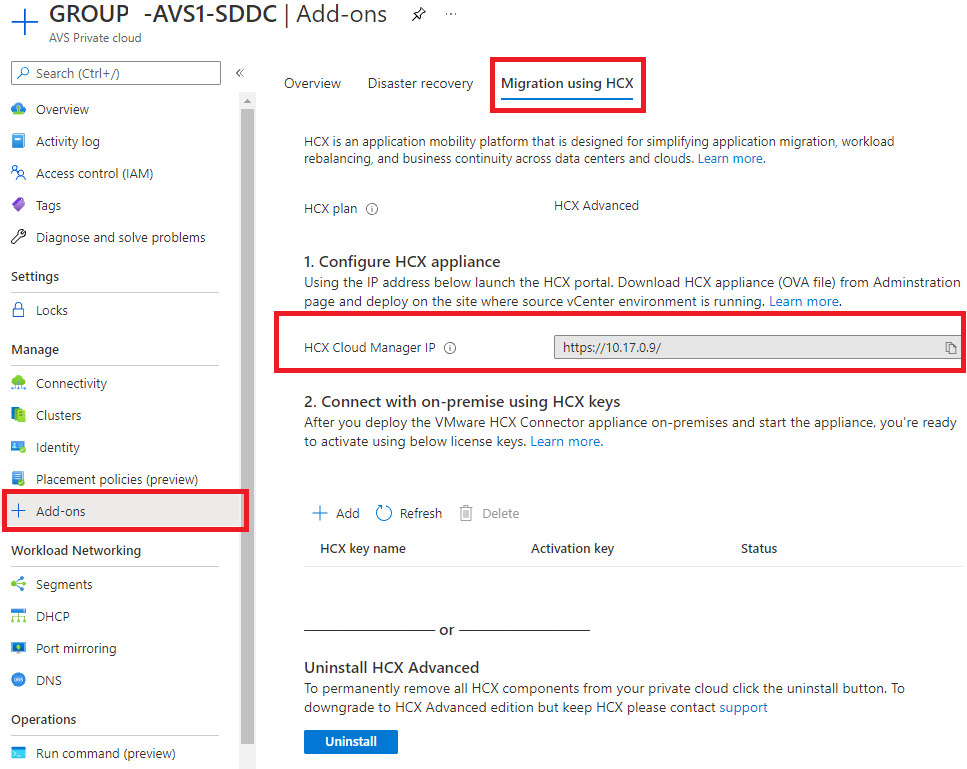

# Few Things before we start

1.  We will record this call & Moderators will be recording the breakout rooms
    sessions

2.  Break Out Rooms – will be closed 1 hour 5 min

3.  Every session will start with a quick discussion on what will be build and
    we move to break out rooms.

4.  Timelines for each module6

5.  Each login please let us know when you utilize

6.  Please all of you chime in to proceed with the steps

7.  Group Assignment, Lab setup and 4 modules

8.  We have a packed agenda so I would ask that you type your questions in the
    chat so the presenter can follow up or address during planned Q&A

9.  We have planned breaks but if you need to step out for a few minutes no
    worries.

10. We are hoping you have completed prerequisites

11. Customer references which are being mentioned during the presentation are
    internal purpose only

12. Provide feedback pre and post session à Links will be pasted in the Teams
    chat

13. Teams channel Link à
    <https://teams.microsoft.com/l/team/19%3asRKiNjNlQWinpCcbAiZHNI1zbOgaXbNhLk2D7wEE_aE1%40thread.tacv2/conversations?groupId=ac67fefa-a196-461e-80ae-205bda9666c3&tenantId=72f988bf-86f1-41af-91ab-2d7cd011db47>

17. 

# **Module 2: Deploy HCX for VM Migration**

## Scenario

Customer would like to migrate
workloads from On-Prem VMware environment to AVS Cloud Migration

## Introduction

VMware HCX™ is an application mobility platform designed for simplifying
application migration, workload rebalancing and business continuity across data
centres and clouds. HCX supports the following types of migrations:

-   Cold Migration - Offline migration of VMs

-   Bulk Migration - scheduled bulk VM (vSphere, KVM, Hyper-V) migrations with
    reboot – low downtime

-   HCX vMotion - Zero-downtime live migration of VMs – limited scale

-   Cloud to Cloud Migrations – direct migrations between VMware Cloud SDDCs
    moving workloads from region to region or between cloud providers

-   OS Assisted Migration – bulk migration of KVM and Hyper-V workloads to
    vSphere (HCX Enterprise feature)

-   Replication Assisted vMotion - Bulk live migrations with zero downtime
    combining HCX vMotion and Bulk migration capabilities (HCX Enterprise
    feature)

In this module, we will go through the steps to Install HCX, configure and
migrate a test VM to AVS

**For more information on HCX, please visit**
<https://www.vmware.com/products/hcx.html>

**Prerequisites:**

-   Ensure that Module 1 has been completed successfully as this will be
    required to connect HCX from AVS to the On-Premises Lab.  
    Jumphost from AVS1&2 should be able to ping following ip addresses:

    -   AVS1 vCenter: get from the Azure Portal

    -   AVS2 vCenter: get from the Azure Portal

    -   On-prem vCenter: 10.211.**\#**.2/24

**Important: Make a note of Latency number from jumpbox to on-prem VM. We’ll use
that number for comparison after VM is moved from on-prem to AVS**

-   Review HCX documentation on VMware site. ([About the VMware HCX User
    Guide)](https://docs.vmware.com/en/VMware-HCX/4.0/hcx-user-guide/GUID-BFD7E194-CFE5-4259-B74B-991B26A51758.html)

## Agenda for next 60 mins:

| **Action Plan**                              | **Time required for each step** |
|----------------------------------------------|---------------------------------|
| Install VMWare HCX on AVS Private Cloud      | Preconfigured                   |
| Download HCX OVA to On-Premises vCenter      | Preconfigured                   |
| Import OVA to On-Premises vCenter            | Preconfigured                   |
| Deploy HCX to On-Premises vCenter            | 15 mins                         |
| Obtain HCX License Key                       | 5 mins                          |
| Activate VMWare HCX                          | 5 mins                          |
| Configure HCX and connect to vCenter         | 15 mins                         |
| Create Site Pairing from On-Premises to AVS  | 5 mins                          |
| Create network profiles                      | 5 mins                          |
| Create compute profiles                      | 5 mins                          |
| Create service mesh                          | 5 mins                          |
| Extend a Network                             | 10 mins                         |
| Create network extension                     | 5 mins                          |
| Migrate a VM                                 | 10 mins                         |

## **Task 1 (Preconfigured) : Install VMware HCX on AVS Private Cloud**

In the following task, we will be installing HCX on our AVS Private Cloud. This
is a simple process from the Add-Ins section in the Azure Portal, or via
Bicep/ARM/PowerShell

**NOTE: This task has been completed for you in your AVS environment**

1.  Navigate to the Azure Portal, search for *Azure VMware Solution* in the
    search bar and select

    

2.  Select your Private Cloud – GROUP\#-AVS1-SDDC

    

3.  Select **Add-ons** \> Migration using HCX

    

4.  Accept the terms and conditions and “**Enable and deploy”. T**his process
    will take about 30 minutes to complete.

    **Note: This step has already been done for you**

## **Task 2 (Preconfigured): Download the HCX OVA to On-Premises vCenter**

The next step is to download HCX onto our On-Premises VMware solution, this will
allow us to setup the connectivity to AVS and allow us to migrate. The HCX
appliance is provided by VMware and has to be requested from within the AVS HCX
Manager

**NOTE: This task has been completed for you in lab environment**

1.  Obtain the AVS vCenter credentials by going to the AVS Private Cloud,
    selecting Identity. Note this down for next steps

    

2.  Navigate to the Azure portal to the Virtual Machines blade, select the
    **GROUP\#-AVS1-jumpbox** which is in the **GROUP\#-AVS1-Jumpbox** Resource
    Group.

3.  Then click **Connect \> Bastion**  
    Reminder: This is only possible since we have connected AVS to our VNet via
    our Virtual Network Gateway (Module 1, Task 1)

    

1.  Use the Credentials provided to login:

    1.  username: avsjump

    2.  password: see Getting Started section

2.  Once logged in, browse to the AVS HCX Manager URL

    1.  <https://HCXCloudManagerIP> (see screenshot below)

    2.  Enter the [cloudadmin@vsphere.local](mailto:cloudadmin@vsphere.local)
        credentials from Step 1

        You can get this URL from your AVS as shown below

        T

3.  Once logged in, Go to System Updates

    

    The Request Download Link button will be Greyed out initially but will be
    live after a minute or two. Do not navigate away from this page

    Once available, you will have an option to Download the OVA or Copy a Link.
    This link is valid for 1 week

## **Task 3 (**Preconfigured**) : Import the OVA file to the On-Premises vCenter**

In this step we will import the HCX appliance into the on premises vCenter

**NOTE: This task is already completed in your lab environment**

1.  From the Jumpbox, browse to the On-Premises vCenter URL, See [Getting
    Started](#_On-Premises_VMware_Lab) section for more information and login
    details

2.  Go to Menu \> Content Libraries

    

1.  Create a new content library if one doesn’t exist

2.  Once done, select Actions \> Import Item

3.  Enter HCX URL copied from Task 3, Step 6

    

4.  Accept any prompts and actions and Proceed. The HCX OVA will download to the
    library in the background

## **Task 4: Deploy the HCX OVA to On-Premises vCenter**

In this step, we will deploy the HCX VM with the configuration from the Getting
Started section

1.  Once the import is complete, Right Click this template \> New VM from This
    Template

    

1.  Give the VM a **Name**, select the **Cluster**, **Datastore** and
    **Network**

    

    

    

1.  In this step, we will configure the HCX appliance with the information from
    the Getting Started page. This is important as we need to specify the HCX
    manager password, hostname, and network information. In the real world,
    careful planning would have been done to identity the network and ranges to
    be used for HCX.

Enter the following details next

| **Property**                            | **Value**                                                                                                              |
|-----------------------------------------|------------------------------------------------------------------------------------------------------------------------|
| Hostname                                | Any name (Suggestion: HCXGROUP**\#**) **Note: Do not leave a space in the name as this causes the webserver to fail)** |
| CLI "admin" User Password/root Password | 0hDG3VqFyTd!                                                                                                           |
| Network 1 IPv4 Address                  | 10.211.**X**.9                                                                                                         |
| Network 1 IPv4 Prefix Length            | 27                                                                                                                     |
| Default IPv4 Gateway                    | 10.211.**X**.1                                                                                                         |
| DNS Server list                         | 1.1.1.1                                                                                                                |

1.  Once done, navigate to Menu \> VM’s and Templates \> Power on the newly
    created HCX Manager VM. The boot process will take 5-10 minutes to complete

## **Task 5: Obtain HCX License Key**

While the HCX installation runs, we will need to obtain a license key to
activate HCX. This is available from the AVS environment.

1.  Navigate to AVS1, go to Add-ons \> Migration using HCX

2.  Select Add to enter a key name, once added a new Activation Key will appear

    

## **Task 6: Activate VMware HCX**

In this task, we will activate the On-Premises HCX appliance that we just
deployed in Task 5

1.  Browse to the On-Premises HCX Manager IP specified in Task 4 on port 9443 IP
    and login (Make sure you use https:// in the address bar in the browser)

    1.  <https://10.211.x.9:9443>

2.  Login using the **HCX Credentials** specified in Task 4

    1.  Username: admin

    2.  Password: Specified earlier in Task 4 (step 3).

3.  Obtain and Copy the HCX license from the AVS1 Private Cluster in Azure (See
    Module 2, Task 2)

    

4.  Once logged in, In **Licensing**, enter your key for **HCX Advanced Key**
    and select **Activate**. This process can take several minutes.

    

5.  In **Datacenter Location**, provide the nearest location for installing the
    VMware HCX Manager On-Premises. Then select **Continue**.

6.  In **System Name**, modify the name or accept the default and select
    **Continue**.

1.  Click “**Yes,** **Continue”** for completing next task.

## **Task 7: Configure HCX and connect to vCenter**

In this section, we will integrate HCX Manager with the On-Premises vCenter

1.  In **Connect your vCenter**, provide the FQDN or IP address of on-premise
    vCenter server and the appropriate credentials, and then select
    **Continue**., see Getting Started Section for more details

    1.  In this lab, this is <https://10.211.X.2>

    2.  Username:
        [administrator@vsphere.local](mailto:administrator@vsphere.local)

    3.  Password: 0hDG3VqFyTd!

        

2.  In **Configure SSO/PSC**, provide the same vCenter IP address, and select
    **Continue**.

    1.  https://10.211.X.2

        

3.  Verify that the information entered is correct and select **Restart**..

    

    The restart may take up to 5 minutes

4.  After the services restart, you'll see vCenter showing as **Green** on the
    screen that appears. Both vCenter and SSO must have the appropriate
    configuration parameters, which should be the same as the previous screen.

    

    **Note**: It may take an additional 5-10 minutes for the HCX plugins to be
    installed in vCenter, log back out and log back in if it does not show up
    automatically

## **Task 8: Create Site Pairing from On-premises HCX to AVS HCX**

In this task, we will be creating the Site Pairing to connect the On-Premises
HCX appliance to the AVS HCX appliance

1.  Sign into your On-Premises vCenter

    1.  URL: https://10.211.x.2

    2.  Username:
        [administrator@vsphere.local](mailto:administrator@vsphere.local)

    3.  Password: 0hDG3VqFyTd!

2.  You may see a banner item to Refresh the browser, this will load the newly
    installed HCX modules. If you do not see this, log out and log back into
    vCenter

    

3.  Under **Menu**, Select **HCX**

4.  Navigate to Site Pairing \> Connect to Remote Site

    

1.  Enter remote site AVS HCX IP address and login credentials from the Azure
    Portal. See Getting Started section for more details.

    **Note** Ideally the identity provided in this step should be an AD based
    credential with delegation instead of the cloudadmin account.

    

2.  Accept certificate warning and Import. Connection to the remote site will be
    established

    

## **Task 9: Create network profiles**

VMware HCX Connector deploys a subset of virtual appliances (automated) that
require multiple IP segments. You’ll create four network profiles.

**Note**: Customer’s environments may vary and have not have separate networks.

-   Management

-   vMotion

-   Replication

-   Uplink

These networks have been defined for you, please see below section

In the real customer environment, these will have been planned and identified
previously, see here for the [planning
phase](https://docs.microsoft.com/en-us/azure/azure-vmware/plan-private-cloud-deployment#define-vmware-hcx-network-segments)

1.  Select Interconnect \> Network Profiles

    

1.  Create a network profile, use IP addresses allocated during the planning
    phase. In this lab, these are in the [Getting
    Started](#_On-Premises_HCX_details_1) section. We will create 4 separate
    network profiles:

    1.  Management

    2.  vMotion

    3.  Replication

    4.  Uplink

2.  Create Management network profiles

    1.  Select “Distributed Port Groups”

    2.  Select Management Network

**Replace “X” with your group number**

Management Network Profile

| **Property**               | **Value**                       |
|----------------------------|---------------------------------|
| Management Network IP      | 10.211.**X**.10-10.211.**X**.16 |
| Prefix Length              | 27                              |
| Management Network Gateway | 10.211.**X**.1                  |

1.  Repeat the similar steps for “Replication”, “vMotion” and “Uplink”. Use the
    configuration details provided below.

**Replace “X” with your group number**

vMotion Network Profile

| **Property**            | **Value**                       |
|-------------------------|---------------------------------|
| vMotion Network IP      | 10.211.**X**.74-10.211.**X**.77 |
| Prefix Length           | 27                              |
| vMotion Network Gateway | 10.211.**X**.65’                |
| DNS                     | 1.1.1.1                         |

Replication Network Profile

| **Property**                | **Value**                         |
|-----------------------------|-----------------------------------|
| Replication IP              | 10.211.**X**.106-10.211.**X**.109 |
| Prefix Length               | 27                                |
| Replication Network Gateway | 10.211.**X**.97                   |
| DNS                         | 1.1.1.1                           |

Uplink Network Profile

| **Property**           | **Value**                       |
|------------------------|---------------------------------|
| Uplink Network IP      | 10.211.**X**.34-10.211.**X**.40 |
| Prefix Length          | 28                              |
| Uplink Network Gateway | 10.211.**X**.33                 |
| DNS                    | 1.1.1.1                         |

**  
**

## **Task 10: Create compute profiles**

A compute profile contains the compute, storage, and network settings that HCX
uses on this site to deploy the interconnected dedicated virtual appliances when
service mesh is added. For more information on compute profile and creating
please refer to [VMware
documentation](https://docs.vmware.com/en/VMware-HCX/4.2/hcx-user-guide/GUID-BBAC979E-8899-45AD-9E01-98A132CE146E.html#:~:text=A%20Compute%20Profile%20contains%20the%20compute%2C%20storage%2C%20and,virtual%20appliances%20when%20a%20Service%20Mesh%20is%20added.)

1.  Under **Infrastructure**, select **Interconnect** \> **Compute Profiles** \>
    **Create Compute Profile**.

    

2.  Enter a name for the profile and select **Continue**.

3.  Review the selected services, by default all the below are selected.
    **Continue** to go to the next page

    

4.  In **Select Service Resources**, select one or more service resources
    (clusters) to enable the selected VMware HCX services.

5.  When you see the clusters in your On-Premises datacenter, select
    **Continue**.

    

1.  From **Select Datastore**, select the datastore storage resource for
    deploying the VMware HCX Interconnect appliances. Then select **Continue**.

    **Note**: Best practice would be to set resource reservations here as per
    requirements

    

1.  From **Select Management Network Profile**, select the management network
    profile that you created in previous steps. Then select **Continue**.

1.  From **Select Uplink Network Profile**, select the uplink network profile
    you created in the previous procedure. Then select **Continue**.

    

1.  From **Select vMotion Network Profile**, select the vMotion network profile
    that you created in previous steps. Then select **Continue**.

    

2.  From **Select vSphere Replication Network Profile**, select the replication
    network profile that you created in previous steps. Then select
    **Continue**.

    

1.  Review the connection rules and select **Continue**.

    

2.  Select **Finish** to create the compute profile.

    

## **Task 11: Create a service mesh**

In this section, we will be creating the service mesh

**Important Note -** Make sure ports UDP 500/4500 are open between your
On-Premises VMware HCX Connector 'uplink' network profile addresses and the
Azure VMware Solution HCX Cloud 'uplink' network profile addresses.

1.  Create a Service Mesh

    

2.  Select the source and remote compute profiles from the drop-down lists, and
    then select **Continue**.

1.  Select the source and remote compute profiles from the drop-down lists, and
    then click **Continue**. Leave “Select Services to be activated” as default,
    click **Continue**.

    

2.  In **Advanced Configuration - Override Uplink Network profiles**, select the
    uplink profile created earlier and **Continue**.

    Uplink network profiles connect to the network through which the remote
    site's interconnect appliances can be reached.

    

3.  **In Advanced Configuration – Network Extension Appliance Scale Out**, keep
    1 as default appliance and the click **Continue**.

    

4.  **In Advanced Configuration – Traffic Engineering**, review and select
    **Continue**.

1.  Review the topology preview and select **Continue. En**ter a user-friendly
    name for this service mesh and select **Finish** to complete.

    **Note** the appliance names are derived from service mesh name (it's the
    appliance prefix, essentially).

1.  The Service Mesh deployment will take 5-10 minutes to complete. Once
    successful, you will see the services as green

    

2.  Select **Interconnect \> Appliances**

    

    The HCX interconnect tunnel status should indicate **UP** and in green.
    You're ready to migrate and protect Azure VMware Solution VMs using VMware
    HCX. Azure VMware Solution supports workload migrations (with or without a
    network extension). So you can still migrate workloads in your vSphere
    environment, along with On-Premises creation of networks and deployment of
    VMs onto those networks. For more information, see the [VMware HCX
    Documentation](https://docs.vmware.com/en/VMware-HCX/index.html)

**While we wait, let’s discuss the migration options**

## **Task 12 Setup the Network Extension**

Once the Service Mesh appliances have been deployed, the next important step is
to extend the on-premise network to AVS, so that any migrated VM’s will be able
to retain their existing IP address and be accessible from all locations

1.  Navigate to **Network Extension,** Create a Network Extension

    

2.  Select the service mesh and segment to extend. In this lab, we will extend
    **workload-web**

    

3.  Select the First Hop Router, in this Lab there is only 1 option –
    **TNTXX-TI**

4.  Enter the Workload Web Gateway IP as 10.211.10**X**.1/25 or
    10.211.1**XX**.1/25 (Group 10+)

    

5.  Submit, this will start the process of extending the network by creating a
    remote stretch record and network bridges on the remote AVS side. This will
    take about 3-5 minutes to complete

    

## **Task 13: Migrate a VM using HCX and vMotion**

Now that the Service Mesh appliances have been deployed successfully, we can now
migrate workloads from on-premises to AVS. In this lab, we will migrate a Test
VM using vMotion

As part of the on-premises lab, you will see a VM folder named **Workloads** and
a VM called **SampleApp-AppA-Standalone** already connected to our
**workload-web** network

1.  **To test a migration of this VM, from the HCX Menu, select Migration and
    the Migrate button**

    

2.  **Select the SampleApp-AppA-Standalone VM and Add**

    

3.  **Here we have to specify our destination AVS settings and where to migrate
    this VM**

    1.  **Computer Container – Select Cluster-1**

    2.  **Destination Folder – Any folder**

    3.  **Destination Storage – vsanDatastore**

    4.  **Migration Profile – vMotion**

1.  **Validation step, expand “VM for Migration”, note the Network Adapter is
    automatically filled in. This is the network extension adapter that was
    created in the previous task (optional)**

    

2.  **Select Validate and Go – This will migrate the VM to AVS. Since this is
    vMotion, there is no downtime experienced and the VM is moved without any
    disruption**

**  
**

# Module 3: Setup SRM for Disaster Recovery

## Introduction

This module walks through the implementation of a disaster recovery solution for
Azure VMware Solution (AVS), based on VMware Site Recovery Manager (SRM). The
module can be completed in 60 minutes, as per the agenda below.

|    | **Action Plan**                                             | **Installation time** | **Time required for each step** |
|----|-------------------------------------------------------------|-----------------------|---------------------------------|
| 1  | Introduction and Session Walkthrough                        | NA                    | 5 mins                          |
| 2  | Cover SRM concepts for lab                                  | NA                    | 5 mins                          |
| 3  | Enable SRM Addon for both AVS clouds (primary and recovery) | 15-30 mins            | Preconfigured                   |
| 4  | Install the vSphere replication appliance                   | 15 mins               | Preconfigured                   |
| 5  | Configure protected site                                    |                       | 10 mins                         |
| 6  | Create a test VM to be replicated                           |                       | 5 mins                          |
| 7  | Configure recovery site                                     |                       | 5 mins                          |
| 8  | Configure site pairing                                      |                       | 20 mins                         |
| 9  | Configure inventory mappings                                |                       |                                 |
| 10 | Create Recovery Plan                                        |                       |                                 |
| 11 | Test Recovery Plan and Clean-up                             |                       |                                 |
| 12 | For Failover - Run Recovery Plan                            |                       |                                 |
| 13 | Enable Re-Protection                                        |                       |                                 |
| 14 | Failback                                                    |                       |                                 |
| 15 | Q/A                                                         |                       | 10 mins                         |
|    | Total                                                       | 60 mins               |                                 |

### What you will learn

In this module, you will learn how to:

-   Install Site Recovery Manager in an AVS Private Cloud

-   Create a site pairing between two AVS Private Clouds in different Azure
    regions

-   Configure replications for AVS Virtual Machines

-   Configure SRM protection groups and recovery plans

-   Test and execute recovery plans

-   Re-protect recovered Virtual Machines and execute fail back

### Prerequisite knowledge

-   AVS Private Cloud administration (Azure Portal)

-   AVS network architecture, including connectivity across private clouds in
    different regions based on Azure ExpressRoute Global Reach

-   Familiarity with disaster recovery DR concepts such as RPO and RTO

-   Basic concepts of Site Recovery Manager and vSphere Replication, covered in
    the next two sections

### Module scenario

In this module, two AVS Private Clouds are used. VMWare Site Recovery Manager
will be configured at both sites to replicate VMs in the protected site to the
recovery site.

| Private Cloud Name | Location         | Role               |
|--------------------|------------------|--------------------|
| GROUP\#-AVS1-SDDC  | East US 2        | **Protected** Site |
| GROUP\#-AVS2-SDDC  | South Central US | **Recovery** Site  |

**The two private clouds have been already interconnected with each other in
Module 1, using ExpressRoute Global Reach. The diagram below depicts the
topology of the lab environment**.

### Site Recovery Manager

VMware Site Recovery Manager is a business continuity and disaster recovery
solution that helps you plan, test, and run the recovery of virtual machines
between a protected vCenter Server site and a recovery vCenter Server site. You
can use Site Recovery Manager to implement different types of recovery from the
protected site to the recovery site:

-   **Planned migration**: The orderly evacuation of virtual machines from the
    protected site to the recovery site. Planned migration prevents data loss
    when migrating workloads in an orderly fashion. For planned migration to
    succeed, both sites must be running and fully functioning.

-   **Disaster recovery**: Similar to planned migration except that disaster
    recovery does not require that both sites be up and running, for example if
    the protected site goes offline unexpectedly. During a disaster recovery
    operation, failure of operations on the protected site is reported but is
    otherwise ignored.

Site Recovery Manager **orchestrates the recovery process with VM replication
between the protected and the recovery site**, to minimize data loss and system
down time. At the protected site, Site Recovery Manager shuts down virtual
machines cleanly and synchronizes storage, if the protected site is still
running. Site Recovery Manager powers on the replicated virtual machines at the
recovery site according to a recovery plan. A recovery plan specifies the order
in which virtual machines start up on the recovery site. A recovery plan
specifies network parameters, such as IP addresses, and can contain
user-specified scripts that Site Recovery Manager can run to perform custom
recovery actions on virtual machines.

Site Recovery Manager lets you **test recovery plans**. You conduct tests by
using a temporary copy of the replicated data in a way that does not disrupt
ongoing operations at either site.

Site Recovery Manager supports both hybrid (protected site on-prem, recovery
site on AVS) and cloud-to-cloud scenarios (protected and recovery sites on AVS,
in different Azure regions). This lab covers the cloud-to-cloud scenario only.

Site Recovery Manager is installed by deploying the **Site Recovery Manager
Virtual Appliance** on an ESXi host in a vSphere environment. The Site Recovery
Manager Virtual Appliance is a preconfigured virtual machine that is optimized
for running Site Recovery Manager and its associated services. After you deploy
and configure Site Recovery Manager instances on both sites, the Site Recovery
Manager plug-in appears in the vSphere Web Client or the vSphere Client. The
figure below shows the high-level architecture for a SRM site pair.

### vSphere replication

SRM can work with multiple replication technologies: Array-based replication,
vSphere (aka host-based) replication, vVols replication and a combination of
array-based and vSphere replication ([learn
more](https://docs.vmware.com/en/Site-Recovery-Manager/8.3/com.vmware.srm.admin.doc/GUID-35BBE965-ADC3-4E6E-A094-3D0037DA8528.html)).
AVS Private Clouds run on hyperconverged physical infrastructure powered by
VMWare’s first-party storage virtualization software, vSAN. As such, **the only
replication technology that can be used with SRM in AVS is vSphere replication,
which does not require storage arrays**. With vSphere replication, the storage
source and target can be any storage device. vSphere Replication is configured
on a per-VM basis, allowing you to control which VMs are duplicated.

vSphere Replication requires a virtual appliance to be deployed from an Open
Virtualization Format (OVF) file using the vSphere Web Client. The first virtual
appliance deployed at each site is referred to as the **vSphere Replication
management server**. It contains the necessary components to receive replicated
data, manage authentication, maintain mappings between the source virtual
machines and the replicas at the target location and provide support for Site
Recovery Manager. Additional vSphere Replication appliances can be deployed to
support larger-scale deployments and topologies with multiple target locations.
These additional virtual appliances are referred to as **vSphere Replication
servers**.

The components that transmit replicated data (the **vSphere Replication agent**
and a **vSCSI filter**) are built into vSphere. They provide the plug-in
interfaces for configuring and managing replication, track the changes to VMDKs,
automatically schedule replication to achieve the RPO for each protected virtual
machine, and transmit the changed data to one or more vSphere Replication
virtual appliances. There is no need to install or configure these components,
further simplifying vSphere Replication deployment.

When the target is a vCenter Server environment, data is transmitted from the
source vSphere host to either a vSphere Replication management server or vSphere
Replication server and is written to storage at the target location.

vSphere Replication begins the initial full synchronization of the source
virtual machine to the target location, using TCP port 31031. A copy of the
VMDKs to be replicated can be created and shipped to the target location and
used as “seeds,” reducing the time and network throughput. Changes to the
protected virtual machine are tracked and replicated on a regular basis. The
transmissions of these changes are referred to as “lightweight delta syncs.”
Their frequency is determined by the RPO that was configured for the virtual
machine. A lower RPO requires more-frequent replication and network bandwidth
consumed by the initial full synchronization.

The replication stream can be encrypted. As data is being replicated, the
changes are first written to a file called a redo log, which is separate from
the base disk. After all changes for the current replication cycle have been
received and written to the redo log, the data in the redo log is consolidated
into the base disk. This process helps ensure the consistency of each base disk
so virtual machines can be recovered at any time, even if replication is in
progress or network connectivity is lost during transmission.

### Site Recovery Concepts

-   **Inventory Mappings.** For array-based protection and vSphere Replication
    protection, Site Recovery Manager applies inventory mappings to all virtual
    machines in a protection group when you create that group. Inventory
    mappings provide default objects in the inventory on the recovery site for
    the recovered virtual machines to use when you run recovery. Site Recovery
    Manager cannot protect a virtual machine unless it has valid inventory
    mappings. However, configuring site-wide inventory mappings is not mandatory
    for array-based replication protection groups and vSphere Replication
    protection groups. If you create vSphere Replication protection group
    without having defined site-wide inventory mappings, you can configure each
    virtual machine in the group individually. You can override site-wide
    inventory mappings by configuring the protection of the virtual machines in
    a protection group. You can also create site-wide inventory mappings after
    you create a protection group, and then apply those site-wide mappings to
    that protection group.

-   **Protection Groups**. A protection group is a collection of virtual
    machines that Site Recovery Manager protects together. After you create a
    vSphere Replication protection group, Site Recovery Manager creates
    placeholder virtual machines on the recovery site and applies the inventory
    mappings to each virtual machine in the group. If Site Recovery Manager
    cannot map a virtual machine to a folder, network, or resource pool on the
    recovery site, Site Recovery Manager sets the virtual machine to the Mapping
    Missing status, and does not create a placeholder for it

-   **Recovery Plan.** A recovery plan is like an automated run book. It
    controls every step of the recovery process, including the order in which
    Site Recovery Manager powers on and powers off virtual machines, the network
    addresses that recovered virtual machines use, and so on. Recovery plans are
    flexible and customizable. A recovery plan includes one or more protection
    groups. You can include a protection group in more than one recovery plan.
    For example, you can create one recovery plan to handle a planned migration
    of services from the protected site to the recovery site for the whole
    organization, and another set of plans per individual departments. **You can
    run only one recovery plan at a time to recover a particular protection
    group.**

-   **Reprotection.** After a recovery, the recovery site becomes the primary
    site, but the virtual machines are not protected yet. If the original
    protected site is operational, you can reverse the direction of protection
    to use the original protected site as a new recovery site to protect the new
    protected site. Manually re-establishing protection in the opposite
    direction by recreating all protection groups and recovery plans is time
    consuming and prone to errors. **Site Recovery Manager provides the
    reprotect function, which is an automated way to reverse protection.**
    Reprotect uses the protection information that you established before a
    recovery to reverse the direction of protection. You can initiate the
    reprotect process only after recovery finishes without any errors. You can
    conduct tests after a reprotect operation completes, to confirm that the new
    configuration of the protected and recovery sites is valid.

**  
**

## **Task 0 (preconfigured): Install SRM add-on in the protected and the recovery sites**

**In the lab environment, this task has been already completed**, as it can take
up to 30 minutes to complete.

In the Azure portal, browse to the primary AVS Private Cloud
(GROUP\#-AVS1-SDDC), select the “Add-ons” item from the menu and the click on
the “Get Started” button in the “Disaster Recovery” tile.

Verify that SRM and vSphere replication are already installed (**BOTH** buttons
read “Uninstall…”).

## **Task 1**: Configure the production site (GROUP\#-AVS1-SDDC)

In this task you will create a network segment in the production site and deploy
a test VM to be protected with Site Recovery Manager.

*This task requires a DHCP profile to be available in the private cloud. DHCP
profiles have been configured in Module 1 for both GROUP\#-AVS1-SDDC and
GROUP\#-AVS2-SDDC. If you did not complete the corresponding steps in Module 1,
please go back to it and configure DHCP profiles before proceeding.*

Log into NSX-T client for the protected/primary site GROUP\#-AVS1-SDDC. Click on
the “Segments” item in the left-hand menu and then click the “ADD SEGMENT”
button in the main tile. Enter the following configuration settings:

-   Segment Name: “SRM-LAB”

-   Connected gateway: Select the private cloud’s default Tier1 gateway

-   Transport Zone: Select the private cloud’s default **overlay** transport
    zone

-   Gateway CIDR IPv4: “10.\#.60.1/24”

Click on the “SET DHCP CONFIG” button and provide the following settings:

-   DHCP Type: “Gateway DHCP Server”

-   DHCP Profile: Select the profile created in Module 1

-   DHCP Config: Set the toggle to “Enabled”

-   DHCP Ranges: “10.\#.60.100-10.\#.60.120”

When done, click on the “APPLY” button to close the DHCP Configuration window.
Then scroll down and click on the “SAVE” button to commit the segment
configuration.

Click “NO” to close the configuration window. Confirm the segment is
successfully configured by checking that it appears in the segments list.

Optionally, you can confirm that the newly created segment is also visible in
the Azure portal. It may take up to 2-3 mins to show up in the portal.

Navigate to GROUP\#-AVS1-SDDC AVS Private Cloud and select the “Segments” item
in the Workload Networking menu on the left-hand side.

## Task 2: Create a VM in the protected site

In this task you will create a test VM in the protected site.

*This task requires a VM template file to be available in the private cloud. A
template has been added to the private cloud’s Local Library in Module 1. If you
did not complete the corresponding steps in Module 1, please go back to it and
add a template to your protected site’s Local Library.*

Log into vCenter for the protected site GROUP\#-AVS1-SDDC. From the main menu
select “Content Libraries” and then click on “Local Library”. In the “Templates”
section, find the template “NetworkTest-VM”, right-click on it and select “New
VM from This Template” from the context menu.

Follow the steps in the VM configuration wizard. First, set the VM name to
“GX-SRM-VM1” and select the location “SDDC-Datacenter”.

Then, go through the “Review Details” step (no configuration is required here)
and, in the “Select storage” step, select “vSAN Default Storage Policy”.

Finally, attach the VM to the network segment created in Task1, by selecting
“SRM-LAB” in the “Destination Network” drop-down menu. Deploy the VM by clicking
on the “Finish” button.

In the main vCenter menu, select “VMs and Templates” and then click on the newly
created VM “GX-SRM-VM1”. Power it on by clicking on the green “Power On” icon.

When the VM starts, check that it has been assigned an IP address in the DHCP
range configured in Task 1.

Test your network configuration by pinging the VM from the jump-box you are
working on.

## Task 3: Create an NSX-T segment in the recovery site GROUP\#-AVS2-SDDC

In this task you will configure the recovery site GROUP\#-AVS2-SDDC with a
network segment for the VMs moved by SRM from the primary site. In this lab, we
focus on a basic scenario where the VMs protected by SRM do not need to retain
their IP address when moved to the recovery site. A DHCP service is used both in
the protected and in the recovery site to assign IP addresses to VMs when they
boot.

*This task requires a DHCP profile to be available in the recovery private
cloud. DHCP profiles have been configured in Module 1 for both GROUP\#-AVS1-SDDC
and GROUP\#-AVS2-SDDC. If you did not complete the corresponding steps in Module
1, please go back to it and configure DHCP profiles before proceeding.*

Log into NSX-T for the recovery site GROUP\#-AVS2-SDDC. Please note that,
because of the Global Reach connectivity that has been configured in Module 1
between the protected and the recovery private clouds, you can access vCenter
and NSX-T for both from the same jump-box.

Click on the “Network” menu item on the taskbar at the top of the window, select
“Segments” from the menu on the left and click the “ADD SEGMENT” button.

In the segment configuration tile, enter the following settings:

-   Segment Name: “SRM-LAB-RECOVERY”

-   Connected gateway: Select the private cloud’s default Tier1 gateway

-   Transport Zone: Select the private cloud’s default overlay transport zone

-   Gateway CIDR IPv4: “10.\#.160.1/24” (please note that this IP subnet is not
    the same as the primary site’s)

Click on the “SET DHCP CONFIG” button and provide the following settings:

-   DHCP Type: “Gateway DHCP Server”

-   DHCP Profile: Select the profile created in Module 1

-   DHCP Config: Set the toggle to “Enabled”

-   DHCP Ranges: “10.\#.160.100-10.\#.160.120”

When done, click on the “APPLY” button to close the DHCP Configuration window.
Then scroll down and click on the “SAVE” button to commit the segment
configuration.

Confirm that the segment has been created successfully.

Optionally, you can confirm that the newly created segment is also visible in
the Azure portal (navigate to GROUP\#-AVS2-SDDC Private Cloud and select the
“Segments” item in the Workload Networking menu on the left-hand side.

## Task 4: Configure a Site Pairing in Site Recovery Manager

In this task you will pair the protected site GROUP\#-AVS1-SDDC and the recovery
site GROUP\#-AVS2-SDDC.

Site pairing can be configured from vCenter on either the primary or the
recovery private cloud. You will work on the primary site’s vCenter. If needed,
log into vCenter in the primary AVS private cloud GROUP\#-AVS1-SDDC and select
“Site Recovery” from the main menu. Click on the “OPEN Site Recovery” button.

Site Recovery Manager opens in a new browser tab.

**Note: Web page may perpetually get stuck into loading status. In this case, go
back to main page and click “Open Site Recovery” button again.**

Click on the “NEW SITE PAIR” button to launch the configuration wizard.

Select the local vCenter server that you want to pair. The only option is the
protected site’s vCenter (GROUP\#-AVS1-SDDC). Provide the IP address and the
credentials of the recovery site’s vCenter (GROUP\#-AVS2-SDDC), which can be
obtained from the Azure portal. Ensure that you remove *https and/or any
slashes* after pasting the vCenter value.

Click on the “NEXT” button. The security alert(s) that you receive are due to
the usage of certificates issued by an untrusted CA in the lab. In real,
production environments certificates issued by a trusted CA should be used
instead. In this lab, you can ignore the security warning and click on the
“CONNECT” button.

Configure the site pairing with both the SRM and the vSphere replication
services. Again, you can ignore the security warnings due to untrusted
certificates and proceed by clicking on the “CONNECT” button.

When the configuration process completes, the SRM main page displays the new
site pairing.

## Task 5: Configure Inventory Mappings

In this task you will configure inventory mappings, which define the resources
(networks, folders, compute resources, storage policies) that VMs must use when
moved to the recovery site. It is also possible to define reverse mappings,
which control resource allocation for failback processes.

### Network mappings

Open the “Site Pair” configuration pane in SRM and select “Network Mappings” in
the “Configure” section of the left-hand-side menu. Then click on the “NEW”
button to launch the configuration wizard.

Select “Prepare mappings manually” to define a custom mapping between the
network segments created for the SRM lab module in the previous tasks. Then
click on the “NEXT” button and map the “SRM-LAB” segment in the protected site
to the “SRM-LAB-RECOVERY” segment in the recovery site. Click on the “ADD
MAPPINGS” button to confirm.

In the “Reverse Mapping” step, enable the suggested reverse mapping.

In “Test Networks” step, accept the default setting. When later in the module
you will test your recovery plan, the protected VM will be instantiated in an
isolated network segment automatically created at the beginning of the test (and
automatically removed when the recovery plan test is cleaned up).

Click on the “NEXT” button and then commit your configuration by clicking on the
green “FINISH” button.

### Folder Mappings

Open the “Site Pair” configuration pane in SRM and select “Folder Mappings” in
the “Configure” section of the left-hand-side menu. Then click on the “NEW”
button to launch the configuration wizard.

Select “Automatically prepare mappings for folders with the same name”, then
click on the “NEXT” button. Select “SDDC-Datacenter” on both sides of the
mapping and click on the “ADD MAPPINGS” button. Accept the automatically
prepared mappings.

On step 3 “Reverse Mappings” accept the mappings proposed by the wizard. Then
click on the “NEXT” button and commit your configuration by clicking on the
green “FINISH” button.

### Resource Mappings

Open the “Site Pair” configuration pane in SRM and select “Resource Mappings” in
the “Configure” section of the left-hand-side menu. Then click on the “NEW”
button to launch the configuration wizard.

On step 1 “Recovery Resources” expand the “SDDC-Datacenter” nodes on both the
primary and the recovery side and select “Cluster 1”. Click on the “ADD
MAPPINGS” button to confirm.

Accept the reverse mapping proposed by the wizard, click on the “NEXT” button
and then confirm your settings by clicking on the green “FINISH” button.

### Storage Policy Mappings

Open the “Site Pair” configuration pane in SRM and select “Storage Policy
Mappings” in the “Configure” section of the left-hand-side menu. Then click on
the “NEW” button to launch the configuration wizard.

Select “Automatically prepare mappings for storage policies with the same name”,
then click on the “NEXT” button. Select “vSAN Default Storage Policy” on both
sides of the mapping and click on the “ADD MAPPINGS” button. Accept the
automatically prepared mappings. Accept the automatically discovered mappings.

Accept the reverse mapping proposed by the wizard, click on the “NEXT” button
and then confirm your settings by clicking on the green “FINISH” button.

### Placeholder Datastores

When vSphere Replication is configured for a VM, a “placeholder VM” is created
in the target recovery site. Placeholder VMs represent, in the recovery site,
VMs that will be instantiated when a recovery plan is run. SRM requires you to
define which datastore to use for placeholder VMs. If you plan to use SRM for
failback, you need to define placeholder datastores at both the protected and
the recovery sites.

Open the “Site Pair” configuration pane in SRM and select “Placeholder
Datastores” in the “Configure” section of the left-hand-side menu. In the
“Placeholder Datastores” configuration tile, select your primary site’s vCenter
server (its FQDN ends with the suffix “**eastus2**.avs.azure.com”).

Click on the “NEW” button to add a datastore. Select “vSAN Datastore” and click
on the “ADD” button.

Repeat the same steps for the recovery site’s vCenter (its FQDN ends with the
suffix “**southcentralus**.avs.azure.com”).

Click on the “NEW” button to add a datastore. Select “vSAN Datastore” and click
on the “ADD” button.

## Task 6: Configure vSphere Replication and Recovery Plan

In this task you will configure vSphere replication for the test VM created in
Task 2 and a recovery plan to protect it. This task is performed from the
primary site’s vCenter client. In the main menu, select “VM and Templates” and
then right-click on your test VM named GX-SRM-VM1. From the context menu, select
“All Site Recovery Actions” and then “Configure replication”.

*Note: Check pop-up blocker if stuck.*

### vSphere Replication

Follow the steps in the configuration wizard. Select the recovery site (FDQN
ending with the suffix **southcentralus.avs.azure.com**) as the target site.
Provide credentials for the recovery site’s vCenter. The credentials are
available in the Azure portal. Select “Auto-assign replication server”.

Check that the test VM is ready for replication, then click on the “NEXT” button
and select “vSAN Datastore” as the target datastore. In the “Replication
Settings” step, select the RPO you want to have for the protected VM (15 mins in
the screenshot below).

### SRM Protection Group and Recovery Plan

The last two steps in the configuration wizard allow you to create an SRM
Protection Group and a Recovery Plan. Please note that this is needed because
you are configuring SRM protection for the first VM. Additional VMs can leverage
existing protection groups and recovery plans. In step 5 “Protection Group”
enter a name for your protection group, such as “SRM-LAB-PROTECTION-GROUP”. In
step 6 “Recovery Plan” enter a name for your recovery plan, such as
“SRM-LAB-REC-PLAN”. Confirm your settings by clicking on the green “FINISH”
button.

Wait until the replication status for your test VM is reported to be “OK” (use
the “Refresh” button in SRM’s console).

To confirm that replication and SRM protection have been successfully
configured, log into the recovery site’s vCenter and check that a placeholder VM
has been created.

## Task 7: Test Recovery Plan

In this task you will test the recovery plan created in the previous one.

In the protected site’s SRM console, select the “Recovery Plans” tab, click on
the recovery plan you created and select the “TEST” action.

Follow the steps in the wizard to launch the recovery plan test.

Monitor progress in the SRM console and wait until the test completes
successfully.

Now log into the recovery site’s vCenter and confirm that the test VM has been
successfully powered on in the recovery site.

As this was a recovery plan **test**:

-   The VM in the protected site has NOT been shut down;

-   The VM in the recovery site has been attached to an isolated network
    segment, as per the configuration you created in Task 5 (click on the
    “Networks” tab to double check).

You can now complete your recovery plan testing process by cleaning up the
recovery site. In the SRM console, select your recovery plan and click on the
“CLEANUP” button.

Follow the steps in the wizard to launch the clean-up process.

## Task 8: Run Recovery Plan

In this task you will execute the recovery plan you configured in the previous
tasks. For planned migrations, a recovery plan can be run from either the
primary or the protected site. In case of an actual disaster at the protected
site, it must be triggered from the recovery site (the only one that is still
online). The steps to run a recovery plan are the same in both cases. In this
task, we will run a recovery plan from the recovery site to simulate a disaster
recovery scenario.

Log into the recovery site’s vCenter, select “Site Recovery” from the main menu
and then click on the “OPEN SITE RECOVERY” button.

In the SRM console, open the already configured site pair by clicking on the
“VIEW DETAILS” button.

When prompted for the credentials to log into the protected site, click on the
“CANCEL” button – we are assuming that the protected site is no longer online,
because of a disaster.

Select “Recovery Plans” tab, select the recovery plan defined in the previous
tasks and click on the “RUN” button.

Follow the steps in the wizard. Select “Disaster recovery” as the recovery type.

Monitor progress in the SRM console.

When the recovery process is marked complete, go to the recovery site’s vCenter
and verify that the test VM GX-SRM-VM1 is powered on and attached to the
“SRM-LAB-RECOVERY” network segment.

Confirm that the VM migrated to the recovery site is functional by pinging it
from your jump-box. The VM’s IP address is shown in vCenter (it might be not the
same as the one shown in the screenshots).

## Task 9: Reprotect the Migrated VM

In this task, we assume that the primary site has been brought back online.
Reprotection is the SRM feature that allows migrated VMs in the recovery site to
be synchronized back to the protected site.

In the recovery site’s SRM console, select your recovery plan. Click on “…” in
the actions bar to display additional available actions and select “Reprotect”.

Follow the steps in the wizard.

Monitor progress. When the reprotection process completes, go to the protected
site’s vCenter and confirm that a placeholder VM has been created.

## Task 10: Run Recovery Plan

In this task, you will move the test VM back to the original protected site.
This task can be performed either from the protected site’s or the recovery
site’s SRM console. The steps are identical in both cases.

In the recovery site’s SRM console, provide credentials for the protected site,
by clicking on the “LOGIN” button.

Select your recovery plan and select “RUN”.

Follow the steps in the wizard. As you are now performing a planned failback to
the original protected site, select “Planned Migration” as the recovery type.

Monitor progress. When the recovery plan run completes, go to the primary site’s
vCenter and confirm that the test VM is back online and attached to the
“SRM-LAB” network segment.

Confirm that the test VM is fully operational by pinging it from your jump-box
(please note that the VM’s IP address might not be the same as shown in the
screenshots).

Now that the test VM is running in the protected site, you need to also restore
replication towards the recovery site. This is done by reprotecting the VM
again. In the protected site’s SRM console, select your recovery plan, click on
the “…” item in the actions bar and select “Reprotect”.

Follow the steps in the wizard, which are exactly the same as those described in
Task 9. This completes the lab for SRM Disaster Recovery scenario.

# Module 4: Create and configure a Secure Hub to route traffic to the internet

**Section Overview:**

Now that the Tier-0 and Tier-1 routers are configured, it’s time to see if
workloads can access the internet. The key takeaway here is to setup a Secured
vWAN Hub to allow internet egress and ingress (if necessary) for the VMs on AVS.

In this section you will learn how to:

-   Create a secure VWAN hub

-   Configure Azure Firewall with a public IP

-   Configure Azure Firewall

Before we start the steps, let’s validate if the AVS VMs can access internet. In
the previous section, you accessed VM1 from the vCenter portal. Verify that from
VM1 that you can not

-   Access [www.google.com](http://www.google.com) by name. On the server,
    **type** wget [www.google.com](http://www.google.com)

-   Access [www.google.com](http://www.google.com) by IP. On the server,
    **type** wget <https://142.250.9.101>

You may also use utilities such as ping or nslookup to validate.

**Deployment Steps:**

## Task 1: Deploy Virtual WAN

1.  Sign into the Azure portal and then search for and select Azure VMware
    Solution.

2.  Select the Azure VMware Solution private cloud.

3.  Under Manage, select Connectivity.

4.  Select the Public IP tab and then select Configure.

1.  Accept the default values, modify the Virtual hub address block and Number
    of Public Ips fields. Select Create.

| Field                         | Value                                                                                                                 |
|-------------------------------|-----------------------------------------------------------------------------------------------------------------------|
| Virtual WAN resource group    | Auto-populated and can not be modified in the poral                                                                   |
| Virtual WAN name              | Leave default auto-populated                                                                                          |
| Virtual hub address block     | Use the following value 10.**[Your Group Number]**.4.0/24 to avoid conflict with other networks used in this training |
| Number of public IPs (1-100): | 1                                                                                                                     |

It takes about one hour to complete the deployment of all components. This
deployment only must occur once to support all future public IPs for this Azure
VMware Solution environment.

## Task 2: Configure Public IP Option

1.  

## Task 3: Configure Azure Firewall policies

Once Azure vWAN is configured, you will see both Azure Firewall

****

1.  In the Azure portal, search for and select **Firewall**.

2.  Select a deployed firewall and then select **Visit Azure Firewall Manager to
    configure and manage this firewall**.

****

1.  Select Azure Firewall
    Policies and then select Create Azure Firewall Policy.

1.  Under the **Basics** tab, provide the required details.

| Field          | Value                        |
|----------------|------------------------------|
| Subscription   | Auto-populated               |
| Resource Group | Leave default auto-populated |
| Name           | “Internet Enabled”           |
| Region         | Pre-Populated                |
| Policy Tier    | Standard                     |
| Parent Policy  | None                         |

1.  Select Next: DNS Settings.

2.  Under the **DNS** tab, select **Enable**. For **DNS Servers** Select the
    Default (Azure provided). For the **DNS Proxy** select **Enabled**

    

3.  and then select Next: **Rules**.

4.  Select **Add a rule collection**, provide the below details, and select Add.

5.  

| Field                  | Value                                    |
|------------------------|------------------------------------------|
| Name                   | “Internet Outbound Enabled”              |
| Rule collection type   |  Network                                 |
| Priority               | Select a numeric value between 100-65000 |
| Rule collection action | Allow                                    |
| Rule collection group  | Pre-populated                            |
| Name of Rule           | Optional                                 |
| Source Type            | IPaddress                                |
| Source                 | \*                                       |
| Protocol               | TCP                                      |
| Destination port       | 80,443                                   |
| Destination Type       | IP Address                               |
| Destination            | \*                                       |

****

1.  Select Next: **Tags**.

2.  (Optional) Create name and value pairs to categorize your resources.

3.  Select Next: **Review** + **create** and then select **Create**.

Log back into vCenter and retest VM1’s internet connectivity
