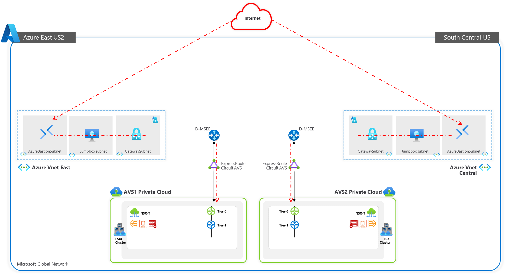
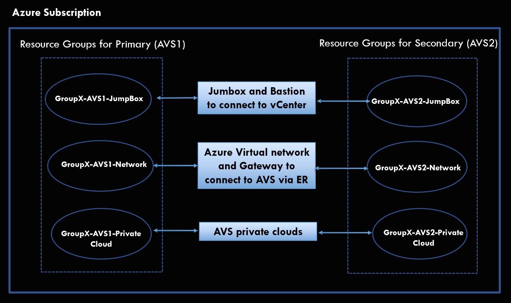

# Getting Started
- [Getting Started](#getting-started)
  - [**Training Environment**!](#training-environment)
  - [**Azure Credentials**](#azure-credentials)
  - [**Environment Details**](#environment-details)
  - [**Jumpbox Details**](#jumpbox-details)
  - [**AVS Environments**](#avs-environments)
  - [**On-Premises VMware Lab Environment**](#on-premises-vmware-lab-environment)
  - [**Module Configuration Details [Moderators Use]**](#module-configuration-details-moderators-use)
    - [**NSX-T Configuration to use in Module 1**](#nsx-t-configuration-to-use-in-module-1)
    - [**On-Premises HCX details to use in Module 2**](#on-premises-hcx-details-to-use-in-module-2)

## **Training Environment**

**  
Resource Groups**

**  
**The details below will be used across all modules, please take note, and refer
whenever required.

## **Azure Credentials**

**Replace “\#” with your group number**

Connect to [**https://portal.azure.com**](https://portal.azure.com) with the
following credentials:

| **Username** | Group**\#**@vmwaresales101outlook.onmicrosoft.com |
|--------------|---------------------------------------------------|
| **Password** | Avs\$levelUp400                                   |

## **Environment Details**

## **Jumpbox Details**

| **Name**                    | **Resource Group**          | **Username** | **Password** |
|-----------------------------|-----------------------------|--------------|--------------|
| OS-GROUP**\#**-AVS1-JUMPBOX | OS-GROUP**\#-**AVS1-JUMPBOX | avsjump      | ChangeM3!    |
|                             |                             | avsjump2     | ChangeM3!    |
| OS-GROUP**\#**-AVS2-JUMPBOX | OS-GROUP**\#-**AVS2-JUMPBOX | avsjump      | ChangeM3!    |
|                             |                             | avsjump2     | ChangeM3!    |

## **AVS Environments**

| **Name**          | **Resource Name**        | **Resource Group**               | **Username**             | **Password**               |
|-------------------|--------------------------|----------------------------------|--------------------------|----------------------------|
| AVS 1 (Primary)   | OS-GROUP**\#**-AVS1-SDDC | OS-GROUP**\#-**AVS1-PrivateCloud | cloudadmin@vsphere.local | Obtain from the AVS Portal |
| AVS 2 (Secondary) | OS-GROUP**\#**-AVS2-SDDC | OS-GROUP**\#-**AVS2-PrivateCloud | cloudadmin@vsphere.local | Obtain from the AVS Portal |

**Note**: In a real customer environment, the local
[cloudadmin@vsphere.local](mailto:cloudadmin@vsphere.local) account should be
treated as an emergency access account for "break glass" scenarios in your
private cloud. It's not for daily administrative activities or integration with
other services. For more information see
[here](https://docs.microsoft.com/en-us/azure/azure-vmware/concepts-identity)

## **On-Premises VMware Lab Environment**

| **Name**   | **vCenter IP**     | **Username**                | **Password** |
|------------|--------------------|-----------------------------|--------------|
| LAB **\#** | 10.211.**\#**.2/24 | administrator@vsphere.local | 0hDG3VqFyTd! |

## **Module Configuration Details [Moderators Use]**

### **NSX-T Configuration to use in Module 1**

| **AVS1 NSX-T Details** |                                 |
|------------------------|---------------------------------|
| **DHCP Server IP**     | 10.**\#**.1.1/30                |
| **Segment Name**       | WEB-NET                         |
| **Segment Gateway**    | 10.**\#**.51.1/24               |
| **DHCP Range**         | 10.**\#**.51.4-10.**\#**.51.254 |

| **AVS2 NSX-T Details** |                                 |
|------------------------|---------------------------------|
| **DHCP Server IP**     | 10.**\#**.2.1/30                |
| **Segment Name**       | WEB-NET                         |
| **Segment Gateway**    | 10.**\#**.52.1/24               |
| **DHCP Range**         | 10.**\#**.52.4-10.**\#**.52.254 |

### **On-Premises HCX details to use in Module 2**

The following are the details you will enter during the On-Premises HCX
appliance installation

| **Property**                      | **Value**                              |
|-----------------------------------|----------------------------------------|
| HCX Manager Name                  | Any name (Suggestion: HCX GROUP **X**) |
| HCX Manager Admin + Root Password | 0hDG3VqFyTd!                           |
| HCX Manager IP                    | 10.211.**X**.9                         |
| HCX Manager Network Prefix Length | 27                                     |
| HCX Manager Gateway IP            | 10.211.**X**.1                         |
| DNS                               | 1.1.1.1                                |

Management Network Profile

| **Property**               | **Value**                          |
|----------------------------|------------------------------------|
| Management Network IP      | 10.211.**X**.10-10.211.**X**.16/27 |
| Management Network Gateway | 10.211.**X**.1                     |

vMotion Network Profile

| **Property**            | **Value**                          |
|-------------------------|------------------------------------|
| vMotion Network IP      | 10.211.**X**.74-10.211.**X**.77/27 |
| vMotion Network Gateway | 10.211.**X**.65                    |

Replication Network Profile

| **Property**                | **Value**                            |
|-----------------------------|--------------------------------------|
| Replication IP              | 10.211.**X**.106-10.211.**X**.109/27 |
| Replication Network Gateway | 10.211.**X**.97                      |

Uplink Network Profile

| **Property**           | **Value**                          |
|------------------------|------------------------------------|
| Uplink Network IP      | 10.211.**X**.34-10.211.**X**.40/28 |
| Uplink Network Gateway | 10.211.**X**.33                    |

**Workload Network Details for Module 3 - Task 12**

| **Property**         | **Value**                                                  |
|----------------------|------------------------------------------------------------|
| Workload-web Gateway | 10.211.10**X**.1/25 or 10.211.1**XX**.1/25 (Group 10+)     |
| Workload-app Gateway | 10.211.10**X**.129/25 or 10.211.1**XX**.129/25 (Group 10+) |
