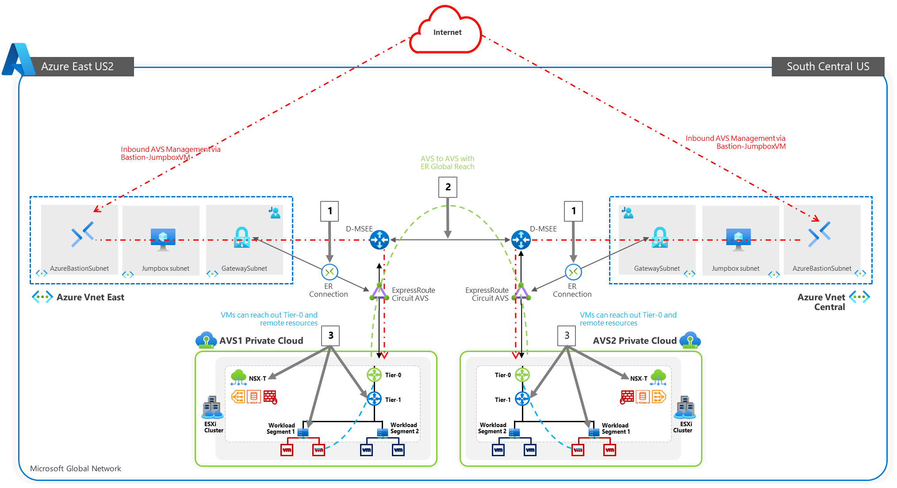

## Introduction

Azure VMware Solution offers a private cloud environment accessible from
On-Premises and Azure-based resources. Services such as Azure ExpressRoute, VPN
connections, or Azure Virtual WAN deliver the connectivity.

## Scenario

Customer needs to have connectivity between their workloads in AVS, existing services and workloads in
Azure, and access to the internet.

## Agenda for next 60 mins:

This hands-on lab will show you how to configure the Networking components of an
Azure VMware Solution for:

-   Connecting Azure VNet’s to AVS over an ExpressRoute circuit **(Preconfigured)**

-   Peering with remote environments using Global Reach **(Preconfigured)**

-   Configuring NSX-T (check DNS and configure DHCP, Segments, and Gateway) to
    manage connectivity within AVS

| **Action Plan**                                         | **Expected Time**      |
|---------------------------------------------------------|------------------------|
| Create AVS environment                                  | Preconfigured          |
| [Connect to Azure Virtual Networks](#_Task_1:_Connect)  | Preconfigured               |
| [Connect to On-Premises Environments](#_Task_2:_Peer)   | Preconfigured               |
| Configure DNS                                           | Preconfigured – 2 mins |
| Configure DHCP                                          | 5 mins                 |
| Configure Tier-1 Gateway                                | Preconfigured - 2 mins |
| [Configure network Segments](#_Step_4:_Create)          | 5 mins                 |

The lab environment has a preconfigured Azure VMware Solution environment with an
Express Route circuit. A nested or embedded VMware environment is configured to simulate
an On-Premises environment **(PLEASE DO NOT TOUCH)**. Both environments are accessible through Bastions
and JumpBoxes.

After this lab is complete, you will have built out this scenario below

1.  ExpressRoute, for connectivity between Azure VMware Solution and Azure Virtual Networks.

2.  Configure NSX-T to establish connectivity within the AVS environment.

## Next Steps

[Module 1, Task 1](module-1-task-1.md)

[Module 1 Index](module-1-index.md)

[Main Index](index.md)
