## Task 1: Connect an existing Virtual Network with AVS using AVS ExpressRoute Circuit
**THIS IS FOR REFERENCE ONLY AS IT HAS BEEN PRECONFIGURED FOR THIS LAB**

### Section Overview:

In this section you will create a connection between an existing, non-AVS,
Virtual Network in Azure and the Azure VMware Service environment. This allows
the jumpbox virtual machine to manage key components in the VMware management
plane such as vCenter, HCX, and NSX-T. You will also be able to access Virtual
Machines deployed in AVS and allows those VMs to access resources deployed in
the Hub or Spoke VNet’s, such as Private Endpoints and other Azure VMs or
Services.

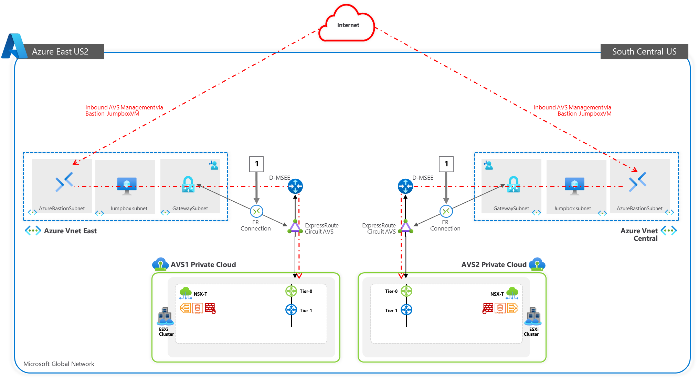

**Summary**: Generate a new Authorization Key in the AVS ExpressRoute settings,
and then create a new Connection from the Virtual Network Gateway in the VNet
where the JumpBox is connected to.

The diagram below shows the respective resource groups for your lab environment.

You will replace Group1 with GROUP\# where **\#** represents your group
number.

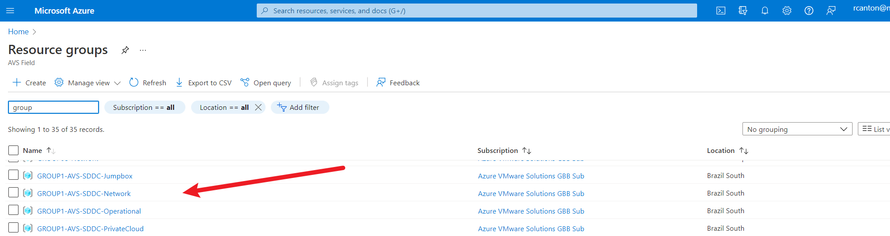

### Deployment Steps:

> **NOTE:** 
> - Since we already have a virtual network gateway, you'll add a connection between it and  
>  your Azure VMware Solution private cloud.
> - **The last step of this section is expected to fail, the Connection will be created but it 
> will be in Failed state because another Connection to the same target already exists. This is 
> expected behaviour and you can ignore the error.** 
> 
> 

1.  Request an ExpressRoute authorization key:

    1.1  In the Azure portal, navigate to the Azure VMware Solution private
        cloud, then click **GROUP\#-AVS-SDDC**, then Select **Manage** \>
        **Connectivity** \> **ExpressRoute** and then select **+ Request an
        authorization key**.
    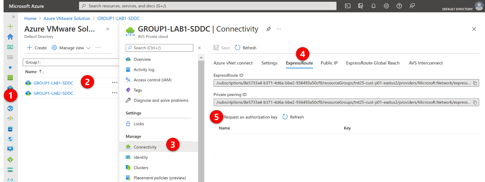
    1.2  Provide a name for it and select **Create**.
        It may take about 30 seconds to create the key. Once created, the new
        key appears in the list of authorization keys for the private cloud.
    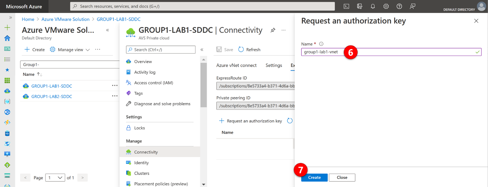

    1.3  Copy the authorization key and ExpressRoute ID. You'll need them to
        complete the peering. The authorization key disappears after some time,
        so copy it as soon as it appears.
    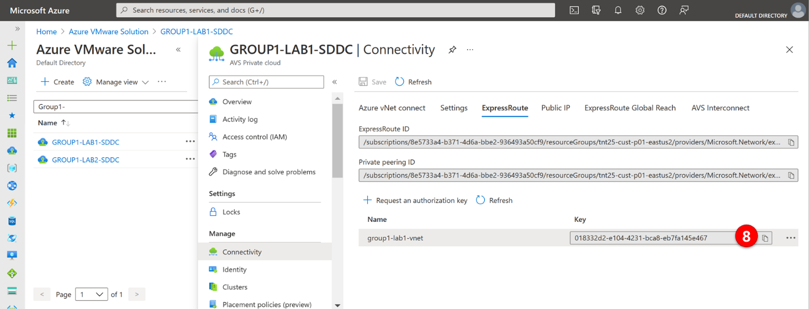

2.  Navigate to the **virtual network gateway** - which is in resource group
    “GROUP**\#**-AVS-Network”, where X is your lab/group number - you plan to
    use and select **Connections** \> **+ Add**.
    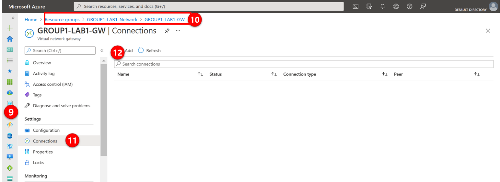

3.  On the **Add connection** page, provide values for the fields, and select
    **OK**.

    | Field                       | Value                                                       |
    |-----------------------------|-------------------------------------------------------------|
    | **Name**                    | Enter a name for the connection (e.g. avs1-vnet-connection) |
    | **Connection type**         | Select **ExpressRoute**.                                    |
    | **Redeem authorization**    | Ensure this box is selected.                                |
    | **Virtual network gateway** | The virtual network gateway you intend to use.              |
    | **Authorization key**       | Paste the authorization key you copied earlier.             |
    | **Peer circuit URI**        | Paste the ExpressRoute ID you copied earlier.               |

    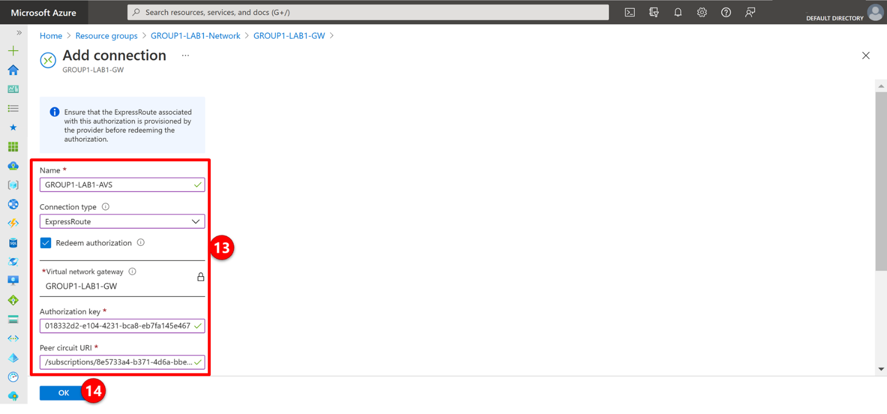

    The connection between your ExpressRoute circuit and your Virtual Network is
    created.

    **Reminder**: It is expected that the connection is in **Failed State** after
    the creation, that is because another connection to the same target already
    exists.

4.  Next, delete the connection. In the left-hand section, select
    **Connections.** Select the 3 ellipses next to the connection with the
    status **Failed,** and select **Delete**

    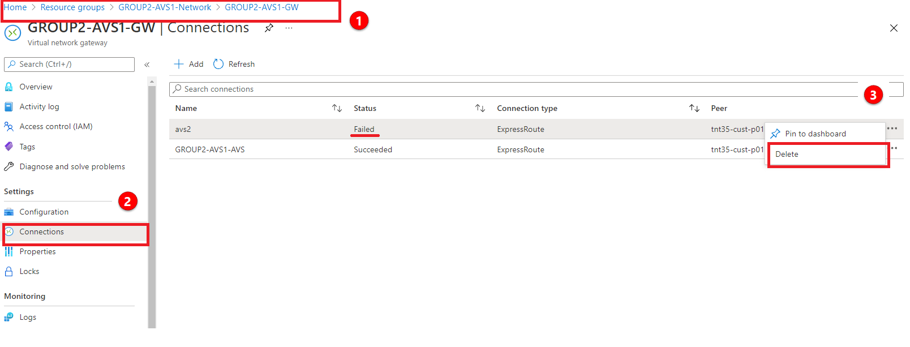

5.  **Access vCenter and NSX-T environment with Bastion -** Now you can validate
    this connection by accessing vCenter in AVS from a jumpbox in Azure.
6.  In the Azure Portal, go back to the Azure VMWare Solution

7.  Select the Azure VMware Solution associated with your group:
    GROUP\#-AVS-SDDC

8.  In the left hand navigation, select **Identity**

9.  You will now see the **Login Credentials** for both vCenter and NSX-T
    manager. You will need these credentials for the next steps. You do not need
    to copy the Certificate thumbprint. Do Not Generate
    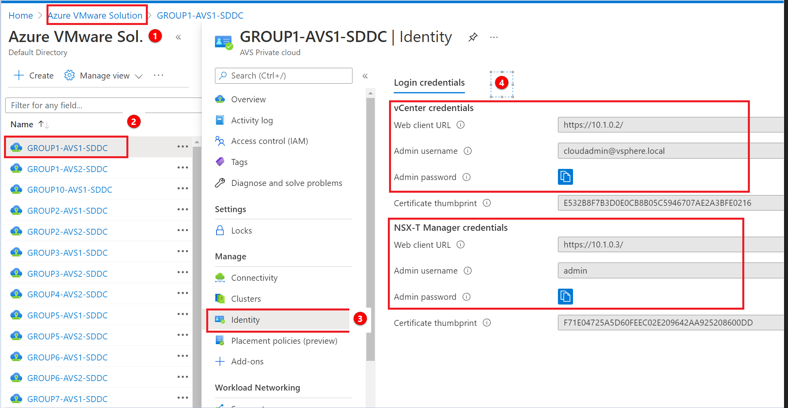

10.  Next, open a separate tab in your browser and access another Azure Portal.
    Go to Resources Groups \> GROUP\#-AVS-JUMPBOX

11.  In the Overview pane, you will see several resources. Select the
    GROUP\#-AVS-JUMPBOX virtual machine
     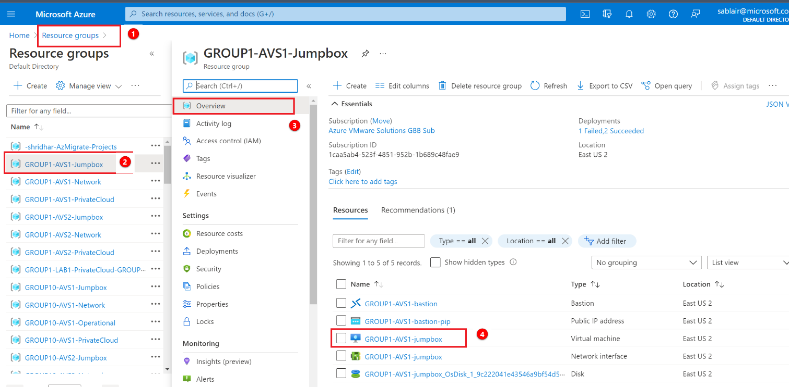

12.  Next, connect to the Group\#-AVS-jumpbox using Bastion. On the
    GROUP\#-AVS-Jumpbox select **Connect \> Bastion**
    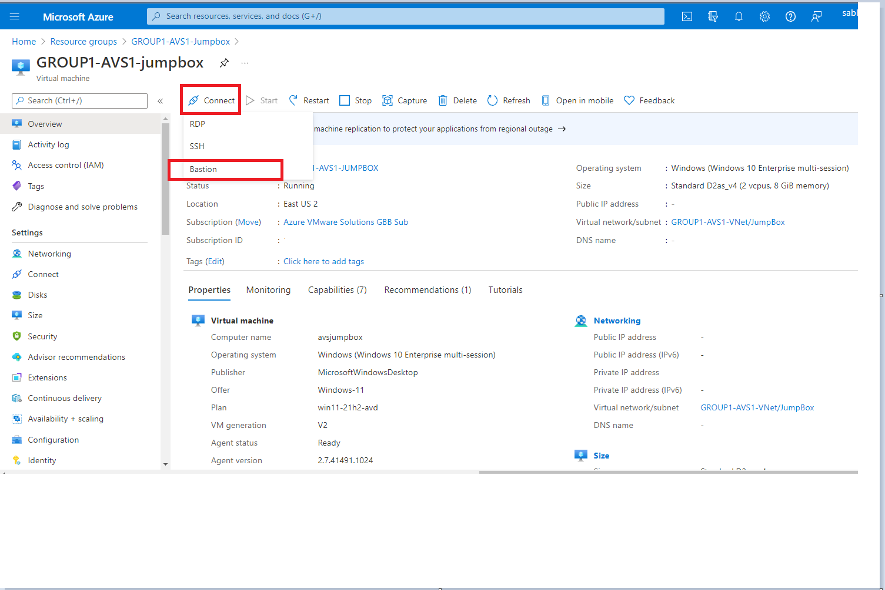

13. Enter the credentials found in [Getting Started](#getting-started)

14. Once connected to the desktop, open a browser and enter the credentials from
    step 4

    14.1.  In the Azure Portal, go to your primary AVS \> Identity

    14.2.  Select the IP for vCenter. On the bastion hosts, open the Edge browser
        and enter the VCenter IP’s.

    14.3.  There will be a Secure browser connection popup. Select the advanced
        button

    14.4.  Select the continue to \<IP\> address link to launch the vCenter getting
        started screen.

    14.5.  Select the Launch vSphere Client (HTML5) button to launch the login
    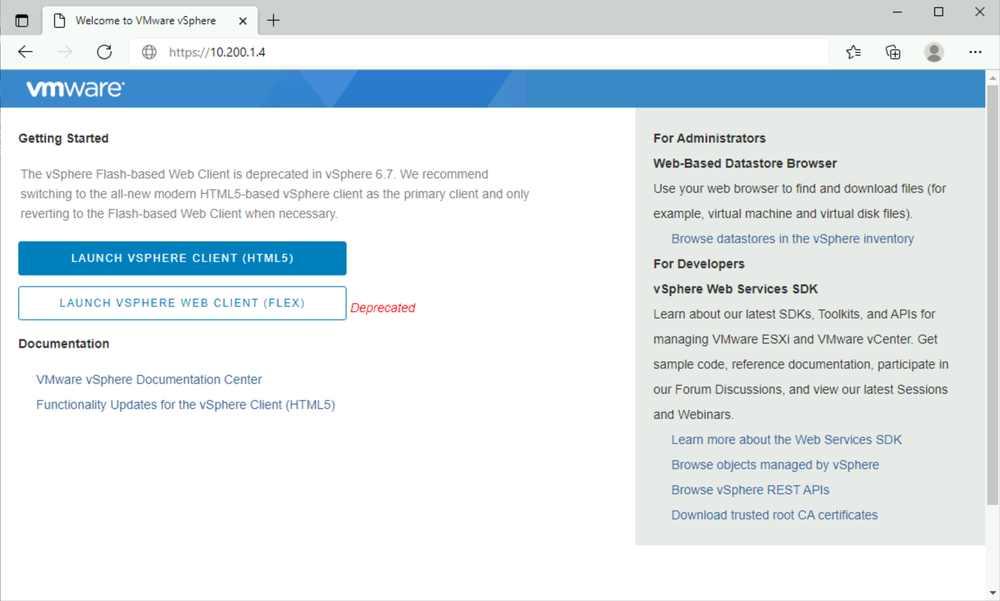

    14.6.  If the portal launches successfully, then the ExpressRoute connection is
    working properly

    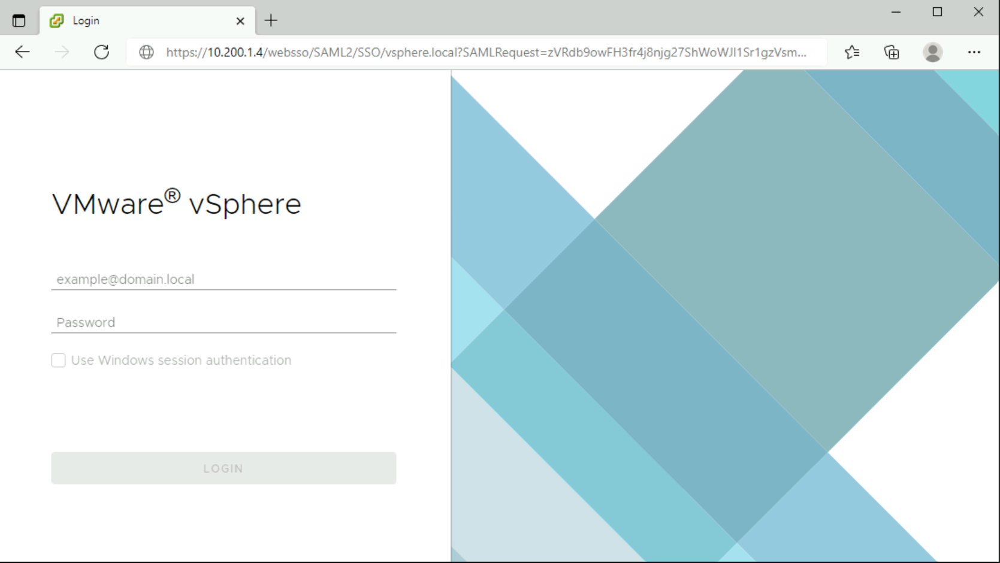

You’ve now confirmed that you can access AVS from a remote environment

**References:**

[Tutorial - Configure networking for your VMware private cloud in Azure - Azure
VMware Solution \| Microsoft
Docs](https://docs.microsoft.com/en-us/azure/azure-vmware/tutorial-configure-networking#connect-expressroute-to-the-virtual-network-gateway)

## Next Steps

[Module 1, Task 2](module-1-task-2.md)

[Module 1 Index](module-1-index.md)

[Main Index](index.md)