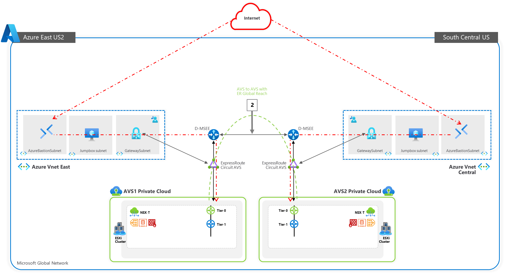
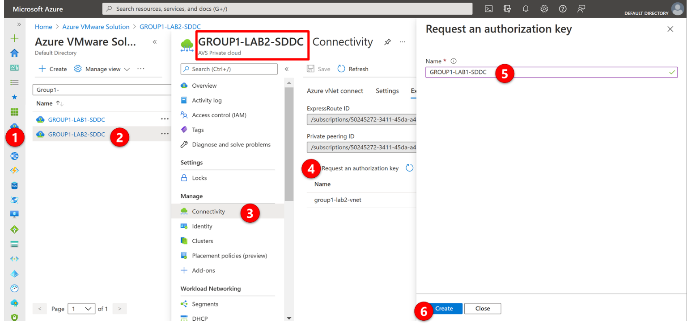
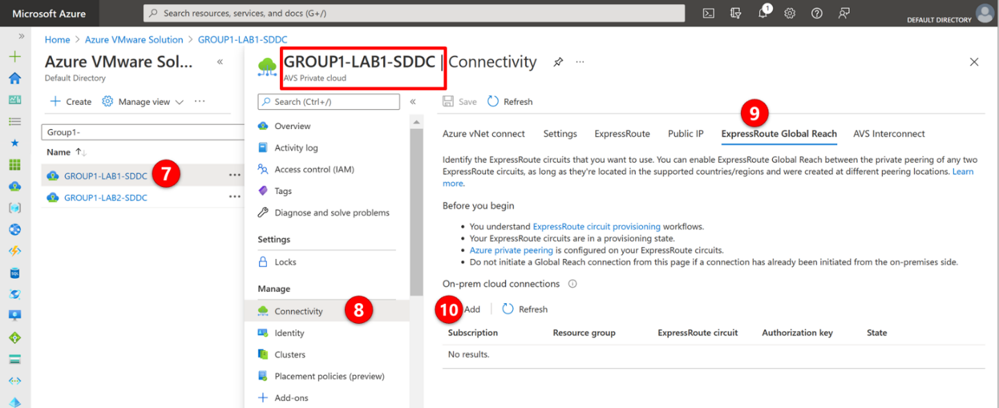
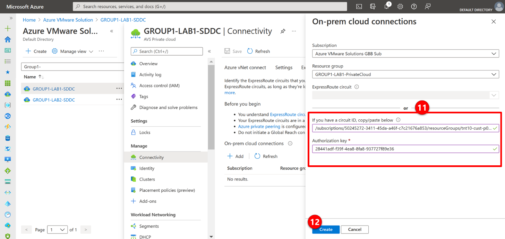

## Task 2: Peer remote environments with Global Reach

### Section Overview:

After you connect your AVS with the existing VNet, you'll peer it with another
AVS lab environment. The process used in this section is the same for when
connecting from the Azure VMWare Solution to On-Premises.

ExpressRoute Global Reach is used to connect AVS to AVS in a different region,
and On-premises environments to AVS. The ExpressRoute Global Reach connection is
established between the private cloud ExpressRoute circuit and an existing
ExpressRoute connection to your On-Premises environments.

**Since we don’t have a real On-premises with an ExpressRoute Circuit, we will
use another AVS environment to show how to execute the process.**

> **NOTE:** 
> - Each connection requires a separate authorization. 
> - You will be accessing two 
> different AVS environments, **GROUP\#-AVS1-SDDC** (Primary), and **GROUP\#-AVS2-SDDC** 
> (Secondary). 
> - Assume that **GROUP\#-AVS2-SDDC** is your On-Premises environment.

### Deployment Steps:

1.  Peering with another AVS

    1.1.  Access your **Secondary AVS** environment **GROUP\#-AVS2-SDDC** and
        request an ExpressRoute authorization key:

    1.2.  In the Azure portal, navigate to the Azure VMware Solution private
        cloud. Select **Manage** \> **Connectivity** \> **ExpressRoute** and
        then select **+ Request an authorization key**.

    1.3.  Provide a name for it and select **Create**. It may take about 30 seconds to create the key. Once created, the new key appears in the list of authorization keys for the private cloud.

    

    1.4.  Copy the **Authorization key** and **ExpressRoute Resource ID**. You'll need
    them to complete the peering. The authorization key disappears after some
    time, so copy it as soon as it appears.

2.  Now that you've created an authorization key for the private cloud
    ExpressRoute circuit, you can peer it with your On-Premises ExpressRoute
    circuit or with another AVS environment.

    

3.  From the **GROUP\#-AVS1-SDDC environment**, under Manage, select
    **Connectivity** \> **ExpressRoute Global Reach** \> **Add**.

4.  Enter the **ExpressRoute ResourceID** and the **Authorization Key** from the
    Secondary AVS created in the previous steps.

5.  Select Create. The new connection shows in the On-Premises cloud connections
    list.

    

    5.1.  Validate access to AVS 2 vCenter server management
    (https://[vCenter-Server-IP]) from the AVS 1 JumpBox or AVS 2 JumpBox.
    (Refer to Task 1, step 5). Bothe JumpBox should be able to reach both AVSs.

**References:**

[Peer On-Premises environments to Azure VMware Solution - Azure VMware Solution
\| Microsoft
Docs](https://docs.microsoft.com/en-us/azure/azure-vmware/tutorial-expressroute-global-reach-private-cloud)**

## Next Steps

[Task 3](module-1-task-3.md)

[Module 1 Index](module-1-index.md)

[Main Index](index.md)