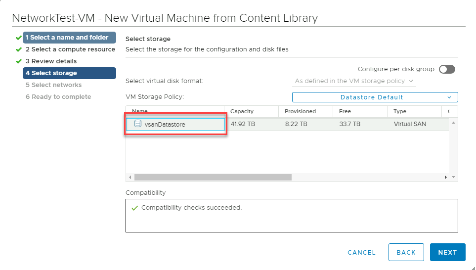

## Task 3: Configure NSX-T to establish connectivity within AVS

> **Important: ONLY ONE PERSON IN THE GROUP CAN DO THIS STEP. IF THE FIRST PERSON ALREADY DID THIS STEP, YOU ARE WELCOME TO GO THROUGH THE STEPS TO LEARN HOW THIS STEP IS DONE BUT KEEP IN MIND YOU MAY NOT BE ABLE TO SUCCESSFULLY FINISH THIS STEP.**

### Section Overview:

After deploying Azure VMware Solution, you can configure an NSX-T network
segment from NSX-T Manager or the Azure portal. Once configured, the segments
are visible in Azure VMware Solution, NSX-T Manager, and vCenter.

NSX-T comes pre-provisioned by default with an NSX-T Tier-0 gateway in
Active/Active mode and a default NSX-T Tier-1 gateway in Active/Standby mode.
These gateways let you connect the segments (logical switches) and provide
East-West and North-South connectivity. Machines will not have IP addresses
until statically or dynamically assigned from a DHCP server or DHCP relay.

In this Section, you will learn how to:

-   Add network segments using either NSX-T Manager or the Azure portal

-   Configure DHCP and DNS

-   Deploy a Test VM in the configured segments

-   Validate connectivity

**Configuration Steps:**

> **Important: Please ensure all Steps are done.**

### Step 1 (Preconfigured): Configure DNS Forwarder

>**NOTE: This task is done by default for every new AVS deployment**

AVS DNS forwarding services run in DNS zones and enable workload VMs in the zone
to resolve fully qualified domain names to IP addresses. Your SDDC includes
default DNS zones for the Management Gateway and Compute Gateway. Each zone
includes a preconfigured DNS service. Use the DNS Services tab on the DNS
Services page to view or update properties of DNS services for the default
zones. To create additional DNS zones or configure additional properties of DNS
services in any zone, use the DNS Zones tab.

The DNS Forwarder and DNS Zone are already configured for this training but
follow the steps to see how to configure it for new environments.

1.  In the NSX-T Console

2.  Select **Networking** \> **DNS**.

3.  Click **DNS Services** to open the **DNS Services** page.

4.  View or edit DNS service parameters. Most gateway DNS service parameters are
    read-only but you can click the vertical ellipses button and choose **Edit
    DNS Server IPs** to add or modify the server IP addresses for this service.

5.  Click **CANCEL**.

6.  Now click DNS Zones tab, look at the settings

    

### Step 2: Add a DHCP Profile in AVS private cloud

> **Please ensure to replace X with your group's assigned number, Y with your participant number. For participant 10 please replace XY with 20**

|  **AVS 1 NSX-T Details** |                                 |
|-------------------------|---------------------------------|
| **DHCP Server IP**      | 10.**XY**.50.1/30               |
| **Segment Name**        | WEB-NET-GROUP-**XY**                         |
| **Segment Gateway**     | 10.**XY**.51.1/24               |
| **DHCP Range**          | 10.**XY**.51.4-10.**XY**.51.254 |

A DHCP profile specifies a DHCP server type and configuration. You can use the
default profile or create others as needed.

A DHCP profile can be used to configure DHCP servers of DHCP relay servers
anywhere in your SDDC network.

1.  In the NSX-T Console

2.  Select **Networking** \> **DHCP**.

3.  Click **ADD DHCP PROFILE** and name the profile as
    **DHCP-Profile-GROUP-XY-AVS for your respective group/participant.**

4.  Under **Profile Type** and select DHCP Server and provide the required
    configuration parameters.

5.  Specify the IPv4 **Server IP Address** as **10.XY.50.1/30 and optionally change the **Lease Time** or leave the default.

6.  Click **SAVE** to create the profile.

    

### Step 3: Add the DHCP Profile to the T1 Gateway

Perform these tasks:

1.  In the NSX-T Console

2.  Select **Networking** \> **Tier-1 Gateways**.

3.  Click the **vertical ellipsis button** and select **EDIT**
    

    

4.  Then click **Set DHCP Configuration.**

    

5.  Select **DHCP Server** and select the **DHCP Profile** you created in the
    previous and click **SAVE**.

    

6.  Click **SAVE** again to confirm the changes, and then click **CLOSE
    EDITING**.

### Step 4: Create a Network Segment for workloads

Network segments are logical networks for use by workload VMs in the SDDC
compute network. Azure VMware Solution supports three types of network segments:
routed, extended, and disconnected.

-   A routed network segment (the default type) has connectivity to other
    logical networks in the SDDC and, through the SDDC firewall, to external
    networks.

-   An extended network segment extends an existing L2VPN tunnel, providing a
    single IP address space that spans the SDDC and an On-Premises network.

-   A disconnected network segment has no uplink and provides an isolated
    network accessible only to VMs connected to it. Disconnected segments are
    created when needed by HCX. You can also create them yourself and can
    convert them to other segment types.

**Configuration Steps:**

1.  In NSX-T Manager, select **Networking** \> **Segments**, and then select
    **Add Segment**.

2.  Enter **WEB-NET-GROUP-XY** in the **Segment Name** field

3.  Select the Tier-1 Gateway **(TNTxx-T1)** as the **Connected Gateway**

4.  Select the pre-configured overlay **Transport Zone** (TNTxx-OVERLAY-TZ)

5.  In the **Subnets** column, you will enter the IP Address for the **Gateway**
    of the Subnet that you are creating, which is the first valid IP of the
    Address Space.
    -   For Example: **10.XY.51.1/24**

6.  Then click **SET DHCP CONFIG**

7.  In the DHCP config window, select **Gateway DHCP Server** as the **DHCP
    Type**

8.  In the **DHCP config** click the toggle button to **Enabled**

9.  Then in the **DHCP Ranges** field enter the range according to the IPs
    assigned to your group. The IP in in the same network as the Gateway defined
    above.

    -   Use **10.XY.51.4-10.XY.51.254**

10.  In the DNS Servers, enter the IP **10.1.0.192** and click **Apply**
     

11. Then scroll down and click **Save**.

12. Select **No** to decline the option to continue configuring the segment.

**Important**

The IP address needs to be on a non-overlapping RFC1918 address block, which
ensures connection to the VMs on the new segment.

**References**:

-   [Create or Modify a Network Segment
    (vmware.com)](https://docs.vmware.com/en/VMware-Cloud-on-AWS/services/com.vmware.vmc-aws.networking-security/GUID-267DEADB-BD01-46B7-82D5-B9AA210CA9EE.html)

-   [Configure Segment DHCP Properties
    (vmware.com)](https://docs.vmware.com/en/VMware-Cloud-on-AWS/services/com.vmware.vmc-aws.networking-security/GUID-F6D433BE-753E-4B44-82FF-236CEBA17F8B.html)

### Step 5: Create Test VM and connect to Segment

Now that we have our networks created, we can deploy a virtual machine and
ensure we can get and IP address from DHCP

1.  From AVS vCenter, go to **Menu** \> **Content Library**

    

2.  Create a new local content library if one does not exist

    

3.  Select the datastore and Finish

    

4.  Navigate into the **Local library \>Templates Tab \> Actions \> Import Item**

    

5.  Import using this URL - [Download
    Link](https://gpsusstorage.blob.core.windows.net/ovas-isos/workshop-vm.ova)

    <https://gpsusstorage.blob.core.windows.net/ovas-isos/workshop-vm.ova>

    

6.  This will now download and import the VM to the library

7.  Once downloaded, Right-click the VM Template \> **New VM from This Template**

    

8.  Give the VM a name – e.g **G-XY-VM1-AVS** and select the **SDDC-Datacenter**.

    

9.  Select **Cluster-1**

    

10. Review **Details** and Select **Next**

11. Confirm the storage as the **vsanDatastore**

    

12. Select the segment that was created in Step 4 – **“WEB-NET-GROUP-XY”**

    

13. Review and **Finish**.

14. Once deployed, head back to VM’s and Templates and Power On this newly
    created VM. This VM is provided as a very lightweight Linux machine that
    will automatically pick up DHCP if configured. Since we have added this to
    the **Web-Net-Group-XY** segment, it should get an IP address from this DHCP range.
    This usually takes few seconds. Click the “Refresh” button on vCenter
    toolbar.

15. If you see an IP address here, we have configured the VM has connected to
    the segment and will be accessible from the Jumpbox

    

16. We can confirm this by SSH'ing to this IP address from the jumpbox

## Next Steps

[Module 2, Index](module-2-index.md)

[Module 1 Index](module-1-index.md)

[Main Index](index.md)
