# Module 1: Setup AVS Connectivity

## Introduction

Azure VMware Solution offers a private cloud environment accessible from
On-Premises and Azure-based resources. Services such as Azure ExpressRoute, VPN
connections, or Azure Virtual WAN deliver the connectivity.

## Scenario

Customer needs to have connectivity between their workloads in AVS, existing services and workloads in
Azure, and access to the internet.

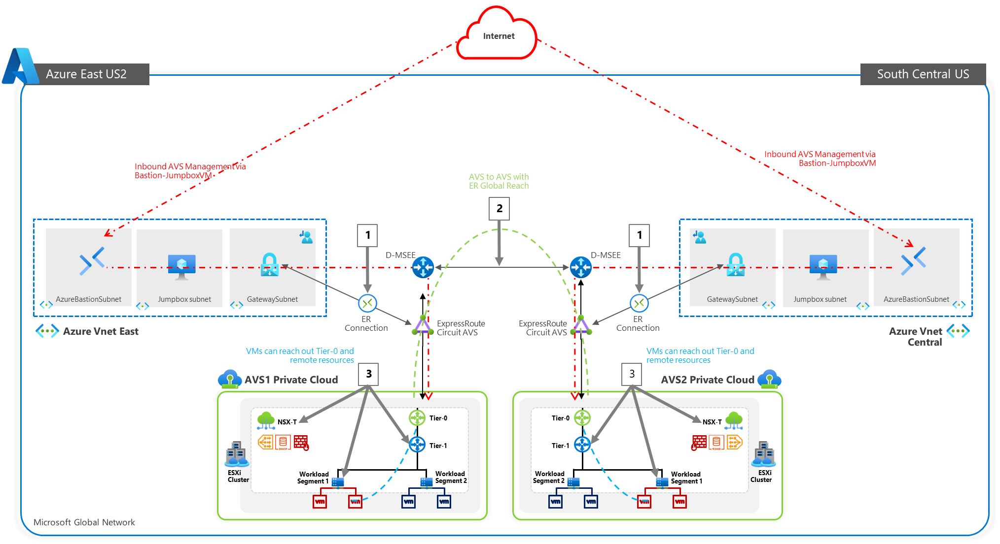

## Agenda for next 60 mins:

This hands-on lab will show you how to configure the Networking components of an
Azure VMware Solution for:

-   Connecting Azure VNet’s to AVS over an ExpressRoute circuit

-   Peering with remote environments using Global Reach

-   Configuring NSX-T (check DNS and configure DHCP, Segments, and Gateway) to
    manage connectivity within AVS

| **Action Plan**                                         | **Expected Time**      |
|---------------------------------------------------------|------------------------|
| Create AVS environment                                  | Preconfigured          |
| [Connect to Azure Virtual Networks](#_Task_1:_Connect)  | 10 mins                |
| [Connect to On-Premises Environments](#_Task_2:_Peer)   | 10 mins                |
| Configure DNS                                           | Preconfigured – 2 mins |
| Configure DHCP                                          | 5 mins                 |
| Configure Tier-1 Gateway                                | Preconfigured - 2 mins |
| [Configure network Segments](#_Step_4:_Create)          | 5 mins                 |

The lab environment has a preconfigured VMware in Azure environment with an
Express Route circuit. An additional VMware on Azure is configured to simulate
an On-Premises environment. Both environments are accessible through Bastions
and JumpBoxes.

After this lab is complete, you will have built out this scenario below

1.  ExpressRoute, or SD-WAN for connectivity between Azure VMware Solution

2.  Connectivity to remote environments using Global Reach

3.  Configure NSX-T to establish connectivity within the AVS environment

\*For this lab, a secondary AVS environment is provided to simulate a datacenter
or co-location. In real world scenarios, using Global Reach facilitates
connectivity between AVS and On-Premises environments

## Task 1: Connect an existing Virtual Network with AVS using AVS ExpressRoute Circuit

### Section Overview:

In this section you will create a connection between an existing, non-AVS,
Virtual Network in Azure and the Azure VMWare Service environment. This allows
the jumpbox virtual machine to manage key components in the VMWare management
plane such as vCenter, HCX, and NSX-T. You will also be able to access Virtual
Machines deployed in AVS and allows those VMs to access resources deployed in
the Hub or Spoke VNet’s, such as Private Endpoints and other Azure VMs or
Services.

**Summary**: Generate a new Authorization Key in the AVS ExpressRoute settings,
and then create a new Connection from the Virtual Network Gateway in the VNet
where the JumpBox is connected to.

The diagram below shows the respective resource groups for your lab environment.

You will replace Group1 with GROUP**\#** where **\#** represents your group
number.

### Deployment Steps:

> **NOTE:** 
> - Since we already have a virtual network gateway, you'll add a connection between it and  
>  your Azure VMware Solution private cloud.
> - **The last step of this section is expected to fail, the Connection will be created but it 
> will be in Failed state because another Connection to the same target already exists. This is 
> expected behaviour and you can ignore the error.** 
> 
> **Important: Please ensure all Steps are done on both AVS private clouds, AVS1
> and 2.**
> 

1.  Request an ExpressRoute authorization key:

    1.1  In the Azure portal, navigate to the Azure VMware Solution private
        cloud, then click **GROUP\#-AVS1-SDDC**, then Select **Manage** \>
        **Connectivity** \> **ExpressRoute** and then select **+ Request an
        authorization key**.
    
    1.2  Provide a name for it and select **Create**.
        It may take about 30 seconds to create the key. Once created, the new
        key appears in the list of authorization keys for the private cloud.
    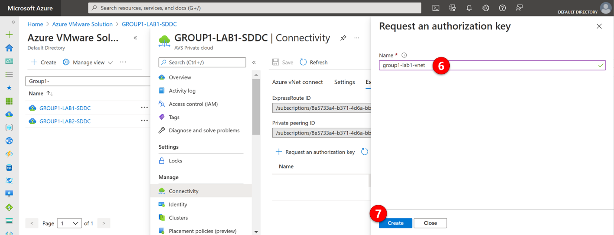

    1.3  Copy the authorization key and ExpressRoute ID. You'll need them to
        complete the peering. The authorization key disappears after some time,
        so copy it as soon as it appears.
    

2.  Navigate to the **virtual network gateway** - which is in resource group
    “GROUP**\#**-AVS1-Network”, where X is your lab/group number - you plan to
    use and select **Connections** \> **+ Add**.
    

3.  On the **Add connection** page, provide values for the fields, and select
    **OK**.

    | Field                       | Value                                                       |
    |-----------------------------|-------------------------------------------------------------|
    | **Name**                    | Enter a name for the connection (e.g. avs1-vnet-connection) |
    | **Connection type**         | Select **ExpressRoute**.                                    |
    | **Redeem authorization**    | Ensure this box is selected.                                |
    | **Virtual network gateway** | The virtual network gateway you intend to use.              |
    | **Authorization key**       | Paste the authorization key you copied earlier.             |
    | **Peer circuit URI**        | Paste the ExpressRoute ID you copied earlier.               |

    

    The connection between your ExpressRoute circuit and your Virtual Network is
    created.

    **Reminder**: It is expected that the connection is in **Failed State** after
    the creation, that is because another connection to the same target already
    exists.

4.  Next, delete the connection. In the left-hand section, select
    **Connections.** Select the 3 ellipses next to the connection with the
    status **Failed,** and select **Delete**

    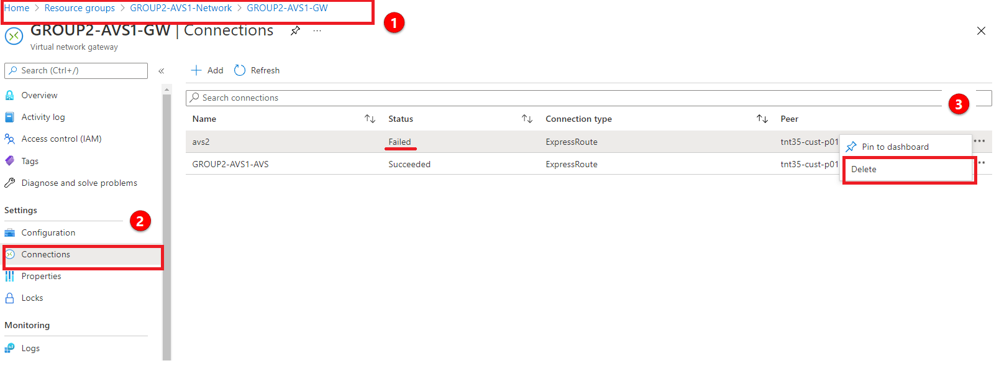

5.  **Access vCenter and NSX-T environment with Bastion -** Now you can validate
    this connection by accessing vCenter in AVS from a jumpbox in Azure.
6.  In the Azure Portal, go back to the Azure VMWare Solution

7.  Select the Azure VMWare Solution associated with your group:
    GROUP\#-AVS1-SDDC

8.  In the left hand navigation, select **Identity**

9.  You will now see the **Login Credentials** for both vCenter and NSX-T
    manager. You will need these credentials for the next steps. You do not need
    to copy the Certificate thumbprint. Do Not Generate
    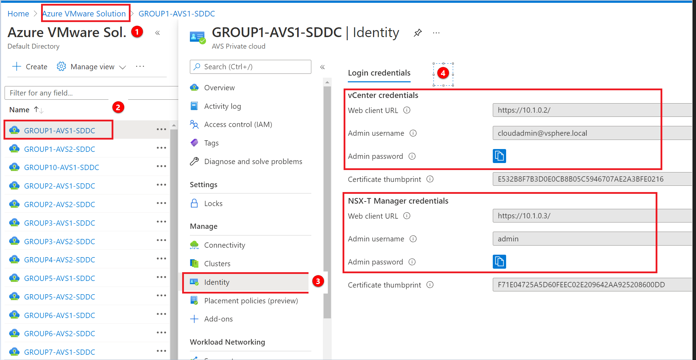

10.  Next, open a separate tab in your browser and access another Azure Portal.
    Go to Resources Groups \> GROUP\#-AVS1-JUMPBOX

11.  In the Overview pane, you will see several resources. Select the
    GROUP\#-AVS1-JUMPBOX virtual machine
     

12.  Next, connect to the Group\#-AVS1-jumpbox using Bastion. On the
    GROUP\#-AVS-Jumpbox select **Connect \> Bastion**
    

13. Enter the credentials found in [Getting Started](#getting-started)

14. Once connected to the desktop, open a browser and enter the credentials from
    step 4

    14.1.  In the Azure Portal, go to your primary AVS \> Identity

    14.2.  Select the IP for vCenter. On the bastion hosts, open the Edge browser
        and enter the VCenter IP’s.

    14.3.  There will be a Secure browser connection popup. Select the advanced
        button

    14.4.  Select the continue to \<IP\> address link to launch the vCenter getting
        started screen.

    14.5.  Select the Launch vSphere Client (HTML5) button to launch the login
    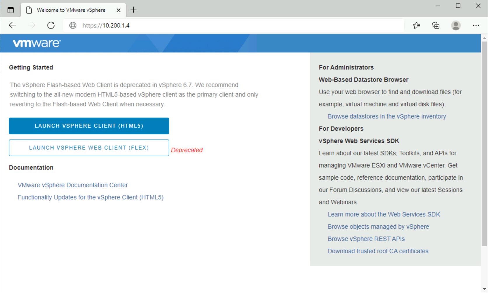

    14.6.  If the portal launches successfully, then the Expressroute connection is
    working properly

    

You’ve now confirmed that you can access AVS from a remote environment

**References:**

[Tutorial - Configure networking for your VMware private cloud in Azure - Azure
VMware Solution \| Microsoft
Docs](https://docs.microsoft.com/en-us/azure/azure-vmware/tutorial-configure-networking#connect-expressroute-to-the-virtual-network-gateway)

## Task 2: Peer remote environments with Global Reach

### Section Overview:

After you connect your AVS with the existing VNet, you'll peer it with another
AVS lab environment. The process used in this section is the same for when
connecting from the Azure VMWare Solution to On-Premises.

ExpressRoute Global Reach is used to connect AVS to AVS in a different region,
and On-premises environments to AVS. The ExpressRoute Global Reach connection is
established between the private cloud ExpressRoute circuit and an existing
ExpressRoute connection to your On-Premises environments.

**Since we don’t have a real On-premises with an ExpressRoute Circuit, we will
use another AVS environment to show how to execute the process.**

> **NOTE:** 
> - Each connection requires a separate authorization. 
> - You will be accessing two 
> different AVS environments, **GROUP\#-AVS1-SDDC** (Primary), and **GROUP\#-AVS2-SDDC** 
> (Secondary). 
> - Assume that **GROUP\#-AVS2-SDDC** is your On-Premises environment.

### Deployment Steps:

1.  Peering with another AVS

    1.1.  Access your **Secondary AVS** environment **GROUP\#-AVS2-SDDC** and
        request an ExpressRoute authorization key:

    1.2.  In the Azure portal, navigate to the Azure VMware Solution private
        cloud. Select **Manage** \> **Connectivity** \> **ExpressRoute** and
        then select **+ Request an authorization key**.

    1.3.  Provide a name for it and select **Create**. It may take about 30 seconds to create the key. Once created, the new key appears in the list of authorization keys for the private cloud.

    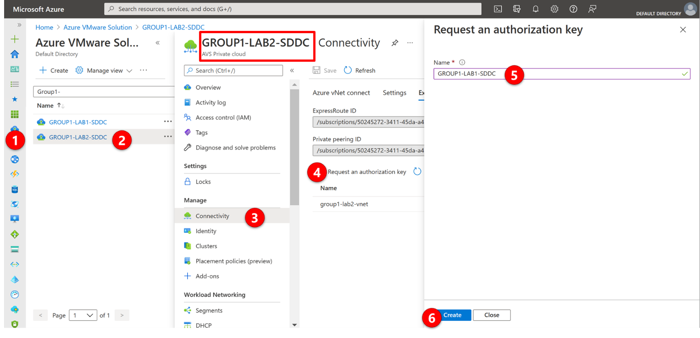

    1.4.  Copy the **Authorization key** and **ExpressRoute Resource ID**. You'll need
    them to complete the peering. The authorization key disappears after some
    time, so copy it as soon as it appears.

2.  Now that you've created an authorization key for the private cloud
    ExpressRoute circuit, you can peer it with your On-Premises ExpressRoute
    circuit or with another AVS environment.

    

3.  From the **GROUP\#-AVS1-SDDC environment**, under Manage, select
    **Connectivity** \> **ExpressRoute Global Reach** \> **Add**.

4.  Enter the **ExpressRoute ResourceID** and the **Authorization Key** from the
    Secondary AVS created in the previous steps.

5.  Select Create. The new connection shows in the On-Premises cloud connections
    list.

    

    5.1.  Validate access to AVS 2 vCenter server management
    (https://[vCenter-Server-IP]) from the AVS 1 JumpBox or AVS 2 JumpBox.
    (Refer to Task 1, step 5). Bothe JumpBox should be able to reach both AVSs.

**References:**

[Peer On-Premises environments to Azure VMware Solution - Azure VMware Solution
\| Microsoft
Docs](https://docs.microsoft.com/en-us/azure/azure-vmware/tutorial-expressroute-global-reach-private-cloud)**

## Task 3: Configure NSX-T to establish connectivity within AVS

### Section Overview:

After deploying Azure VMware Solution, you can configure an NSX-T network
segment from NSX-T Manager or the Azure portal. Once configured, the segments
are visible in Azure VMware Solution, NSX-T Manger, and vCenter.

NSX-T comes pre-provisioned by default with an NSX-T Tier-0 gateway in
Active/Active mode and a default NSX-T Tier-1 gateway in Active/Standby mode.
These gateways let you connect the segments (logical switches) and provide
East-West and North-South connectivity. Machines will not have IP addresses
until statically or dynamically assigned from a DHCP server or DHCP relay.

In this Section, you will learn how to:

-   Add network segments using either NSX-T Manager or the Azure portal

-   Configure DHCP and DNS

-   Deploy a Test VM in the configured segments

-   Validate connectivity

**Configuration Steps:**

> **Important: Please ensure all Steps are done on both AVS private clouds, AVS1
> and 2.**

### Step 1 (Preconfigured): Configure DNS Forwarder

>**NOTE: This task is done by default for every new AVS deployment**

AVS DNS forwarding services run in DNS zones and enable workload VMs in the zone
to resolve fully qualified domain names to IP addresses. Your SDDC includes
default DNS zones for the Management Gateway and Compute Gateway. Each zone
includes a preconfigured DNS service. Use the DNS Services tab on the DNS
Services page to view or update properties of DNS services for the default
zones. To create additional DNS zones or configure additional properties of DNS
services in any zone, use the DNS Zones tab.

The DNS Forwarder and DNS Zone are already configured for this training but
follow the steps to see how to configure it for new environments.

1.  In the NSX-T Console

2.  Select **Networking** \> **DNS**.

3.  Click **DNS Services** to open the **DNS Services** page.

4.  View or edit DNS service parameters. Most gateway DNS service parameters are
    read-only but you can click the vertical ellipses button and choose **Edit
    DNS Server IPs** to add or modify the server IP addresses for this service.

5.  Click **CANCEL**.

6.  Now click DNS Zones tab, look at the settings

    

### Step 2: Add a DHCP Profile in both AVS 1 & AVS 2 private clouds

> **Settings to use for AVS 1**

|  **AVS 1 NSX-T Details** |                                 |
|-------------------------|---------------------------------|
| **DHCP Server IP**      | 10.**\#**.50.1/30               |
| **Segment Name**        | WEB-NET                         |
| **Segment Gateway**     | 10.**\#**.51.1/24               |
| **DHCP Range**          | 10.**\#**.51.4-10.**\#**.51.254 |

> **Settings to use for AVS 2**

| **AVS 2 NSX-T Details** |                                 |
|-------------------------|---------------------------------|
| **DHCP Server IP**      | 10.**\#**.50.5/30               |
| **Segment Name**        | WEB-NET                         |
| **Segment Gateway**     | 10.**\#**.52.1/24               |
| **DHCP Range**          | 10.**\#**.52.4-10.**\#**.52.254 |

A DHCP profile specifies a DHCP server type and configuration. You can use the
default profile or create others as needed.

A DHCP profile can be used to configure DHCP servers of DHCP relay servers
anywhere in your SDDC network.

1.  In the NSX-T Console

2.  Select **Networking** \> **DHCP**.

3.  Click **ADD DHCP PROFILE** and name the profile as
    **DHCP-Profile-GROUP\#-AVS1 for AVS1 or DHCP-Profile-GROUP\#-AVS2 for AVS2**

4.  Under **Profile Type** and select DHCP Server and provide the required
    configuration parameters.

5.  Specify the IPv4 **Server IP Address** as **10.\#.50.1/30 for AVS1 and
    10.\#.50.5/30 for AVS2**, and optionally change the **Lease Time**.

    >   **Important: Please configure DHCP for AVS2 too. This is needed for Module
    SRM.**

6.  Click **SAVE** to create the profile.

    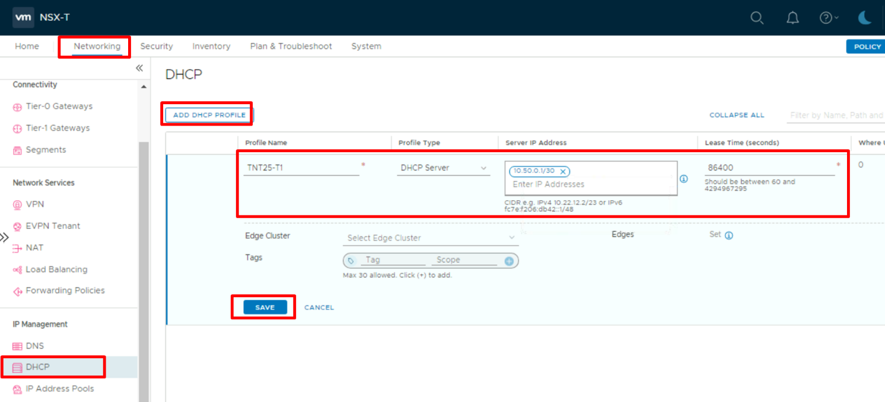

### Step 3: Add the DHCP Profile to the T1 Gateway

Perform these tasks in both AVS1 and AVS2.

1.  In the NSX-T Console

2.  Select **Networking** \> **Tier-1 Gateways**.

3.  Click the **vertical ellipsis button**  and select **EDIT**

    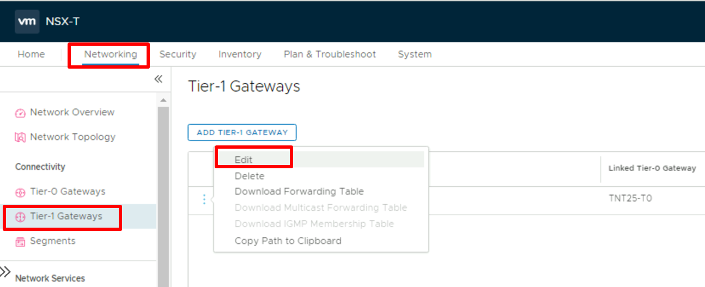

4.  Then click **Set DHCP Configuration.**

    

5.  Select **DHCP Server** and select the **DHCP Profile** you created in the
    previous and click **SAVE**.

    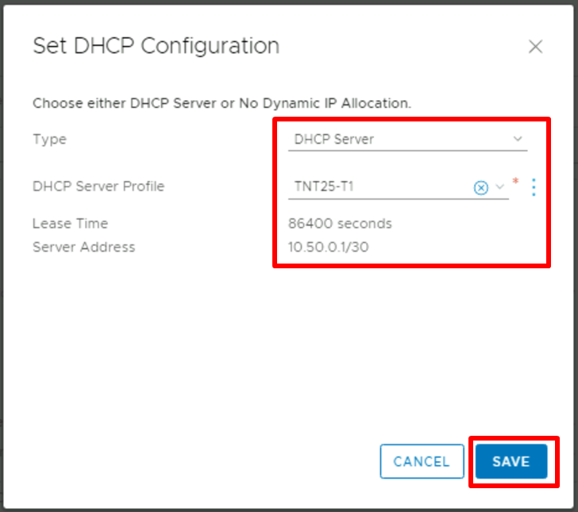

6.  Click **SAVE** again to confirm the changes, and then click **CLOSE
    EDITING**.

### Step 4: Create a Network Segment for workloads

Network segments are logical networks for use by workload VMs in the SDDC
compute network. Azure VMware Solution supports three types of network segments:
routed, extended, and disconnected.

-   A routed network segment (the default type) has connectivity to other
    logical networks in the SDDC and, through the SDDC firewall, to external
    networks.

-   An extended network segment extends an existing L2VPN tunnel, providing a
    single IP address space that spans the SDDC and an On-Premises network.

-   A disconnected network segment has no uplink and provides an isolated
    network accessible only to VMs connected to it. Disconnected segments are
    created when needed by HCX. You can also create them yourself and can
    convert them to other segment types.

**Configuration Steps:**

1.  In NSX-T Manager, select **Networking** \> **Segments**, and then select
    **Add Segment**.

2.  Enter **WEB-NET** in the **Segment Name** field

3.  Select the Tier-1 Gateway **(TNTxx-T1)** as the **Connected Gateway**

4.  Select the pre-configured overlay **Transport Zone** (TNTxx-OVERLAY-TZ)

5.  In the **Subnets** column, you will enter the IP Address for the **Gateway**
    of the Subnet that you are creating, which is the first valid IP of the
    Address Space.

    -   For AVS 1 use **10.\#.51.1/24**

    -   For AVS 2 use **10.\#.52.1/24**

6.  Then click **SET DHCP CONFIG**

    

7.  In the DHCP config window, select **Gateway DHCP Server** as the **DHCP
    Type**

8.  In the **DHCP config** click the toggle button to **Enabled**

9.  Then in the **DHCP Ranges** field enter the range according to the IPs
    assigned to your group. The IP in in the same network as the Gateway defined
    above.

    -   For AVS 1 use **10.\#.51.4-10.\#.51.254**

    -   For AVS 2 use **10.\#.52.4-10.\#.52.254**

10.  In the DNS Servers, enter the IP **10.1.0.192** and click **Apply**
     

11. Then scroll down and click **Save**.

12. Select **No** to decline the option to continue configuring the segment.

**Important**

The IP address needs to be on a non-overlapping RFC1918 address block, which
ensures connection to the VMs on the new segment.

**References**:

-   [Create or Modify a Network Segment
    (vmware.com)](https://docs.vmware.com/en/VMware-Cloud-on-AWS/services/com.vmware.vmc-aws.networking-security/GUID-267DEADB-BD01-46B7-82D5-B9AA210CA9EE.html)

-   [Configure Segment DHCP Properties
    (vmware.com)](https://docs.vmware.com/en/VMware-Cloud-on-AWS/services/com.vmware.vmc-aws.networking-security/GUID-F6D433BE-753E-4B44-82FF-236CEBA17F8B.html)

### Step 5: Create Test VM and connect to Segment

Now that we have our networks created, we can deploy a virtual machine and
ensure we can get and IP address from DHCP

1.  From vCenter, go to **Menu** \> **Content Library**

    

2.  Create a new local content library if one does not exist

    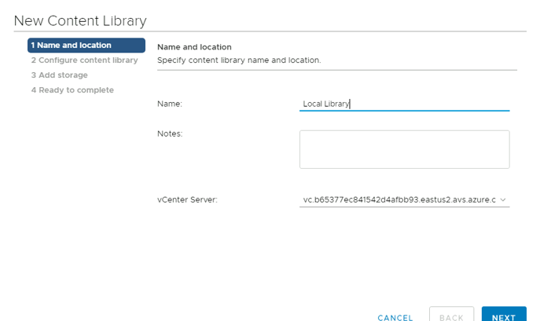

3.  Select the datastore and Finish

    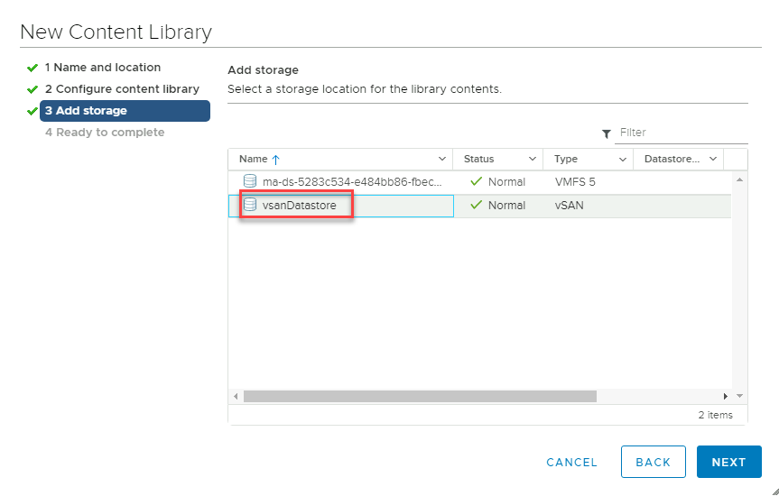

4.  Navigate into the **Local library \>Templates Tab \> Actions \> Import Item**

    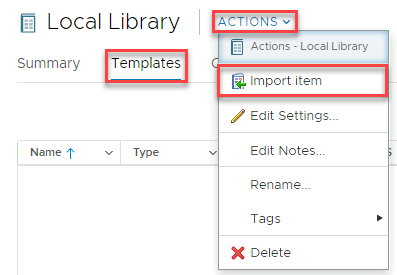

5.  Import using this URL - [Download
    Link](https://nestedlabovawus.blob.core.windows.net/7979ae9d-74ee-477c-93ee-0817ab8b52d4/NetworkTest-VM.ova)

    <https://nestedlabovawus.blob.core.windows.net/7979ae9d-74ee-477c-93ee-0817ab8b52d4/NetworkTest-VM.ova>

    

6.  This will now download and import the VM to the library

7.  Once downloaded, Right-click the VM Template \> **New VM from This Template**

    

8.  Give the VM a name – e.g **G\#-VM1-AVS1** or **G\#-VM1-AVS2** and select the
    **SDDC-Datacenter**.

    

9.  Select **Cluster-1**

    

10. Review **Details** and Select **Next**

11. Confirm the storage as the **vsanDatastore**

    

12. Select the segment that was created in Step 4 – **“WEB-NET”**

    

13. Review and **Finish**.

14. Once deployed, head back to VM’s and Templates and Power On this newly
    created VM. This VM is provided as a very lightweight Linux machine that
    will automatically pick up DHCP if configured. Since we have added this to
    the **Web-Net** segment, it should get an IP address from this DHCP range.
    This usually takes few seconds. Click the “Refresh” button on vCneter
    toolbar.

15. If you see an IP address here, we have configured the VM has connected to
    the segment and will be accessible from the Jumpbox

    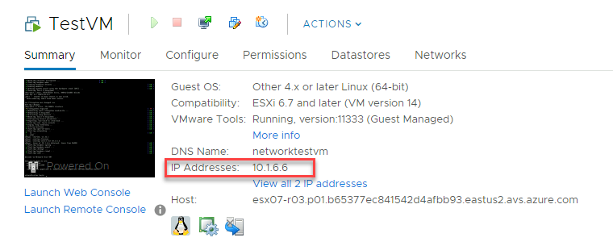

16. We can confirm this by pinging this IP address from the jumpbox

    
