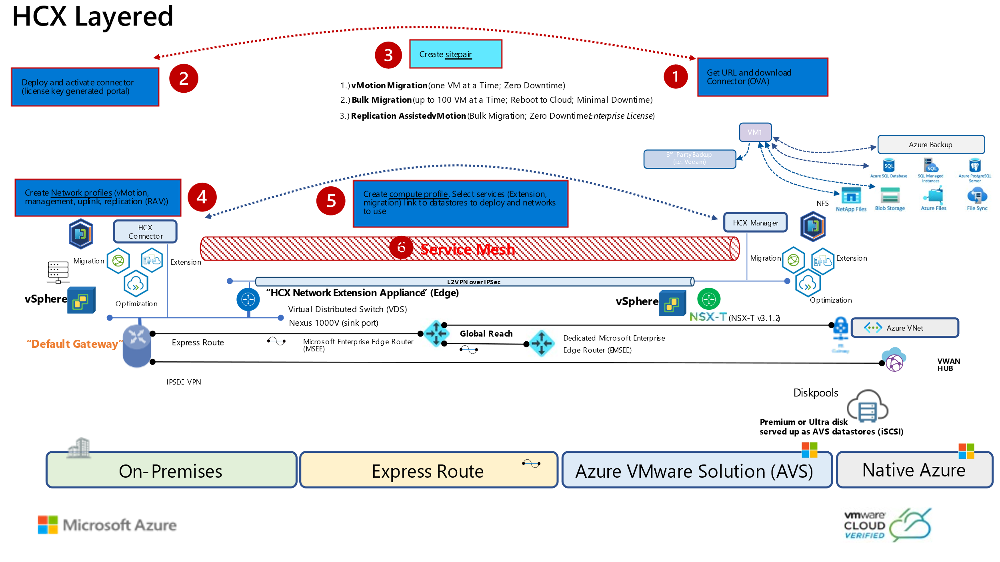

## Introduction

VMware HCX™ is an application mobility platform designed for simplifying
application migration, workload rebalancing and business continuity across data
centres and clouds. HCX supports the following types of migrations:

-   Cold Migration - Offline migration of VMs

-   Bulk Migration - scheduled bulk VM (vSphere, KVM, Hyper-V) migrations with
    reboot – low downtime

-   HCX vMotion - Zero-downtime live migration of VMs – limited scale

-   Cloud to Cloud Migrations – direct migrations between VMware Cloud SDDCs
    moving workloads from region to region or between cloud providers

-   OS Assisted Migration – bulk migration of KVM and Hyper-V workloads to
    vSphere (HCX Enterprise feature)

-   Replication Assisted vMotion - Bulk live migrations with zero downtime
    combining HCX vMotion and Bulk migration capabilities (HCX Enterprise
    feature)

In this module, we will go through the steps to Install HCX, configure and
migrate a test VM to AVS

**For more information on HCX, please visit**
<https://www.vmware.com/products/hcx.html>

## Scenario

Customer would like to migrate
workloads from On-Prem VMware environment to AVS.

**Prerequisites:**

-   Ensure that Module 1 has been completed successfully as this will be
    required to connect HCX from AVS to the On-Premises Lab.  
    Jumphost from AVS should be able to ping following ip addresses:

    -   AVS vCenter: get from the Azure Portal

    -   On-prem vCenter: 192.168.**XY**.2/24

Remember that X is your group number and Y is your participant number.

>**Important: Make a note of Latency number from jumpbox to on-prem VM. We’ll use
that number for comparison after VM is moved from on-prem to AVS**

-   Review HCX documentation on VMware site. [(About the VMware HCX User
    Guide)](https://docs.vmware.com/en/VMware-HCX/4.0/hcx-user-guide/GUID-BFD7E194-CFE5-4259-B74B-991B26A51758.html)

## Agenda for next exercise:

| **Action Plan**                              | **Time required for each step** |
|----------------------------------------------|---------------------------------|
| Install VMware HCX on AVS Private Cloud      | Preconfigured                   |
| Download HCX OVA to On-Premises vCenter      | Preconfigured                   |
| Import OVA to On-Premises vCenter            | Preconfigured                   |
| Deploy HCX to On-Premises vCenter            | 15 mins                         |
| Obtain HCX License Key                       | 5 mins                          |
| Activate VMware HCX                          | 5 mins                          |
| Configure HCX and connect to vCenter         | 15 mins                         |
| Create Site Pairing from On-Premises to AVS  | 5 mins                          |
| Create network profiles                      | 5 mins                          |
| Create compute profiles                      | 5 mins                          |
| Create service mesh                          | 5 mins                          |
| Extend a Network                             | 10 mins                         |
| Create network extension                     | 5 mins                          |
| Migrate a VM                                 | 10 mins                         |

## Next Steps

[Module 2, Task 1](module-2-task-1.md)

[Module 2 Index](module-2-index.md)

[Main Index](index.md)