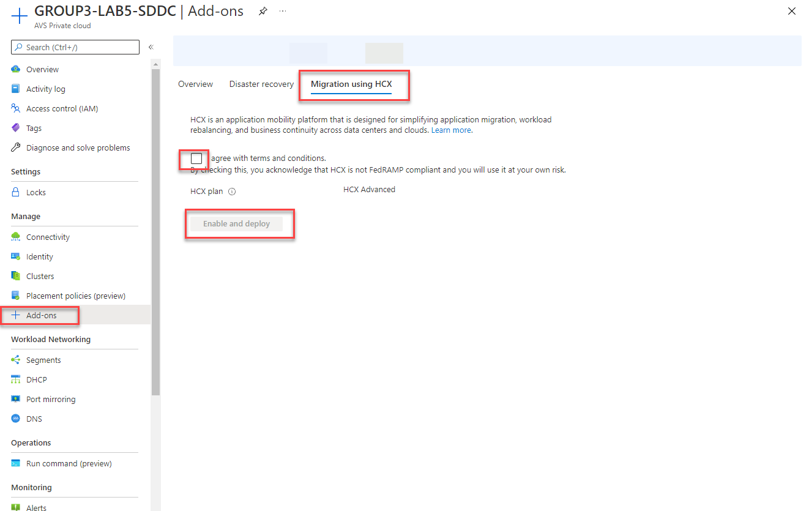

# Task 1 (Preconfigured) : Install VMware HCX on AVS Private Cloud

In the following task, we will be installing HCX on our AVS Private Cloud. This
is a simple process from the Add-Ins section in the Azure Portal, or via
Bicep/ARM/PowerShell

> **NOTE: This task has been completed for you in your AVS environment**

1.  Navigate to the Azure Portal, search for *Azure VMware Solution* in the
    search bar and select

    

2.  Select your Private Cloud – GROUP\#-AVS1-SDDC

    

3.  Select **Add-ons** \> Migration using HCX

    

4.  Accept the terms and conditions and “**Enable and deploy”.** This process
    will take about 30 minutes to complete.

    >**Note: This step has already been done for you**

## Next Steps

[Module 2](module-2-task-2.md)

[Module 2 Index](module-2-index.md)

[Main Index](index.md)