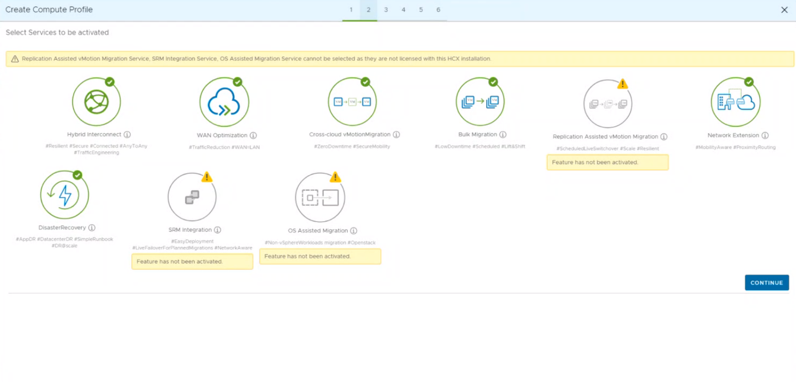
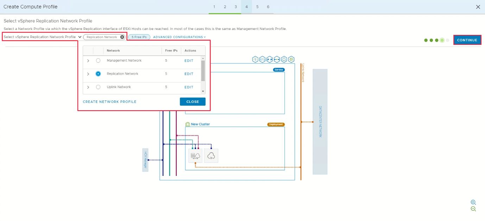

## **Task 10: Create compute profiles**

A compute profile contains the compute, storage, and network settings that HCX
uses on this site to deploy the interconnected dedicated virtual appliances when
service mesh is added. For more information on compute profile and creating
please refer to [VMware
documentation](https://docs.vmware.com/en/VMware-HCX/4.2/hcx-user-guide/GUID-BBAC979E-8899-45AD-9E01-98A132CE146E.html#:~:text=A%20Compute%20Profile%20contains%20the%20compute%2C%20storage%2C%20and,virtual%20appliances%20when%20a%20Service%20Mesh%20is%20added.)

1.  Under **Infrastructure**, select **Interconnect** \> **Compute Profiles** \>
    **Create Compute Profile**.

    

2.  Enter a name for the profile and select **Continue**.

3.  Review the selected services, by default all the below are selected.
    **Continue** to go to the next page

    

4.  In **Select Service Resources**, select one or more service resources
    (clusters) to enable the selected VMware HCX services.

5.  When you see the clusters in your On-Premises datacenter, select
    **Continue**.

    

6.  From **Select Datastore**, select the datastore storage resource for
    deploying the VMware HCX Interconnect appliances. Then select **Continue**.

    **Note**: Best practice would be to set resource reservations here as per
    requirements

    

7.  From **Select Management Network Profile**, select the management network
    profile that you created in previous steps. Then select **Continue**.

    

8.  From **Select Uplink Network Profile**, select the uplink network profile
    you created in the previous procedure. Then select **Continue**.

    

9.  From **Select vMotion Network Profile**, select the vMotion network profile
    that you created in previous steps. Then select **Continue**.

    

10.  From **Select vSphere Replication Network Profile**, select the replication
    network profile that you created in previous steps. Then select
    **Continue**.

   

   

11.  Review the connection rules and select **Continue**.

   

12.  Select **Finish** to create the compute profile.

   

## Next Steps

[Module 2 Task 11](module-2-task-11)

[Module 2 Index](module-2-index)

[Main Index](index)