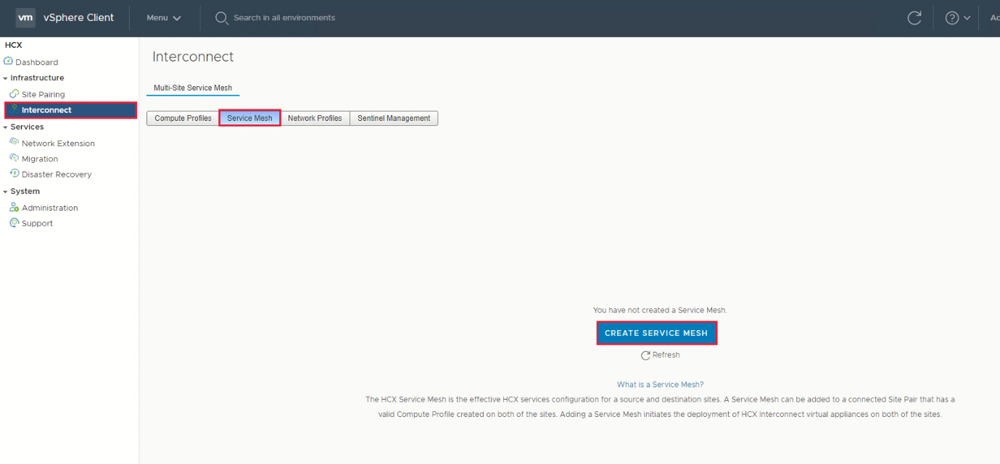
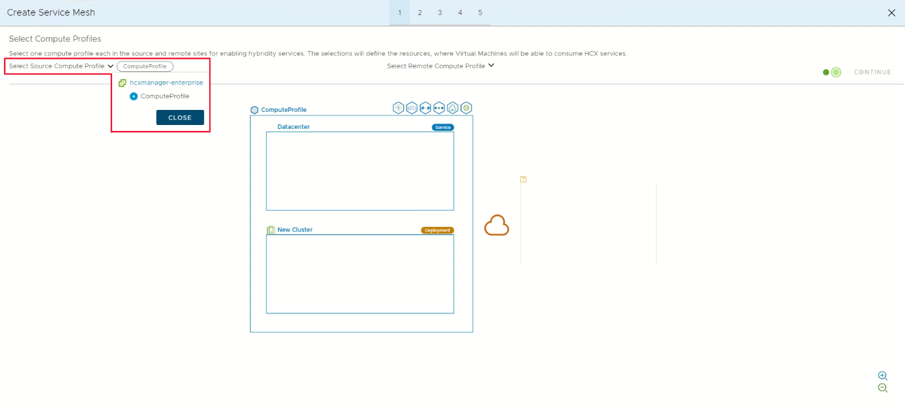
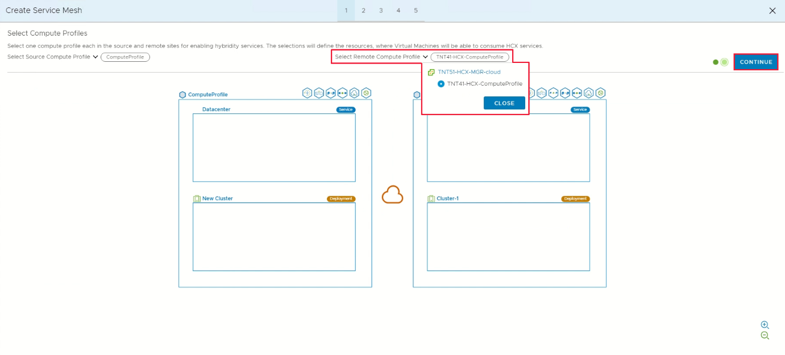
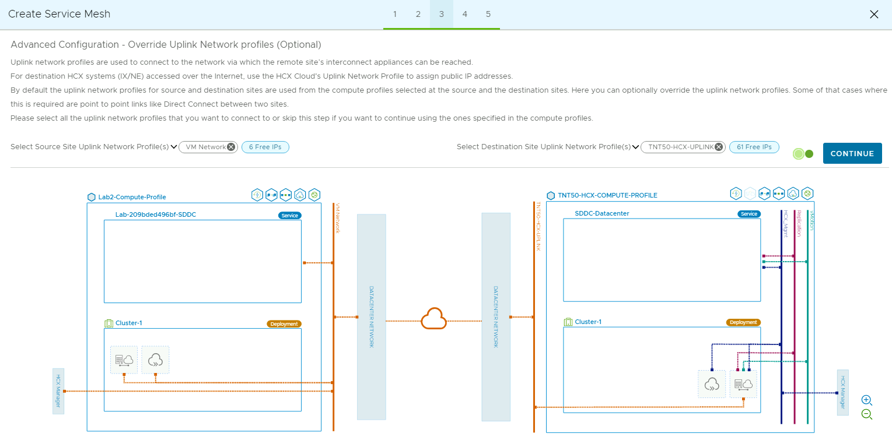
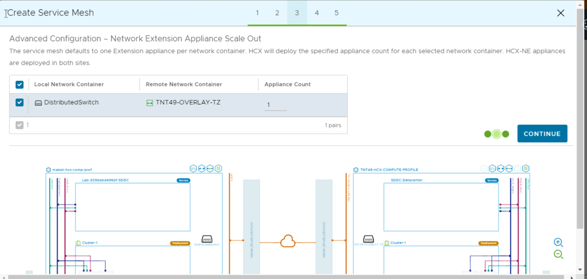
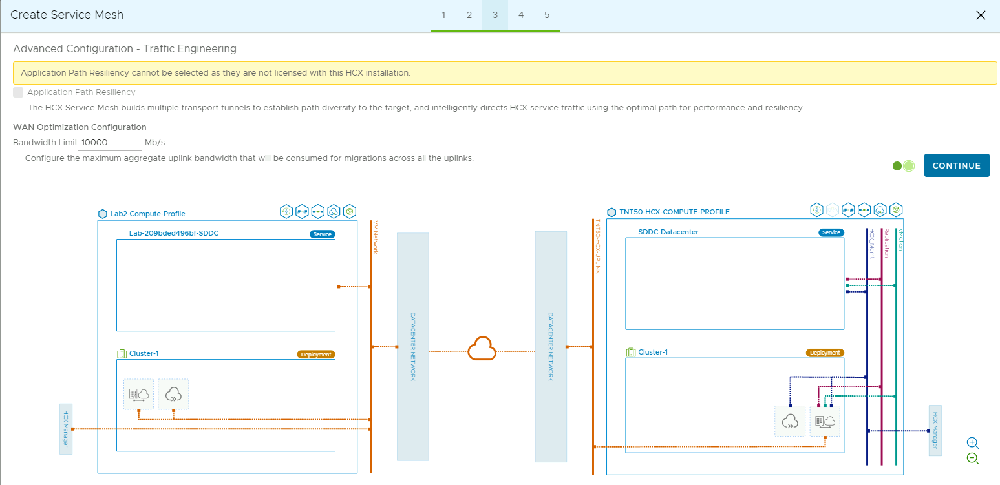
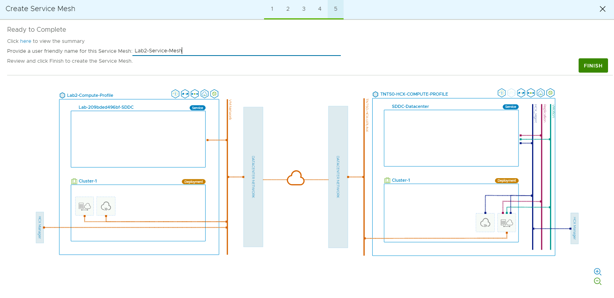
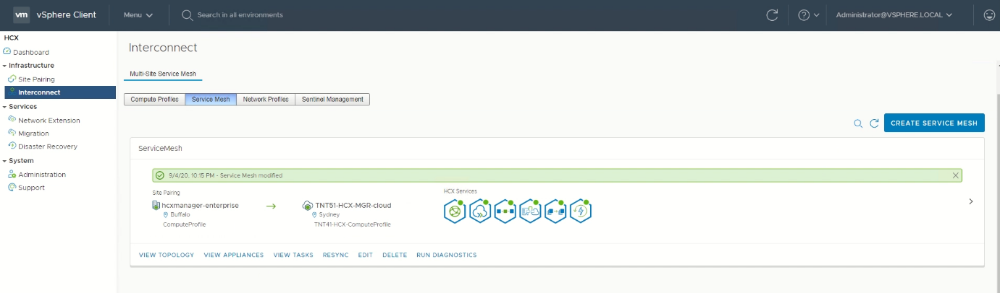
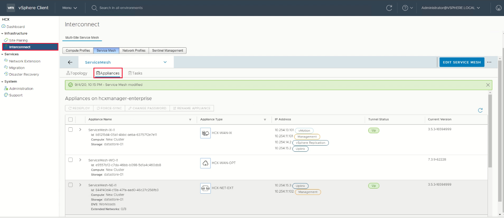

## **Task 11: Create a service mesh**

In this section, we will be creating the service mesh

**Important Note -** Make sure ports UDP 500/4500 are open between your
On-Premises VMware HCX Connector 'uplink' network profile addresses and the
Azure VMware Solution HCX Cloud 'uplink' network profile addresses.

1.  Create a Service Mesh

    

2.  Select the source and remote compute profiles from the drop-down lists, and
    then select **Continue**.

    

3.  Select the source and remote compute profiles from the drop-down lists, and
    then click **Continue**. Leave “Select Services to be activated” as default,
    click **Continue**.

    

4.  In **Advanced Configuration - Override Uplink Network profiles**, select the
    uplink profile created earlier and **Continue**.

    Uplink network profiles connect to the network through which the remote
    site's interconnect appliances can be reached.

    

5.  **In Advanced Configuration – Network Extension Appliance Scale Out**, keep
    1 as default appliance and the click **Continue**.

    

6.  **In Advanced Configuration – Traffic Engineering**, review and select
    **Continue**.

    

7.  Review the topology preview and select **Continue. En**ter a user-friendly
    name for this service mesh and select **Finish** to complete.

    >**Note** the appliance names are derived from service mesh name (it's the
    appliance prefix, essentially).

    

8.  The Service Mesh deployment will take 5-10 minutes to complete. Once
    successful, you will see the services as green

    

9.  Select **Interconnect \> Appliances**

    

    The HCX interconnect tunnel status should indicate **UP** and in green.
    You're ready to migrate and protect Azure VMware Solution VMs using VMware
    HCX. Azure VMware Solution supports workload migrations (with or without a
    network extension). So you can still migrate workloads in your vSphere
    environment, along with On-Premises creation of networks and deployment of
    VMs onto those networks. For more information, see the [VMware HCX
    Documentation](https://docs.vmware.com/en/VMware-HCX/index.html)

>**While we wait, let’s discuss the migration options**

## Next Steps

[Module 2, Task 12](module-2-task-12.md)

[Module 2 Index](module-2-index.md)

[Main Index](index.md)