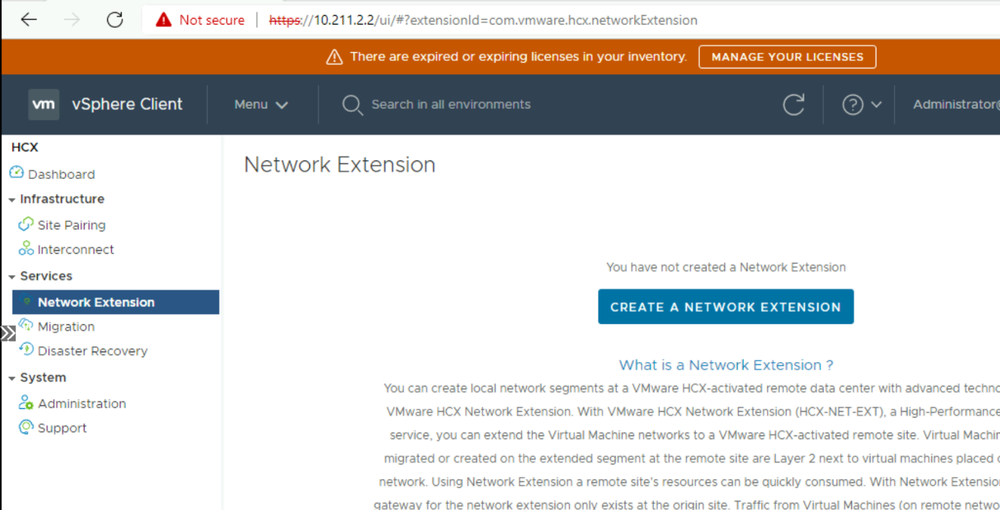
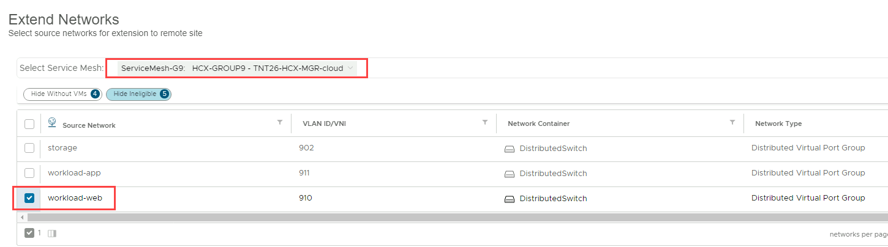
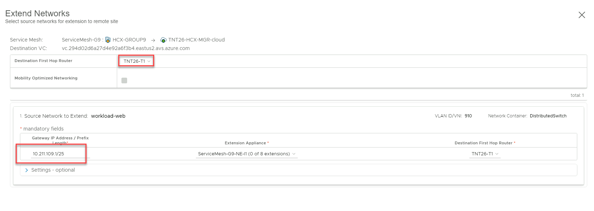
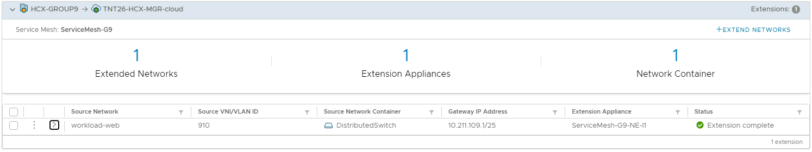

## **Task 12 Setup the Network Extension**

Once the Service Mesh appliances have been deployed, the next important step is
to extend the on-premise network to AVS, so that any migrated VM’s will be able
to retain their existing IP address and be accessible from all locations

1.  Navigate to **Network Extension,** Create a Network Extension

    

2.  Select the service mesh and segment to extend. In this lab, we will extend
    **workload-web**

    

3.  Select the First Hop Router, in this Lab there is only 1 option –
    **TNTXX-TI**

4.  Enter the Workload Web Gateway IP as 192.168.**XY**.1/25 (use 01 for particpant 1, 02 for participant 2, etc.) for example, Group 1 participant 1 will be 101, group 1 participant 10 will be 110.

    

5.  Submit, this will start the process of extending the network by creating a
    remote stretch record and network bridges on the remote AVS side. This will
    take about 3-5 minutes to complete

    

## Next Steps

[Module 2, Task 13](module-2-task-13.md)

[Module 2 Index](module-2-index.md)

[Main Index](index.md)