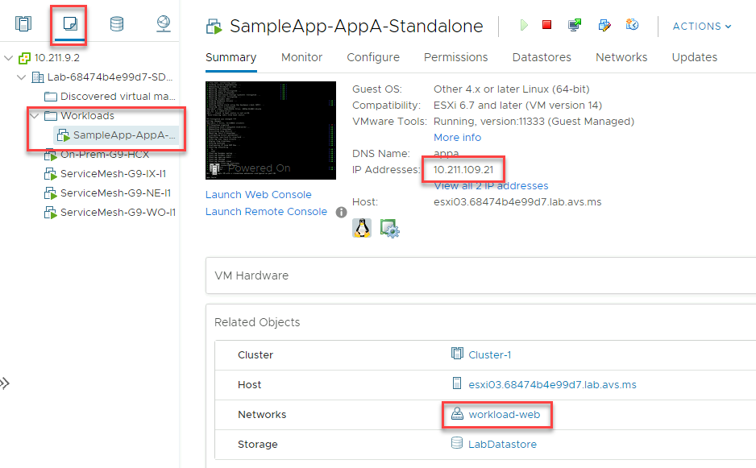
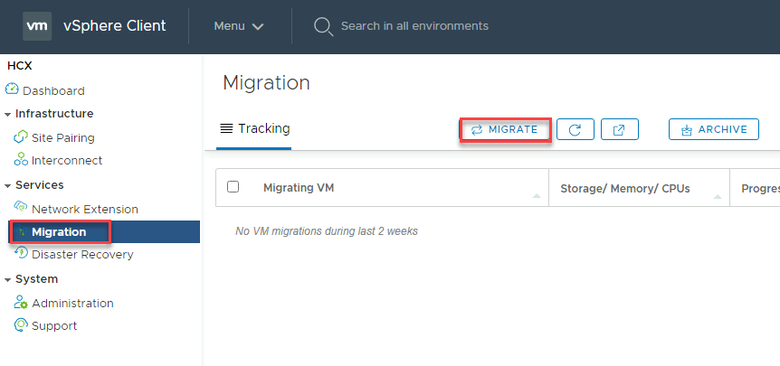
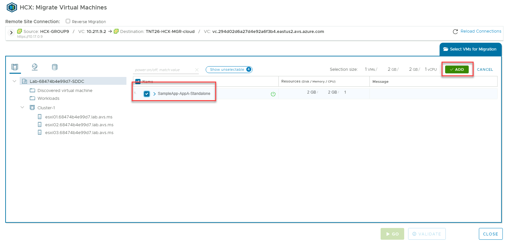
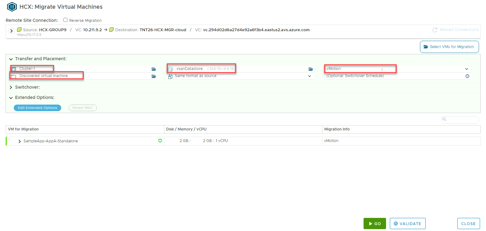
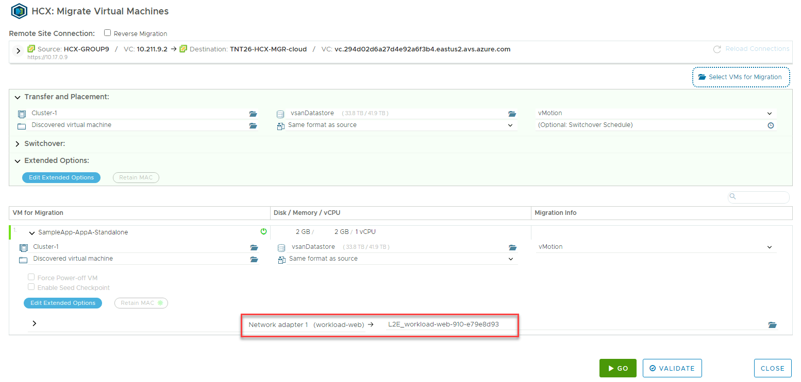

## **Task 13: Migrate a VM using HCX and vMotion**

Now that the Service Mesh appliances have been deployed successfully, we can now
migrate workloads from on-premises to AVS. In this lab, we will migrate a Test
VM using vMotion

As part of the on-premises lab, you will see a VM folder named **Workloads** and
a VM called **SampleApp-AppA-Standalone** already connected to our
**workload-web** network

1.  **To test a migration of this VM, from the HCX Menu, select Migration and
    the Migrate button**

    

2.  **Select the SampleApp-AppA-Standalone VM and Add**

    

3.  Here we have to specify our destination AVS settings and where to migrate this VM

    3.1.  Computer Container: **Select Cluster-1**

    3.2.  Destination Folder: **Any folder**

    3.3.  Destination Storage: **vsanDatastore**

    3.4.  Migration Profile: **vMotion**

    

4.  Validation step, expand **VM for Migration**, note the Network Adapter is automatically filled in. This is the network extension adapter that was created in the previous task (optional)

    

5.  Select Validate and Go – This will migrate the VM to AVS. Since this is vMotion, there is no downtime experienced and the VM is moved without any disruption

## Next Steps

[Module 3, Index](module-3-index.md)

[Module 2 Index](module-2-index.md)

[Main Index](index.md)