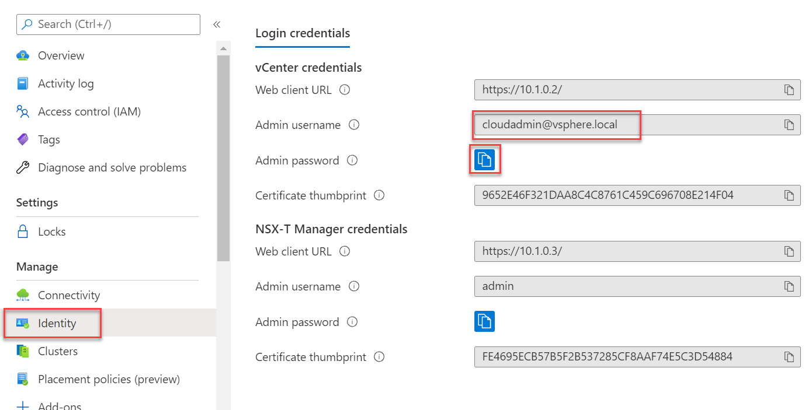
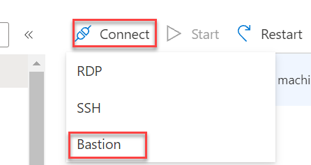

# Task 2 (Preconfigured): Download the HCX OVA to On-Premises vCenter

The next step is to download HCX onto our On-Premises VMware solution, this will
allow us to setup the connectivity to AVS and allow us to migrate. The HCX
appliance is provided by VMware and has to be requested from within the AVS HCX
Manager

>**NOTE: This task has been completed for you in lab environment**

1.  Obtain the AVS vCenter credentials by going to the AVS Private Cloud,
    selecting Identity. Note this down for next steps

    

**Please access your own Bastion VM created at the beginning of the exercises. This is for reference purposes only.**

2.  Navigate to the Azure portal to the Virtual Machines blade, select the
    **GROUP\#-AVS-jumpbox** which is in the **GROUP\#-AVS-Jumpbox** Resource
    Group.

3.  Then click **Connect \> Bastion**  
    Reminder: This is only possible since we have connected AVS to our VNet via
    our Virtual Network Gateway (Module 1, Task 1)

    

4.  Use the credentials:

    username: avsjump

    password: see Getting Started section

5.  Once logged in, browse to the AVS HCX Manager URL

    5.1.  <https://HCXCloudManagerIP> (see screenshot below)

    5.2.  Enter the [cloudadmin@vsphere.local](mailto:cloudadmin@vsphere.local)
        credentials from Step 1. You can get this URL from your AVS as shown below

       

6.  Once logged in, Go to System Updates

    

    The Request Download Link button will be Greyed out initially but will be
    live after a minute or two. Do not navigate away from this page

    Once available, you will have an option to Download the OVA or Copy a Link.
    This link is valid for 1 week

## Next Steps

[Module 2, Task 3](module-2-task-3.md)

[Module 2 Index](module-2-index.md)

[Main Index](index.md)
