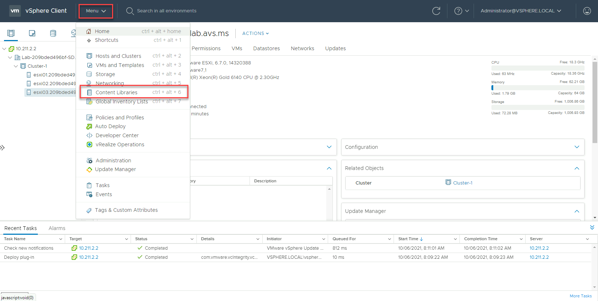
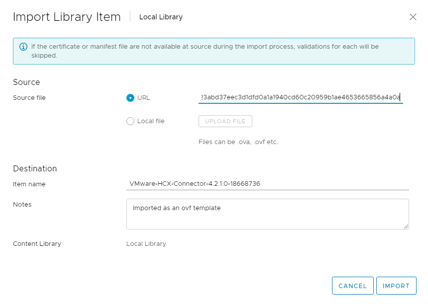

# **Task 3 (**Preconfigured**) : Import the OVA file to the On-Premises vCenter**

In this step we will import the HCX appliance into the on premises vCenter

>**NOTE: This task is already completed in your lab environment**

1.  From the Jumpbox, browse to the On-Premises vCenter URL, See [Getting
    Started](getting-started#on-premises-vmware-lab-environment) section for more information and login
    details

2.  Go to Menu \> Content Libraries

    

3.  Create a new content library if one doesn’t exist

4.  Once done, select Actions \> Import Item

5.  Enter HCX URL copied from Task 3, Step 6

    

6.  Accept any prompts and actions and proceed. The HCX OVA will download to the
    library in the background

## Next Steps

[Module 2, Task 4](module-2-task-4.md)

[Module 2 Index](module-2-index.md)

[Main Index](index.md)