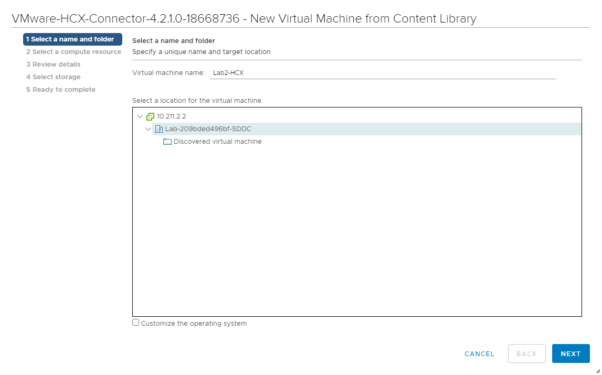
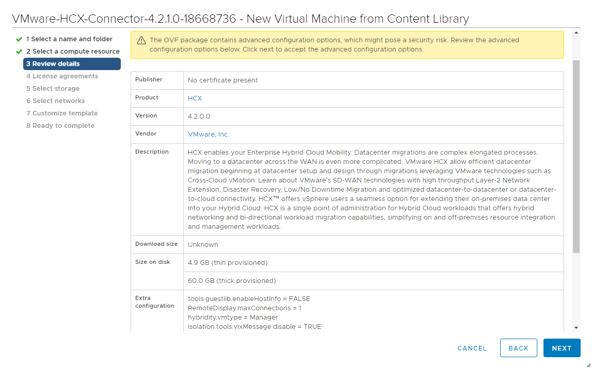
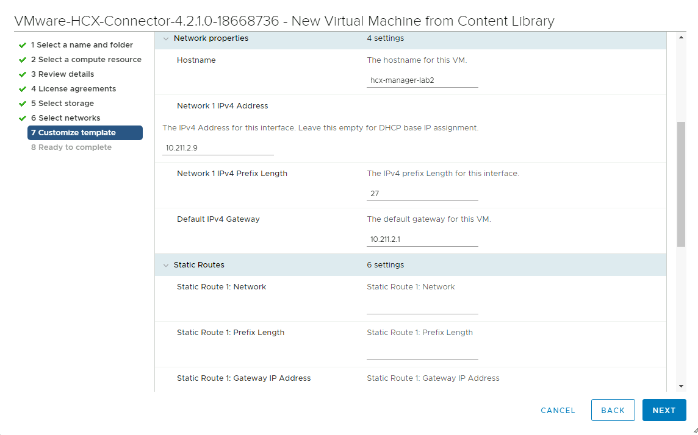
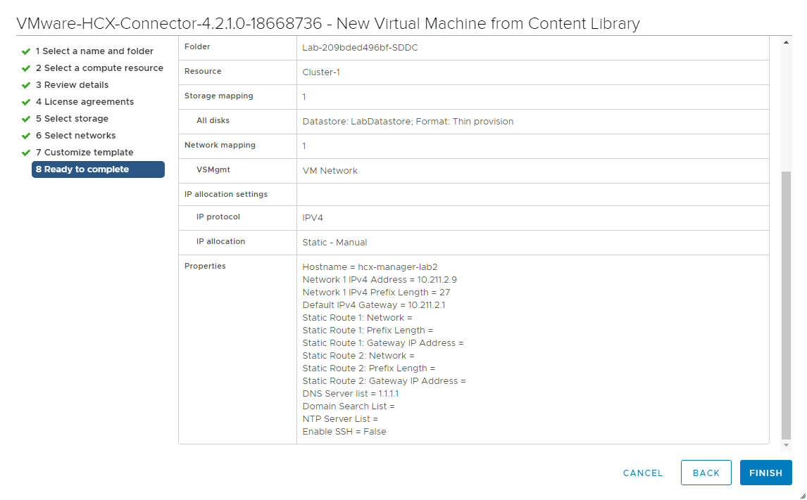

## **Task 4: Deploy the HCX OVA to On-Premises vCenter**

In this step, we will deploy the HCX VM with the configuration from the Getting
Started section

1.  Once the import is complete, Right Click this template \> New VM from This
    Template

    

2.  Give the VM a **Name**, select the **Cluster**, **Datastore** and
    **Network**

    

    

    

    

    

3.  In this step, we will configure the HCX appliance with the information from
    the Getting Started page. This is important as we need to specify the HCX
    manager password, hostname, and network information. In the real world,
    careful planning would have been done to identity the network and ranges to
    be used for HCX.

    Enter the following details next

    | **Property**                            | **Value**                                                                                                              |
    |-----------------------------------------|------------------------------------------------------------------------------------------------------------------------|
    | Hostname                                | Any name (Suggestion: HCXGROUP**\#**) **Note: Do not leave a space in the name as this causes the webserver to fail)** |
    | CLI "admin" User Password/root Password | 0hDG3VqFyTd!                                                                                                           |
    | Network 1 IPv4 Address                  | 10.211.**X**.9                                                                                                         |
    | Network 1 IPv4 Prefix Length            | 27                                                                                                                     |
    | Default IPv4 Gateway                    | 10.211.**X**.1                                                                                                         |
    | DNS Server list                         | 1.1.1.1                                                                                                                |

    

    

    

    

4.  Once done, navigate to Menu \> VM’s and Templates \> Power on the newly
    created HCX Manager VM. The boot process will take 5-10 minutes to complete

## Next Steps

[Module 2 Task 5](module-2-task-5.md)

[Module 2 Index](module-2-index.md)

[Main Index](index.md)