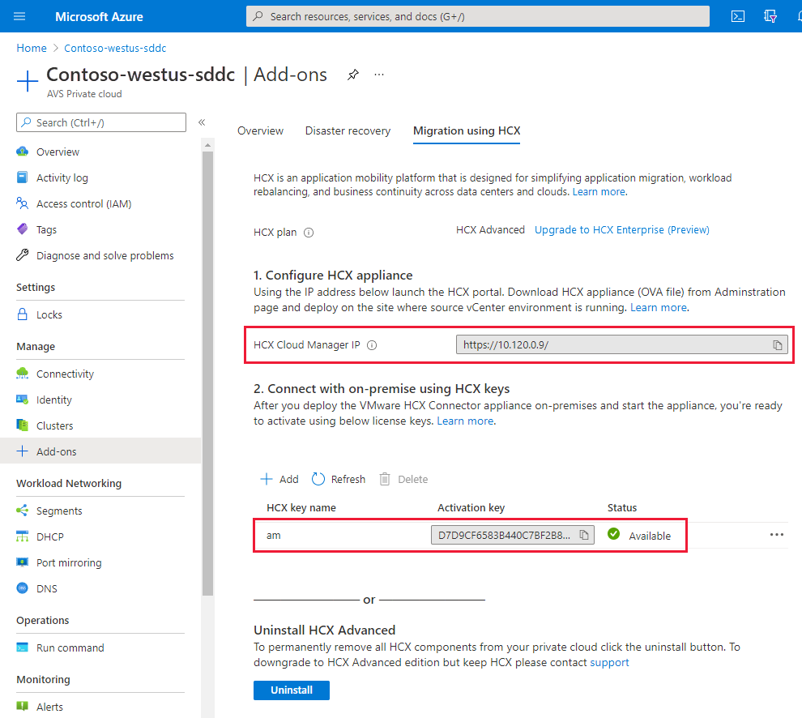

# Task 5: Obtain HCX License Key

While the HCX installation runs, we will need to obtain a license key to
activate HCX. This is available from the AVS environment.

1.  Navigate to AVS, go to **Add-ons \> Migration using HCX**

2.  Select Add to enter a key name, once added a new Activation Key will appear

    

## Next Steps

[Module 2, Task 6](module-2-task-6.md)

[Module 2 Index](module-2-index.md)

[Main Index](index.md)