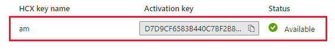
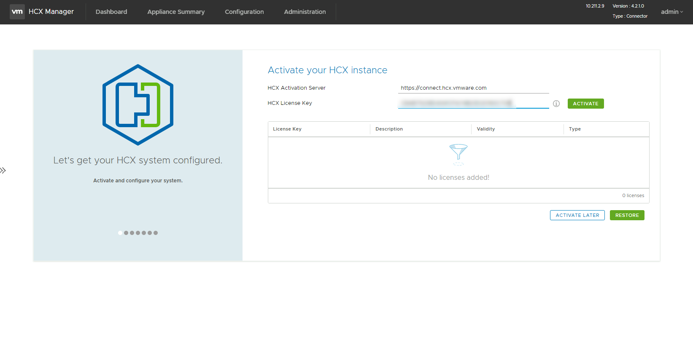
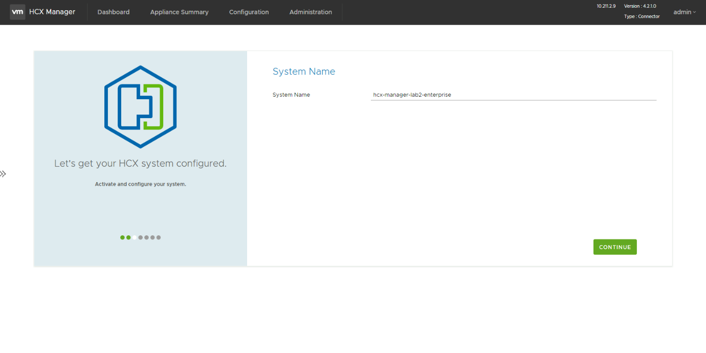
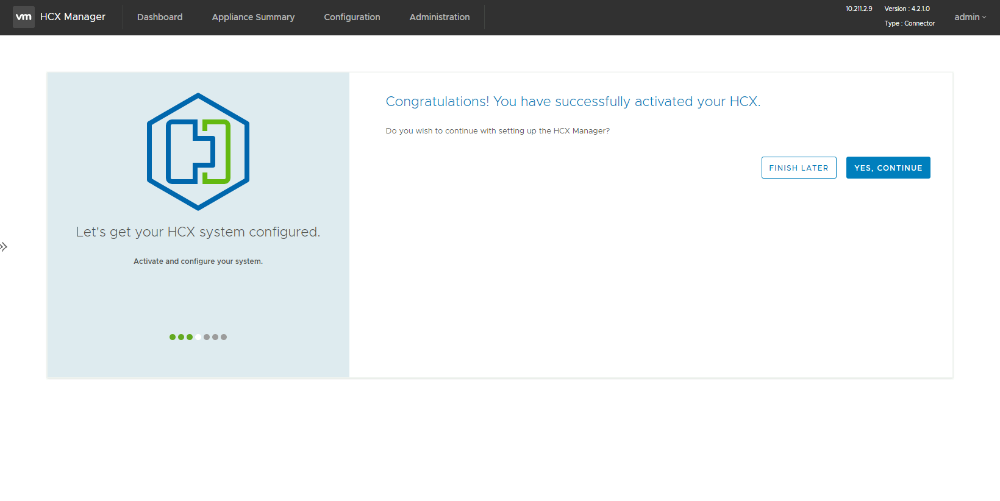

# Task 6: Activate VMware HCX

In this task, we will activate the On-Premises HCX appliance that we just
deployed in Task 5

1.  Browse to the On-Premises HCX Manager IP specified in Task 4 on port 9443 IP
    and login (Make sure you use **https://** in the address bar in the browser)

    1.1.  <https://10.211.x.9:9443>

2.  Login using the **HCX Credentials** specified in Task 4

    2.1.  Username: admin

    2.2.  Password: Specified earlier in Task 4 (step 3).

3.  Obtain and Copy the HCX license from the AVS1 Private Cluster in Azure (See
    Module 2, Task 2)

    

4.  Once logged in, In **Licensing**, enter your key for **HCX Advanced Key**
    and select **Activate**. This process can take several minutes.

    

5.  In **Datacenter Location**, provide the nearest location for installing the
    VMware HCX Manager On-Premises. Then select **Continue**.

6.  In **System Name**, modify the name or accept the default and select
    **Continue**.

    

7.  Click “**Yes,** **Continue”** for completing next task.

    

## Next Steps

[Module 2, Task 7](module-2-task-7.md)

[Module 2 Index](module-2-index.md)

[Main Index](index.md)