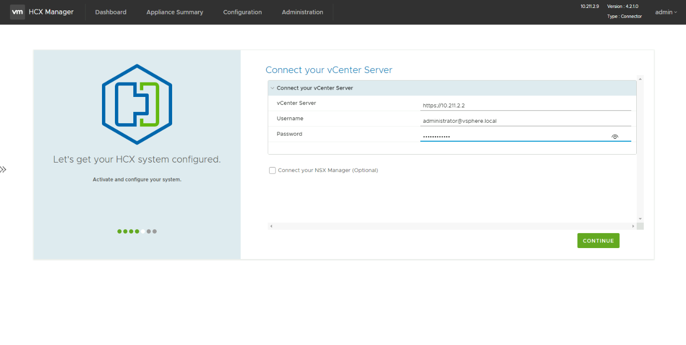
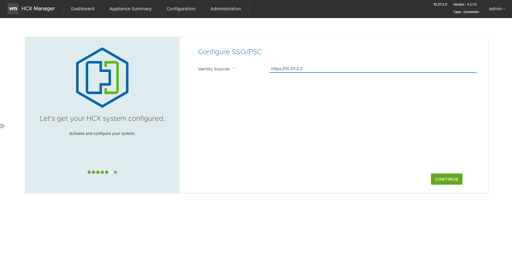
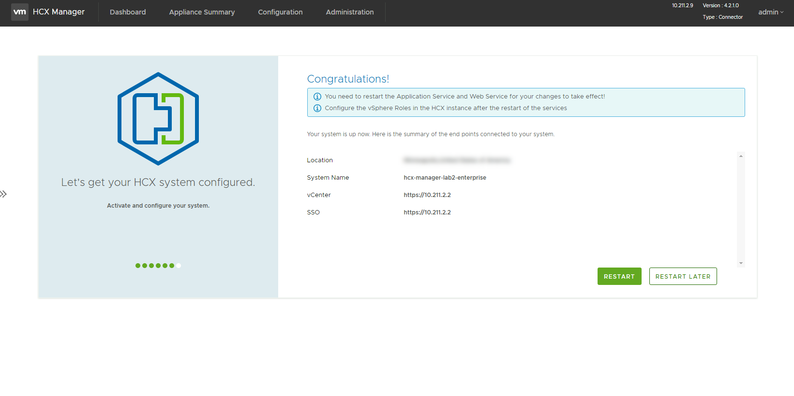
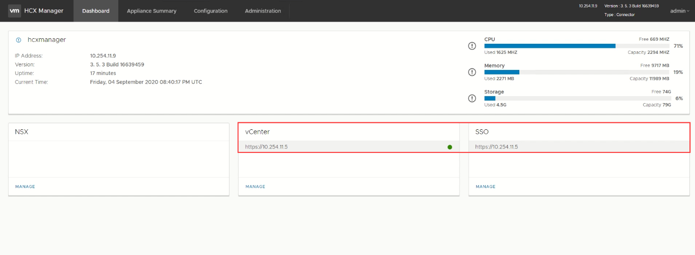

## **Task 7: Configure HCX and connect to vCenter**

In this section, we will integrate HCX Manager with the On-Premises vCenter

1.  In **Connect your vCenter**, provide the FQDN or IP address of on-premise
    vCenter server and the appropriate credentials, and then select
    **Continue**., see Getting Started Section for more details

    1.1.  In this lab, this is <https://192.168.XY.2>

    1.2.  Username:
        [administrator@vsphere.local](mailto:administrator@vsphere.local)

    1.3.  Password: 0hDG3VqFyTd!

    

2.  In **Configure SSO/PSC**, provide the same vCenter IP address, and select
    **Continue**.

    2.1.  https://192.168.XY.2

    

3.  Verify that the information entered is correct and select **Restart**.

    

    The restart may take up to 5 minutes

4.  After the services restart, you'll see vCenter showing as **Green** on the
    screen that appears. Both vCenter and SSO must have the appropriate
    configuration parameters, which should be the same as the previous screen.

    

    > **Note**: It may take an additional 5-10 minutes for the HCX plugins to be
    installed in vCenter, log back out and log back in if it does not show up
    automatically

## Next Steps

[Module 2, Task 8](module-2-task-8.md)

[Module 2 Index](module-2-index.md)

[Main Index](index.md)