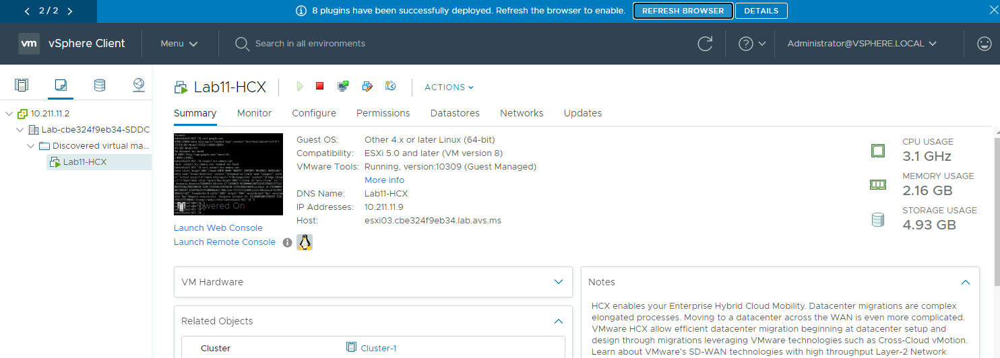
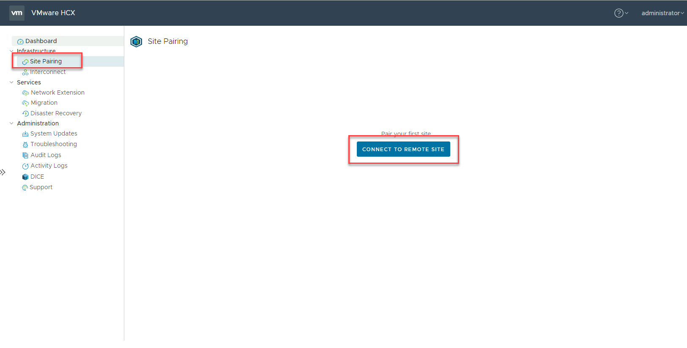
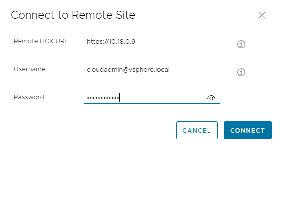
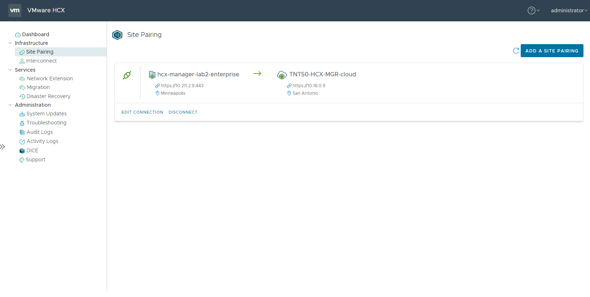

## **Task 8: Create Site Pairing from On-premises HCX to AVS HCX**

In this task, we will be creating the Site Pairing to connect the On-Premises
HCX appliance to the AVS HCX appliance

1.  Sign into your On-Premises vCenter

    1.1.  URL: https://10.X.Y.2

    1.2.  Username:
        administrator@vsphere.local

    1.3.  Password: 0hDG3VqFyTd!

2.  You may see a banner item to Refresh the browser, this will load the newly
    installed HCX modules. If you do not see this, log out and log back into
    vCenter

    

3.  Under **Menu**, Select **HCX**

4.  Navigate to Site Pairing \> Connect to Remote Site

    

5.  Enter remote site AVS HCX IP address and login credentials from the Azure
    Portal. See Getting Started section for more details.

    **Note** Ideally the identity provided in this step should be an AD based
    credential with delegation instead of the cloudadmin account.

    

6.  Accept certificate warning and Import. Connection to the remote site will be
    established

    

## Next Steps

[Module 2, Task 9](module-2-task-9.md)

[Module 2 Index](module-2-index.md)

[Main Index](index.md)