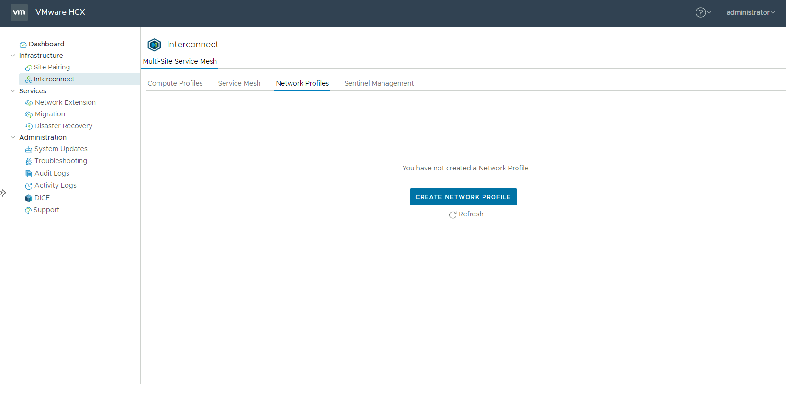
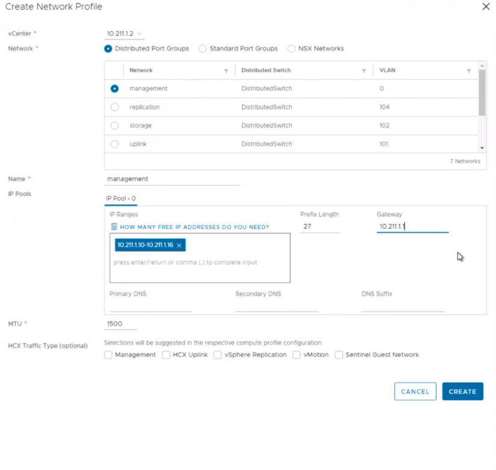
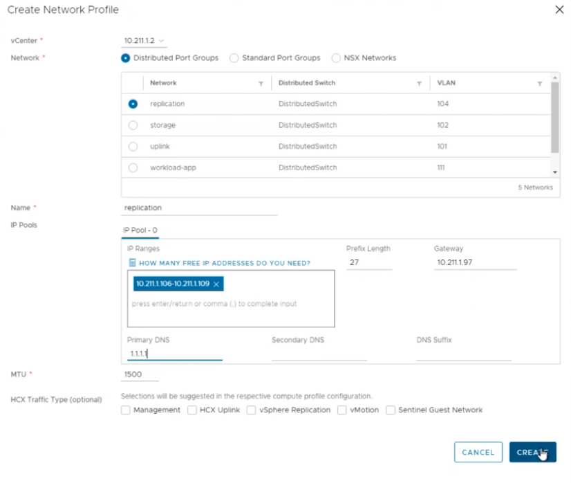
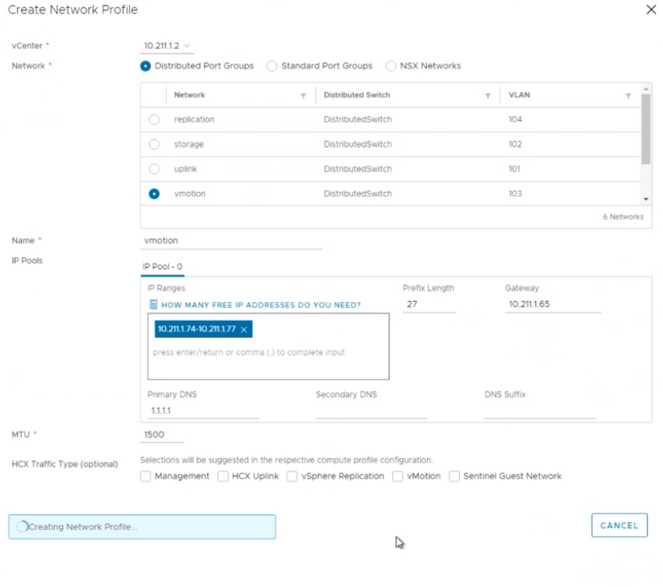

## Task 9: Create network profiles

VMware HCX Connector deploys a subset of virtual appliances (automated) that
require multiple IP segments. You’ll create four network profiles.

**Note**: Customer’s environments may vary and may not have separate networks.

-   Management

-   vMotion

-   Replication

-   Uplink

These networks have been defined for you, please see below section

In the real customer environment, these will have been planned and identified
previously, see here for the [planning
phase](https://docs.microsoft.com/en-us/azure/azure-vmware/plan-private-cloud-deployment#define-vmware-hcx-network-segments)

1.  Select Interconnect \> Network Profiles

    

2.  Create a network profile, use IP addresses allocated during the planning
    phase. In this lab, these are in the [Getting
    Started](#_On-Premises_HCX_details_1) section. We will create 4 separate
    network profiles:
    -  Management
    -  vMotion
    -  Replication
    -  Uplink

3.  Create Management network profiles

    3.1. Select “Distributed Port Groups”

    3.2. Select Management Network

    **Replace "X" with your group number.**
    
    **Replace "Y" with your participant number.**

    Management Network Profile

    | **Property**               | **Value**                       |
    |----------------------------|---------------------------------|
    | Management Network IP      | 10.**X**.**Y**.10-10.**X**.**Y**.16 |
    | Prefix Length              | 27                              |
    | Management Network Gateway | 10.**X**.**Y**.1                  |

    

4.  Repeat the similar steps for “Replication”, “vMotion” and “Uplink”. Use the
    configuration details provided below.

    **Replace "Y" with your participant number.**

    vMotion Network Profile

    | **Property**            | **Value**                       |
    |-------------------------|---------------------------------|
    | vMotion Network IP      | 10.**X**.**Y**.74-10.**X**.**Y**.77 |
    | Prefix Length           | 27                              |
    | vMotion Network Gateway | 10.**X**.**Y**.65                |
    | DNS                     | 1.1.1.1                         |

    Replication Network Profile

    | **Property**                | **Value**                         |
    |-----------------------------|-----------------------------------|
    | Replication IP              | 10.**X**.**Y**.106-10.**X**.**Y**.109 |
    | Prefix Length               | 27                                |
    | Replication Network Gateway | 10.**X**.**Y**.97                   |
    | DNS                         | 1.1.1.1                           |

    Uplink Network Profile

    | **Property**           | **Value**                       |
    |------------------------|---------------------------------|
    | Uplink Network IP      | 10.**X**.**Y**.34-10.**X**.**Y**.40 |
    | Prefix Length          | 28                              |
    | Uplink Network Gateway | 10.**X**.**Y**.33                 |
    | DNS                    | 1.1.1.1                         |

    

    

## Next Steps

[Module 2, Task 10](module-2-task-10.md)

[Module 2 Index](module-2-index.md)

[Main Index](index.md)
