# **Module 2: Deploy HCX for VM Migration**
- [**Module 2: Deploy HCX for VM Migration**](#module-2-deploy-hcx-for-vm-migration)
  - [Scenario](#scenario)
  - [Introduction](#introduction)
  - [Agenda for next 60 mins:](#agenda-for-next-60-mins)
  - [**Task 1 (Preconfigured) : Install VMware HCX on AVS Private Cloud**](#task-1-preconfigured--install-vmware-hcx-on-avs-private-cloud)
  - [**Task 2 (Preconfigured): Download the HCX OVA to On-Premises vCenter**](#task-2-preconfigured-download-the-hcx-ova-to-on-premises-vcenter)
  - [**Task 3 (**Preconfigured**) : Import the OVA file to the On-Premises vCenter**](#task-3-preconfigured--import-the-ova-file-to-the-on-premises-vcenter)
  - [**Task 4: Deploy the HCX OVA to On-Premises vCenter**](#task-4-deploy-the-hcx-ova-to-on-premises-vcenter)
  - [**Task 5: Obtain HCX License Key**](#task-5-obtain-hcx-license-key)
  - [**Task 6: Activate VMware HCX**](#task-6-activate-vmware-hcx)
  - [**Task 7: Configure HCX and connect to vCenter**](#task-7-configure-hcx-and-connect-to-vcenter)
  - [**Task 8: Create Site Pairing from On-premises HCX to AVS HCX**](#task-8-create-site-pairing-from-on-premises-hcx-to-avs-hcx)
  - [**Task 9: Create network profiles**](#task-9-create-network-profiles)
  - [**Task 10: Create compute profiles**](#task-10-create-compute-profiles)
  - [**Task 11: Create a service mesh**](#task-11-create-a-service-mesh)
  - [**Task 12 Setup the Network Extension**](#task-12-setup-the-network-extension)
  - [**Task 13: Migrate a VM using HCX and vMotion**](#task-13-migrate-a-vm-using-hcx-and-vmotion)

## Scenario

Customer would like to migrate
workloads from On-Prem VMware environment to AVS Cloud Migration

## Introduction

VMware HCX™ is an application mobility platform designed for simplifying
application migration, workload rebalancing and business continuity across data
centres and clouds. HCX supports the following types of migrations:

-   Cold Migration - Offline migration of VMs

-   Bulk Migration - scheduled bulk VM (vSphere, KVM, Hyper-V) migrations with
    reboot – low downtime

-   HCX vMotion - Zero-downtime live migration of VMs – limited scale

-   Cloud to Cloud Migrations – direct migrations between VMware Cloud SDDCs
    moving workloads from region to region or between cloud providers

-   OS Assisted Migration – bulk migration of KVM and Hyper-V workloads to
    vSphere (HCX Enterprise feature)

-   Replication Assisted vMotion - Bulk live migrations with zero downtime
    combining HCX vMotion and Bulk migration capabilities (HCX Enterprise
    feature)

In this module, we will go through the steps to Install HCX, configure and
migrate a test VM to AVS

**For more information on HCX, please visit**
<https://www.vmware.com/products/hcx.html>

**Prerequisites:**

-   Ensure that Module 1 has been completed successfully as this will be
    required to connect HCX from AVS to the On-Premises Lab.  
    Jumphost from AVS1&2 should be able to ping following ip addresses:

    -   AVS1 vCenter: get from the Azure Portal

    -   AVS2 vCenter: get from the Azure Portal

    -   On-prem vCenter: 192.168.**\#**.2/24

>**Important: Make a note of Latency number from jumpbox to on-prem VM. We’ll use
that number for comparison after VM is moved from on-prem to AVS**

-   Review HCX documentation on VMware site. ([About the VMware HCX User
    Guide)](https://docs.vmware.com/en/VMware-HCX/4.0/hcx-user-guide/GUID-BFD7E194-CFE5-4259-B74B-991B26A51758.html)

## Agenda for next 60 mins:

| **Action Plan**                              | **Time required for each step** |
|----------------------------------------------|---------------------------------|
| Install VMWare HCX on AVS Private Cloud      | Preconfigured                   |
| Download HCX OVA to On-Premises vCenter      | Preconfigured                   |
| Import OVA to On-Premises vCenter            | Preconfigured                   |
| Deploy HCX to On-Premises vCenter            | 15 mins                         |
| Obtain HCX License Key                       | 5 mins                          |
| Activate VMWare HCX                          | 5 mins                          |
| Configure HCX and connect to vCenter         | 15 mins                         |
| Create Site Pairing from On-Premises to AVS  | 5 mins                          |
| Create network profiles                      | 5 mins                          |
| Create compute profiles                      | 5 mins                          |
| Create service mesh                          | 5 mins                          |
| Extend a Network                             | 10 mins                         |
| Create network extension                     | 5 mins                          |
| Migrate a VM                                 | 10 mins                         |

## **Task 1 (Preconfigured) : Install VMware HCX on AVS Private Cloud**

In the following task, we will be installing HCX on our AVS Private Cloud. This
is a simple process from the Add-Ins section in the Azure Portal, or via
Bicep/ARM/PowerShell

> **NOTE: This task has been completed for you in your AVS environment**

1.  Navigate to the Azure Portal, search for *Azure VMware Solution* in the
    search bar and select

    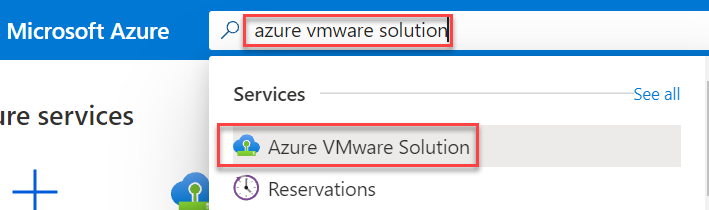

2.  Select your Private Cloud – GROUP\#-AVS1-SDDC

    

3.  Select **Add-ons** \> Migration using HCX

    

4.  Accept the terms and conditions and “**Enable and deploy”.** This process
    will take about 30 minutes to complete.

    >**Note: This step has already been done for you**

## **Task 2 (Preconfigured): Download the HCX OVA to On-Premises vCenter**

The next step is to download HCX onto our On-Premises VMware solution, this will
allow us to setup the connectivity to AVS and allow us to migrate. The HCX
appliance is provided by VMware and has to be requested from within the AVS HCX
Manager

>**NOTE: This task has been completed for you in lab environment**

1.  Obtain the AVS vCenter credentials by going to the AVS Private Cloud,
    selecting Identity. Note this down for next steps

    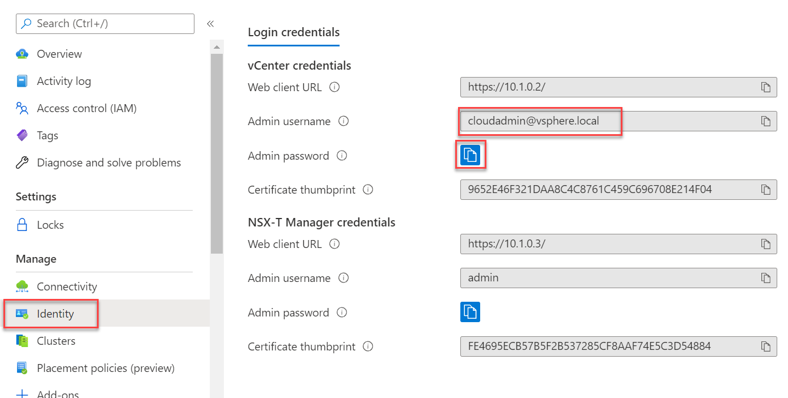

2.  Navigate to the Azure portal to the Virtual Machines blade, select the
    **GROUP\#-AVS-Jumpbox** which is in the **GROUP\#-AVS-Jumpbox** Resource
    Group.

3.  Then click **Connect \> Bastion**  
    Reminder: This is only possible since we have connected AVS to our VNet via
    our Virtual Network Gateway (Module 1, Task 1)

    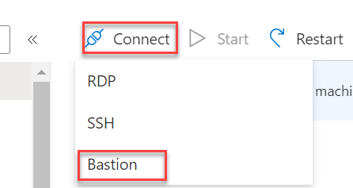

4.  Use the credentials:

    username: avsjump

    password: see Getting Started section

5.  Once logged in, browse to the AVS HCX Manager URL

    5.1.  <https://HCXCloudManagerIP> (see screenshot below)

    5.2.  Enter the [cloudadmin@vsphere.local](mailto:cloudadmin@vsphere.local)
        credentials from Step 1. You can get this URL from your AVS as shown below

       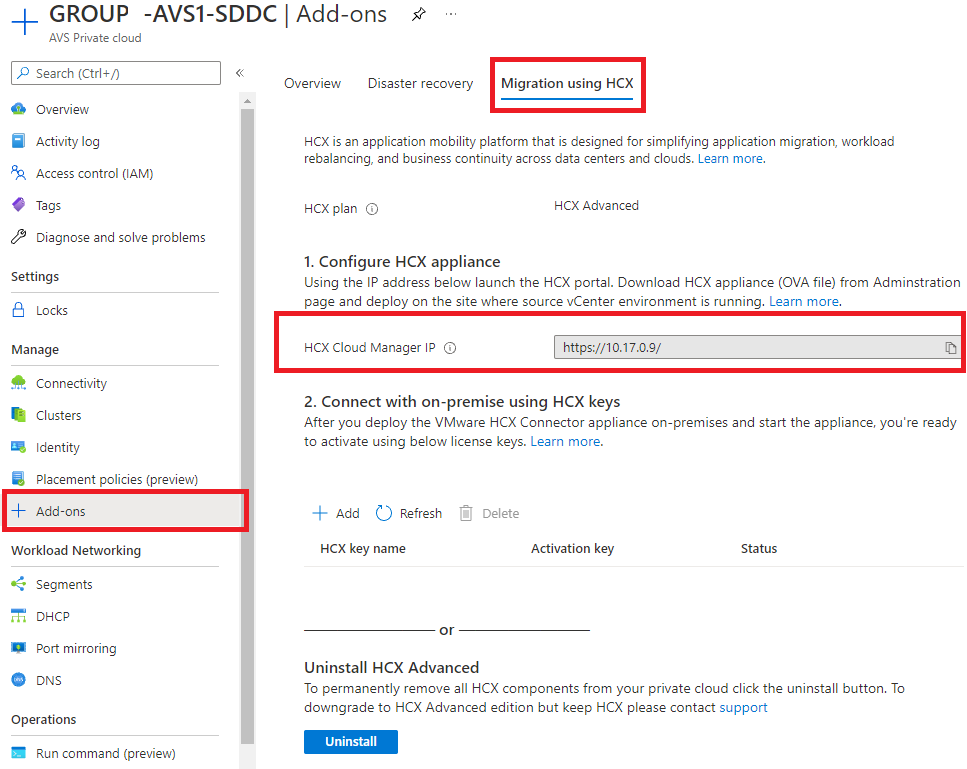

6.  Once logged in, Go to System Updates

    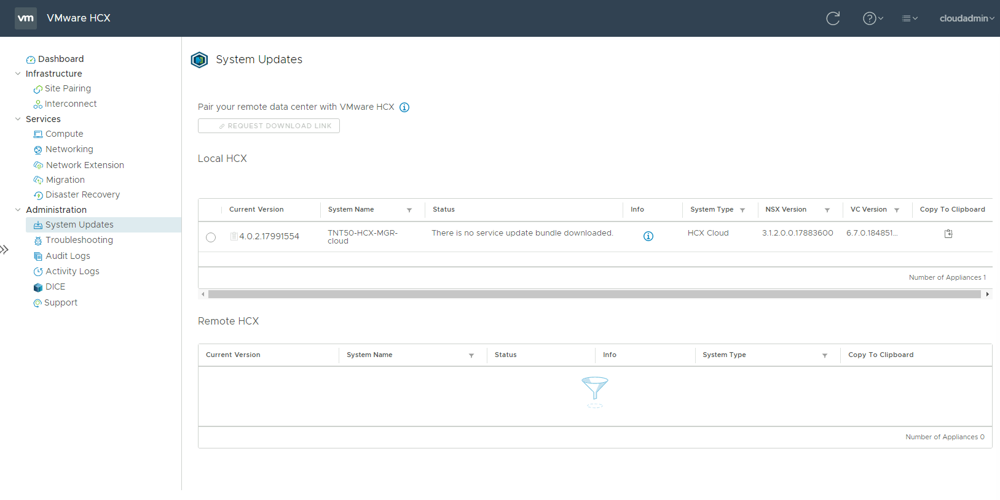

    The Request Download Link button will be Greyed out initially but will be
    live after a minute or two. Do not navigate away from this page

    Once available, you will have an option to Download the OVA or Copy a Link.
    This link is valid for 1 week

## **Task 3 (**Preconfigured**) : Import the OVA file to the On-Premises vCenter**

In this step we will import the HCX appliance into the on premises vCenter

>**NOTE: This task is already completed in your lab environment**

1.  From the Jumpbox, browse to the On-Premises vCenter URL, See [Getting
    Started](getting-started#on-premises-vmware-lab-environment) section for more information and login
    details

2.  Go to Menu \> Content Libraries

    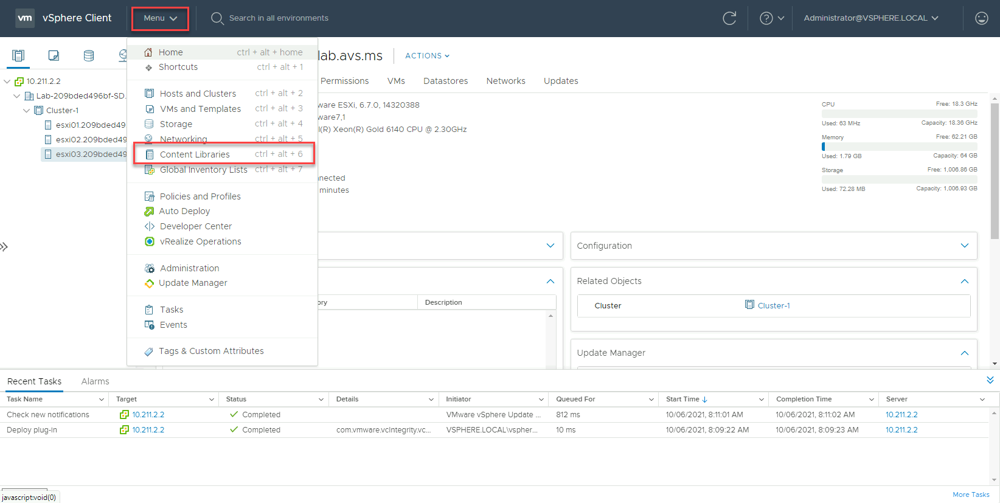

3.  Create a new content library if one doesn’t exist

4.  Once done, select Actions \> Import Item

5.  Enter HCX URL copied from Task 3, Step 6

    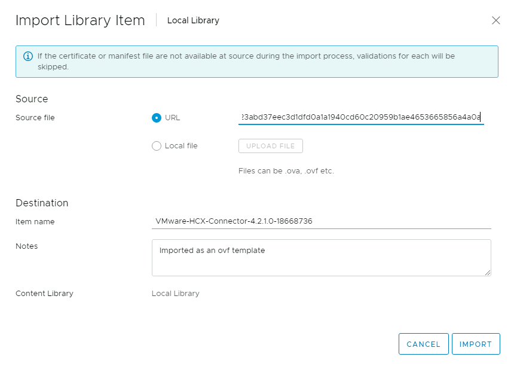

6.  Accept any prompts and actions and proceed. The HCX OVA will download to the
    library in the background

## **Task 4: Deploy the HCX OVA to On-Premises vCenter**

In this step, we will deploy the HCX VM with the configuration from the Getting
Started section

1.  Once the import is complete, Right Click this template \> New VM from This
    Template

    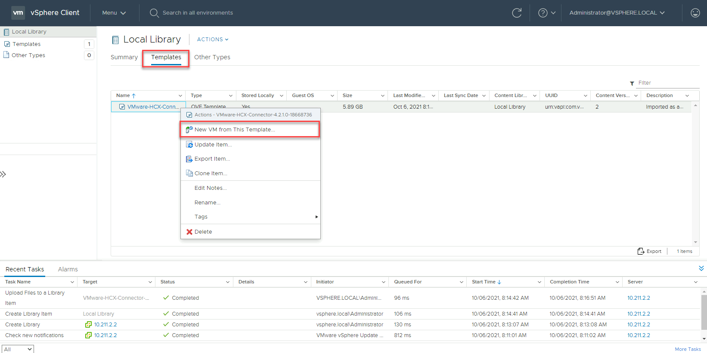

2.  Give the VM a **Name**, select the **Cluster**, **Datastore** and
    **Network**

    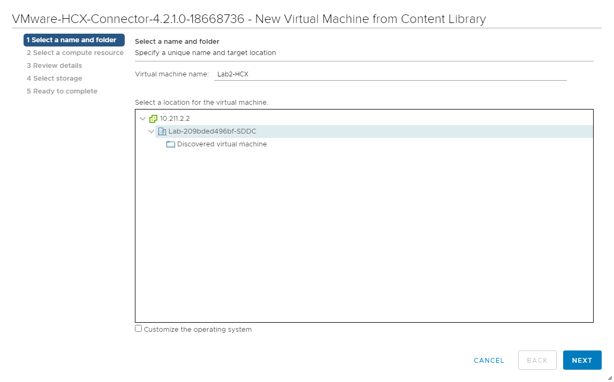

    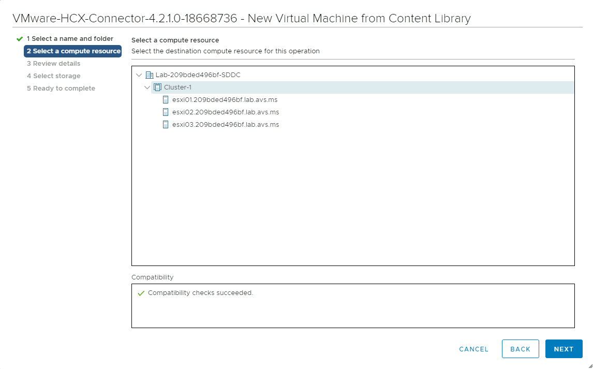

    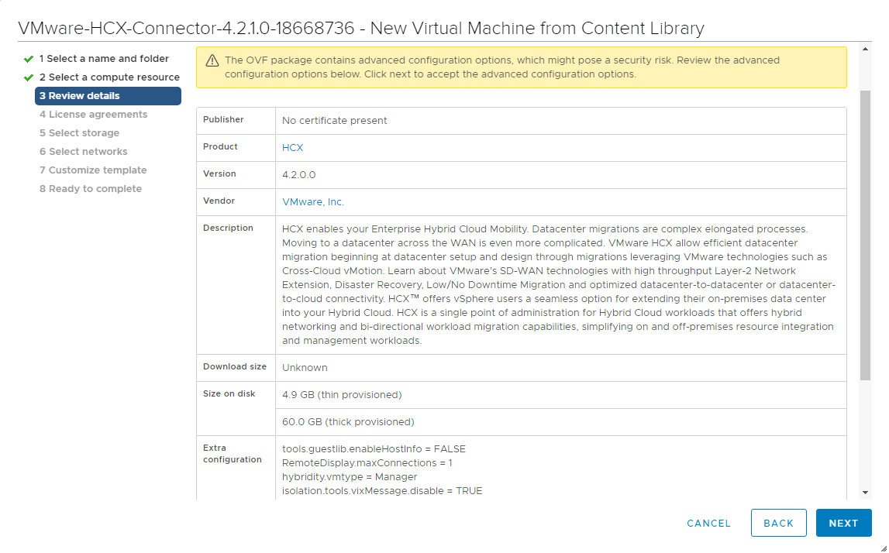

    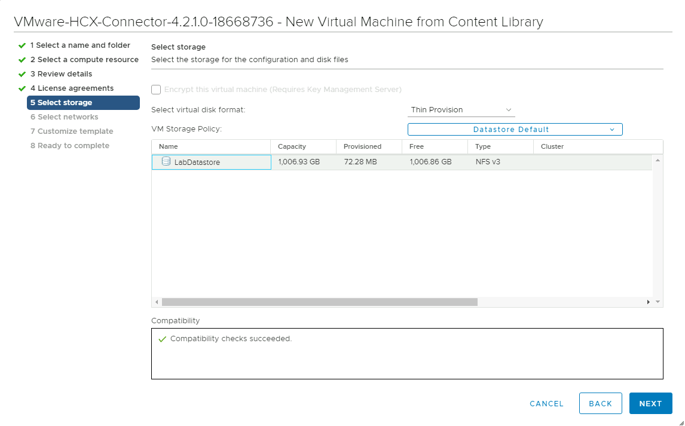

    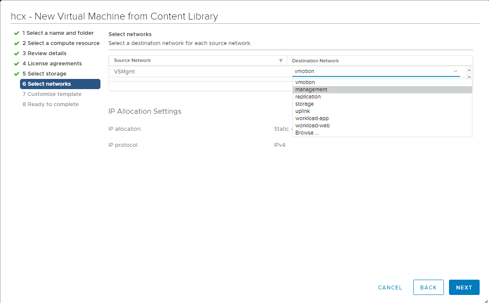

3.  In this step, we will configure the HCX appliance with the information from
    the Getting Started page. This is important as we need to specify the HCX
    manager password, hostname, and network information. In the real world,
    careful planning would have been done to identity the network and ranges to
    be used for HCX.

    Enter the following details next

    | **Property**                            | **Value**                                                                                                              |
    |-----------------------------------------|------------------------------------------------------------------------------------------------------------------------|
    | Hostname                                | Any name (Suggestion: HCXGROUP**\#**) **Note: Do not leave a space in the name as this causes the webserver to fail)** |
    | CLI "admin" User Password/root Password | 0hDG3VqFyTd!                                                                                                           |
    | Network 1 IPv4 Address                  | 192.168.**X**.9                                                                                                         |
    | Network 1 IPv4 Prefix Length            | 27                                                                                                                     |
    | Default IPv4 Gateway                    | 192.168.**X**.1                                                                                                         |
    | DNS Server list                         | 1.1.1.1                                                                                                                |

    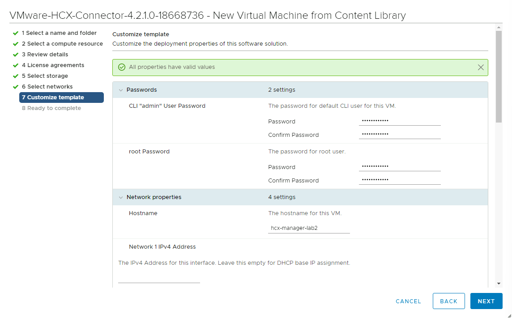

    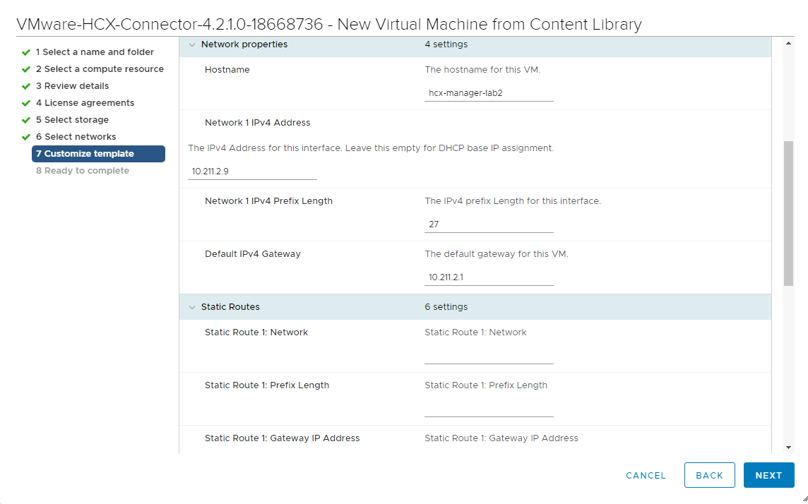

    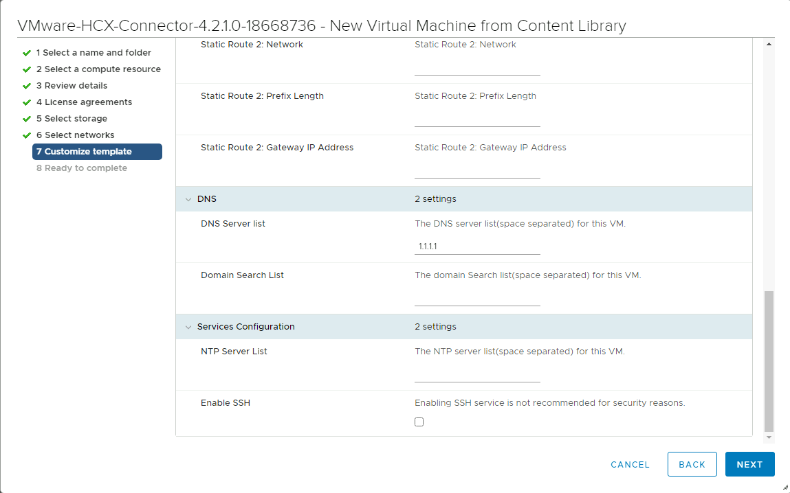

    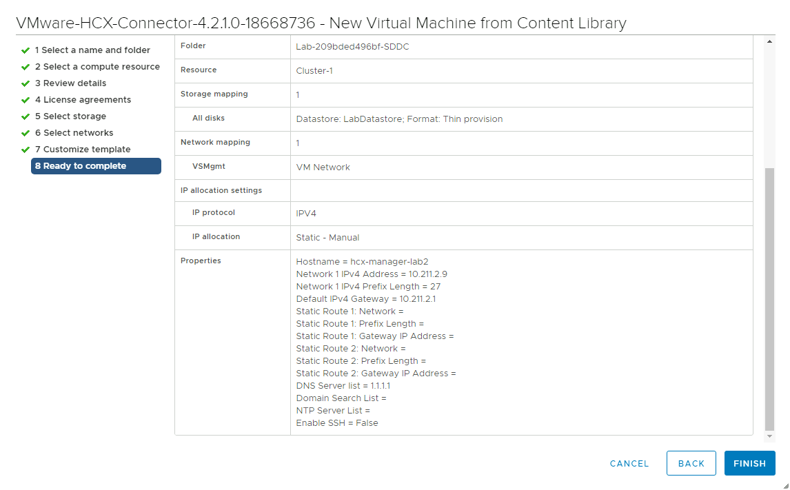

4.  Once done, navigate to Menu \> VM’s and Templates \> Power on the newly
    created HCX Manager VM. The boot process will take 5-10 minutes to complete

## **Task 5: Obtain HCX License Key**

While the HCX installation runs, we will need to obtain a license key to
activate HCX. This is available from the AVS environment.

1.  Navigate to AVS1, go to **Add-ons \> Migration using HCX**

2.  Select Add to enter a key name, once added a new Activation Key will appear

    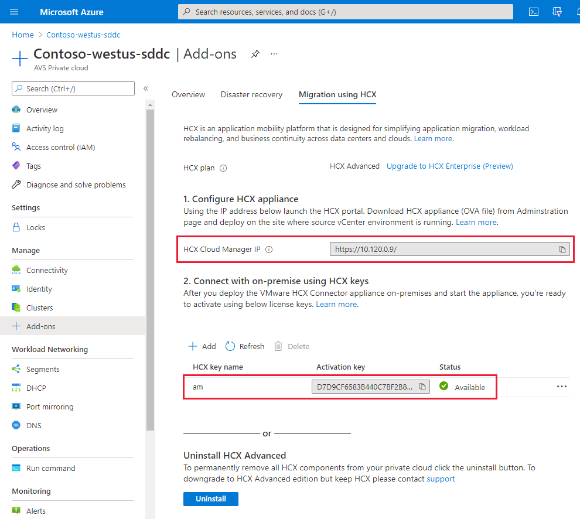

## **Task 6: Activate VMware HCX**

In this task, we will activate the On-Premises HCX appliance that we just
deployed in Task 5

1.  Browse to the On-Premises HCX Manager IP specified in Task 4 on port 9443 IP
    and login (Make sure you use **https://** in the address bar in the browser)

    1.1.  <https://192.168.x.9:9443>

2.  Login using the **HCX Credentials** specified in Task 4

    2.1.  Username: admin

    2.2.  Password: Specified earlier in Task 4 (step 3).

3.  Obtain and Copy the HCX license from the AVS1 Private Cluster in Azure (See
    Module 2, Task 2)

    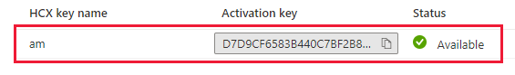

4.  Once logged in, In **Licensing**, enter your key for **HCX Advanced Key**
    and select **Activate**. This process can take several minutes.

    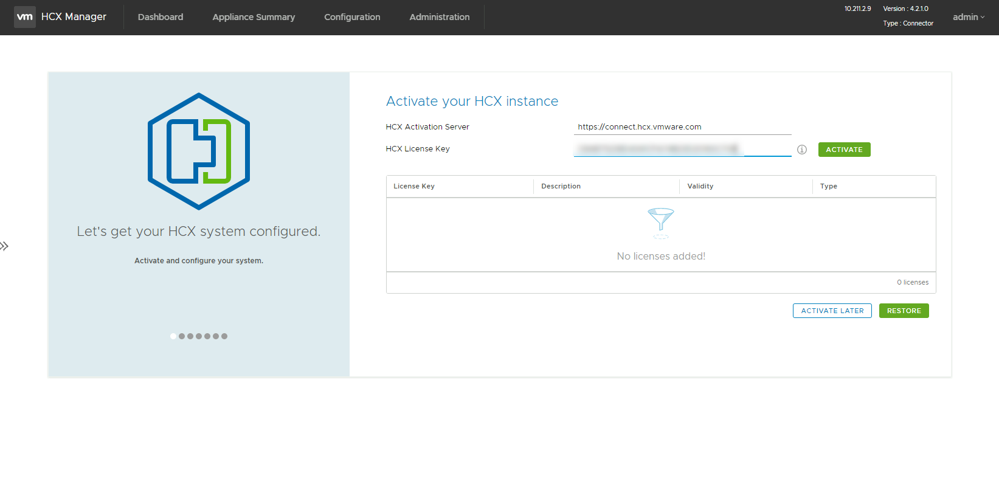

5.  In **Datacenter Location**, provide the nearest location for installing the
    VMware HCX Manager On-Premises. Then select **Continue**.

6.  In **System Name**, modify the name or accept the default and select
    **Continue**.

    

7.  Click “**Yes,** **Continue”** for completing next task.

    

## **Task 7: Configure HCX and connect to vCenter**

In this section, we will integrate HCX Manager with the On-Premises vCenter

1.  In **Connect your vCenter**, provide the FQDN or IP address of on-premise
    vCenter server and the appropriate credentials, and then select
    **Continue**., see Getting Started Section for more details

    1.1.  In this lab, this is <https://192.168.X.2>

    1.2.  Username:
        [administrator@vsphere.local](mailto:administrator@vsphere.local)

    1.3.  Password: 0hDG3VqFyTd!

    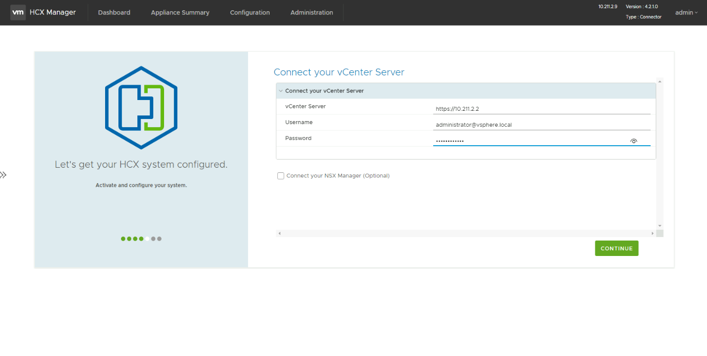

2.  In **Configure SSO/PSC**, provide the same vCenter IP address, and select
    **Continue**.

    2.1.  https://192.168.X.2

    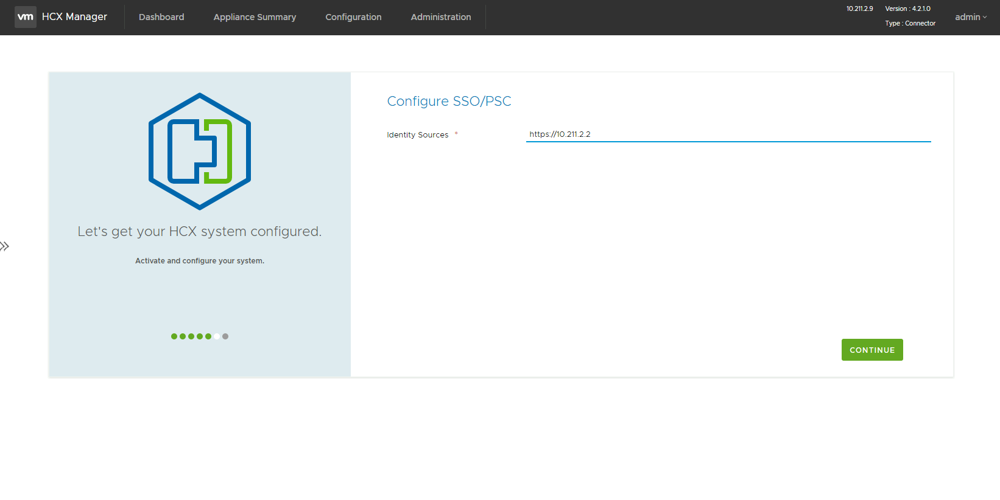

3.  Verify that the information entered is correct and select **Restart**.

    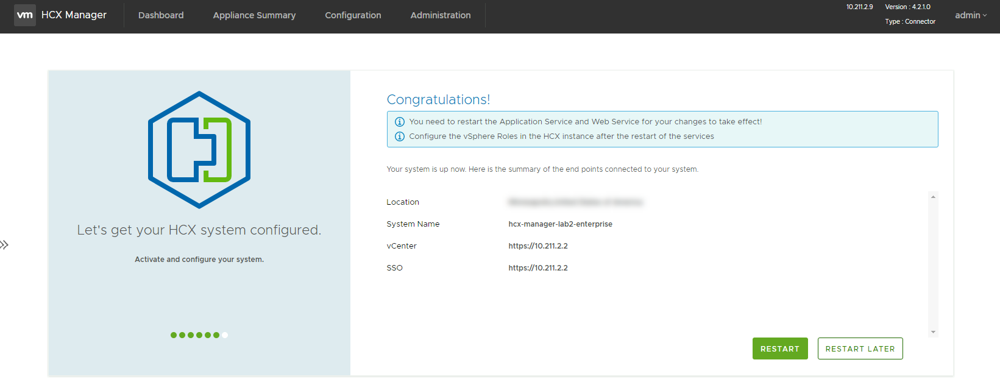

    The restart may take up to 5 minutes

4.  After the services restart, you'll see vCenter showing as **Green** on the
    screen that appears. Both vCenter and SSO must have the appropriate
    configuration parameters, which should be the same as the previous screen.

    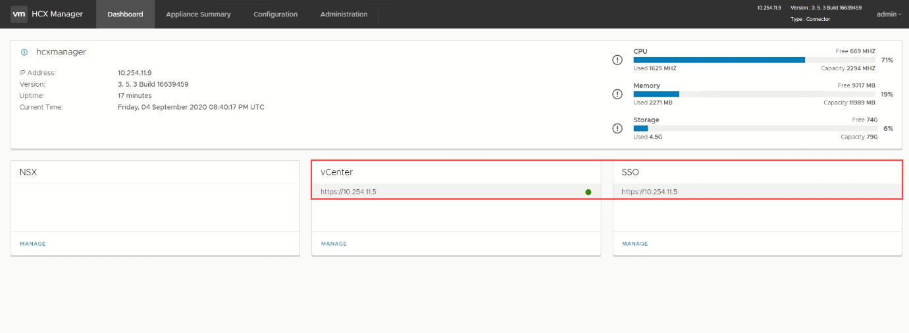

    > **Note**: It may take an additional 5-10 minutes for the HCX plugins to be
    installed in vCenter, log back out and log back in if it does not show up
    automatically

## **Task 8: Create Site Pairing from On-premises HCX to AVS HCX**

In this task, we will be creating the Site Pairing to connect the On-Premises
HCX appliance to the AVS HCX appliance

1.  Sign into your On-Premises vCenter

    1.1.  URL: https://192.168.x.2

    1.2.  Username:
        administrator@vsphere.local

    1.3.  Password: 0hDG3VqFyTd!

2.  You may see a banner item to Refresh the browser, this will load the newly
    installed HCX modules. If you do not see this, log out and log back into
    vCenter

    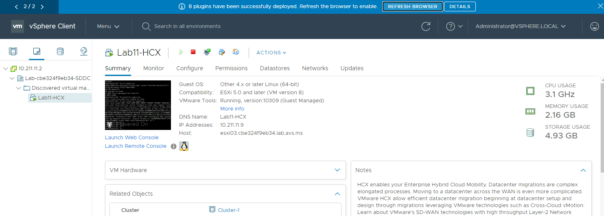

3.  Under **Menu**, Select **HCX**

4.  Navigate to Site Pairing \> Connect to Remote Site

    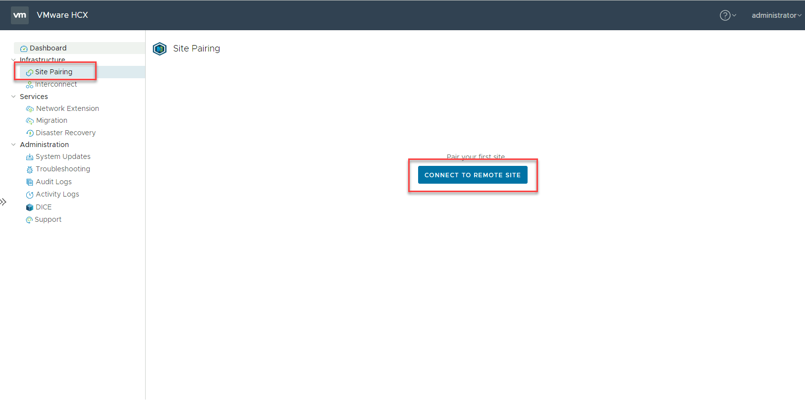

5.  Enter remote site AVS HCX IP address and login credentials from the Azure
    Portal. See Getting Started section for more details.

    **Note** Ideally the identity provided in this step should be an AD based
    credential with delegation instead of the cloudadmin account.

    

6.  Accept certificate warning and Import. Connection to the remote site will be
    established

    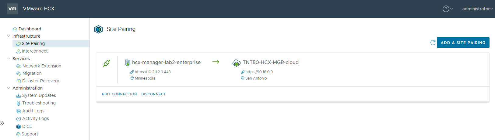

## **Task 9: Create network profiles**

VMware HCX Connector deploys a subset of virtual appliances (automated) that
require multiple IP segments. You’ll create four network profiles.

**Note**: Customer’s environments may vary and have not have separate networks.

-   Management

-   vMotion

-   Replication

-   Uplink

These networks have been defined for you, please see below section

In the real customer environment, these will have been planned and identified
previously, see here for the [planning
phase](https://docs.microsoft.com/en-us/azure/azure-vmware/plan-private-cloud-deployment#define-vmware-hcx-network-segments)

1.  Select Interconnect \> Network Profiles

    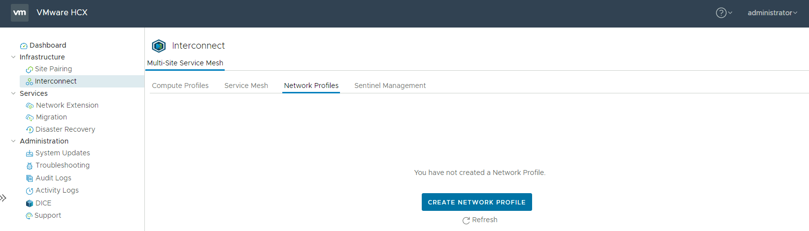

2.  Create a network profile, use IP addresses allocated during the planning
    phase. In this lab, these are in the [Getting
    Started](#_On-Premises_HCX_details_1) section. We will create 4 separate
    network profiles:
    -  Management
    -  vMotion
    -  Replication
    -  Uplink

3.  Create Management network profiles

    3.1. Select “Distributed Port Groups”

    3.2. Select Management Network

    **Replace “X” with your group number**

    Management Network Profile

    | **Property**               | **Value**                       |
    |----------------------------|---------------------------------|
    | Management Network IP      | 192.168.**X**.10-192.168.**X**.16 |
    | Prefix Length              | 27                              |
    | Management Network Gateway | 192.168.**X**.1                  |

    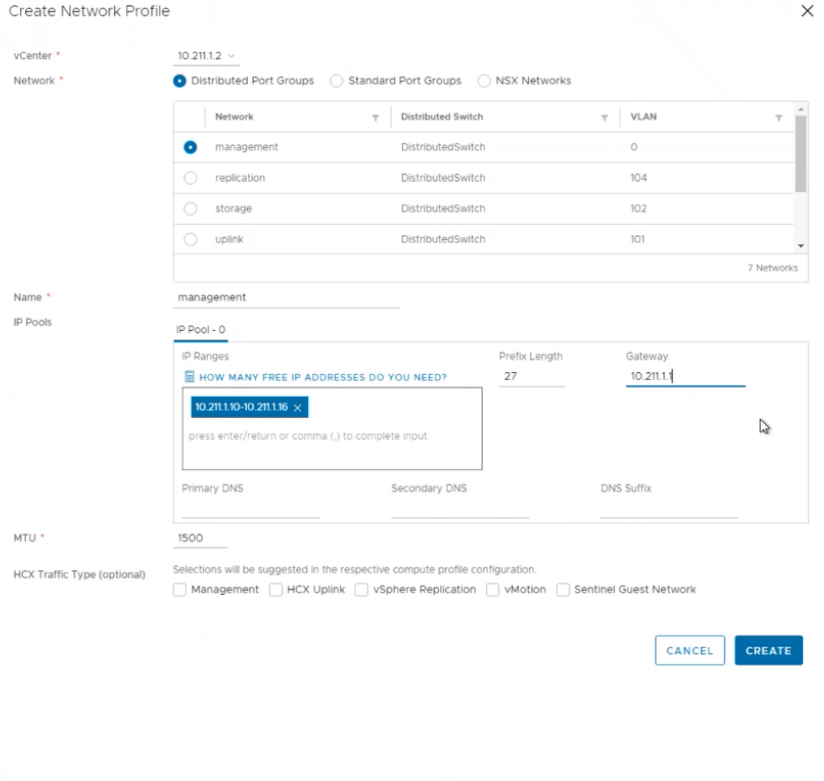

4.  Repeat the similar steps for “Replication”, “vMotion” and “Uplink”. Use the
    configuration details provided below.

    **Replace “X” with your group number**

    vMotion Network Profile

    | **Property**            | **Value**                       |
    |-------------------------|---------------------------------|
    | vMotion Network IP      | 192.168.**X**.74-192.168.**X**.77 |
    | Prefix Length           | 27                              |
    | vMotion Network Gateway | 192.168.**X**.65’                |
    | DNS                     | 1.1.1.1                         |

    Replication Network Profile

    | **Property**                | **Value**                         |
    |-----------------------------|-----------------------------------|
    | Replication IP              | 192.168.**X**.106-192.168.**X**.109 |
    | Prefix Length               | 27                                |
    | Replication Network Gateway | 192.168.**X**.97                   |
    | DNS                         | 1.1.1.1                           |

    Uplink Network Profile

    | **Property**           | **Value**                       |
    |------------------------|---------------------------------|
    | Uplink Network IP      | 192.168.**X**.34-192.168.**X**.40 |
    | Prefix Length          | 28                              |
    | Uplink Network Gateway | 192.168.**X**.33                 |
    | DNS                    | 1.1.1.1                         |

    

    

## **Task 10: Create compute profiles**

A compute profile contains the compute, storage, and network settings that HCX
uses on this site to deploy the interconnected dedicated virtual appliances when
service mesh is added. For more information on compute profile and creating
please refer to [VMware
documentation](https://docs.vmware.com/en/VMware-HCX/4.2/hcx-user-guide/GUID-BBAC979E-8899-45AD-9E01-98A132CE146E.html#:~:text=A%20Compute%20Profile%20contains%20the%20compute%2C%20storage%2C%20and,virtual%20appliances%20when%20a%20Service%20Mesh%20is%20added.)

1.  Under **Infrastructure**, select **Interconnect** \> **Compute Profiles** \>
    **Create Compute Profile**.

    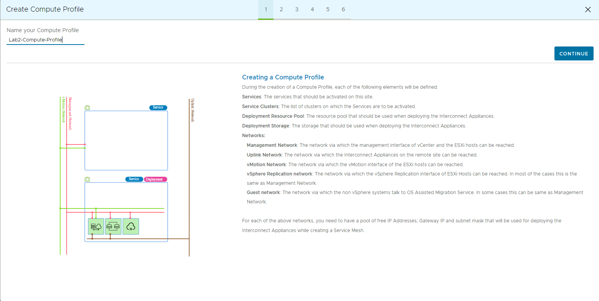

2.  Enter a name for the profile and select **Continue**.

3.  Review the selected services, by default all the below are selected.
    **Continue** to go to the next page

    

4.  In **Select Service Resources**, select one or more service resources
    (clusters) to enable the selected VMware HCX services.

5.  When you see the clusters in your On-Premises datacenter, select
    **Continue**.

    

6.  From **Select Datastore**, select the datastore storage resource for
    deploying the VMware HCX Interconnect appliances. Then select **Continue**.

    **Note**: Best practice would be to set resource reservations here as per
    requirements

    

7.  From **Select Management Network Profile**, select the management network
    profile that you created in previous steps. Then select **Continue**.

    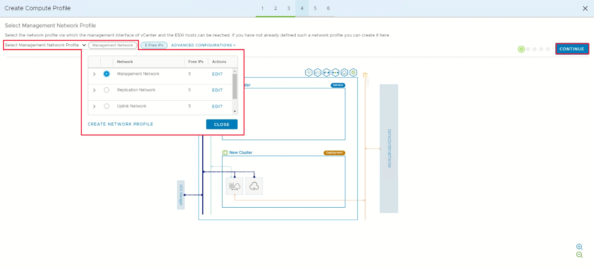

8.  From **Select Uplink Network Profile**, select the uplink network profile
    you created in the previous procedure. Then select **Continue**.

    

9.  From **Select vMotion Network Profile**, select the vMotion network profile
    that you created in previous steps. Then select **Continue**.

    

10.  From **Select vSphere Replication Network Profile**, select the replication
    network profile that you created in previous steps. Then select
    **Continue**.

   

   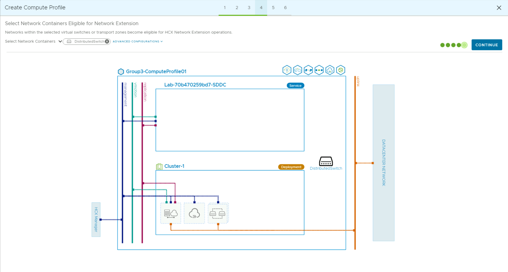

11.  Review the connection rules and select **Continue**.

   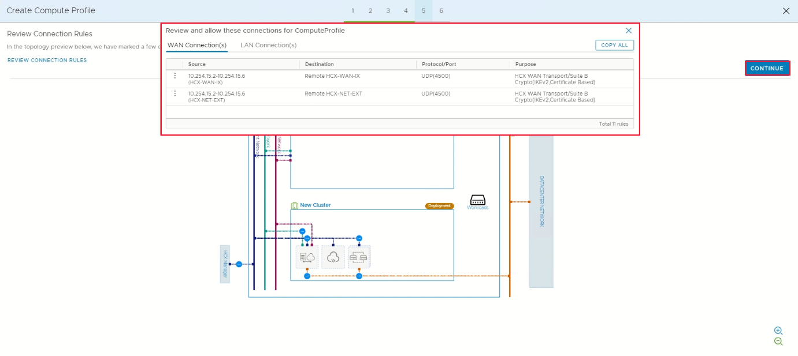

12.  Select **Finish** to create the compute profile.

   

## **Task 11: Create a service mesh**

In this section, we will be creating the service mesh

**Important Note -** Make sure port 4500 is open between your
On-Premises VMware HCX Connector 'uplink' network profile addresses and the
Azure VMware Solution HCX Cloud 'uplink' network profile addresses.

1.  Create a Service Mesh

    

2.  Select the source and remote compute profiles from the drop-down lists, and
    then select **Continue**.

    

3.  Select the source and remote compute profiles from the drop-down lists, and
    then click **Continue**. Leave “Select Services to be activated” as default,
    click **Continue**.

    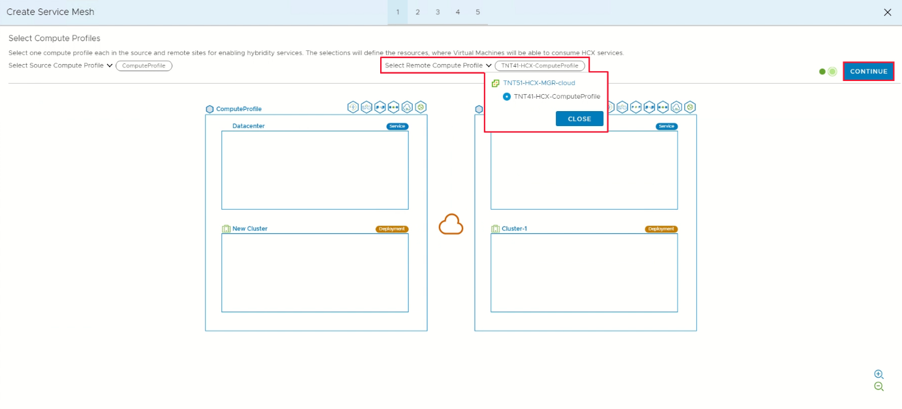

4.  In **Advanced Configuration - Override Uplink Network profiles**, select the
    uplink profile created earlier and **Continue**.

    Uplink network profiles connect to the network through which the remote
    site's interconnect appliances can be reached.

    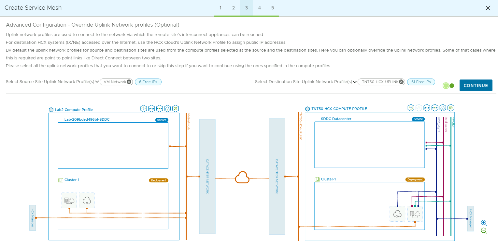

5.  **In Advanced Configuration – Network Extension Appliance Scale Out**, keep
    1 as default appliance and the click **Continue**.

    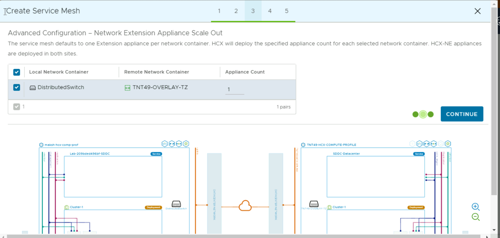

6.  **In Advanced Configuration – Traffic Engineering**, review and select
    **Continue**.

    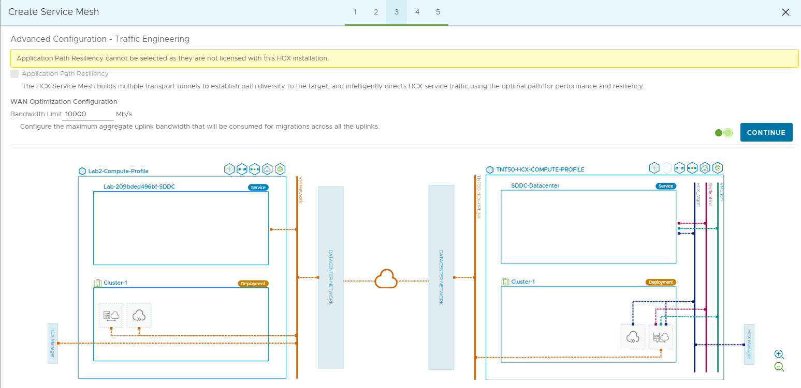

7.  Review the topology preview and select **Continue. En**ter a user-friendly
    name for this service mesh and select **Finish** to complete.

    >**Note** the appliance names are derived from service mesh name (it's the
    appliance prefix, essentially).

    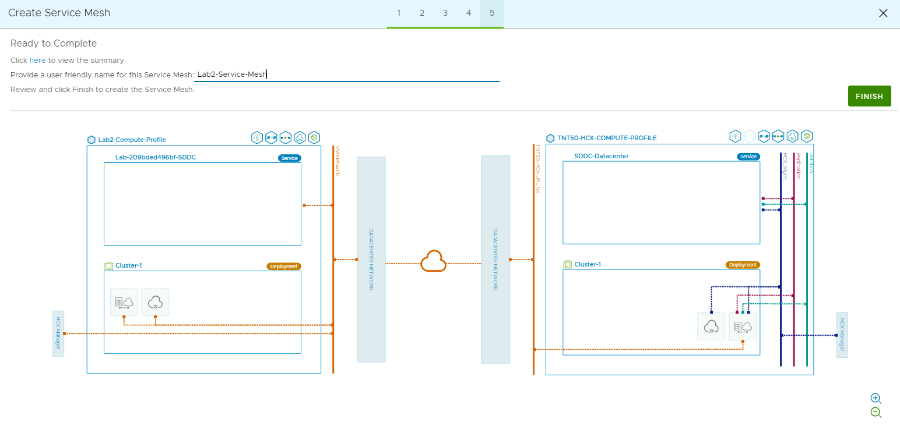

8.  The Service Mesh deployment will take 5-10 minutes to complete. Once
    successful, you will see the services as green

    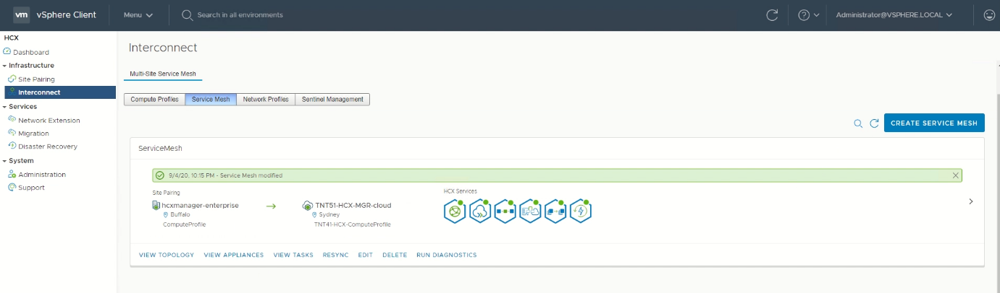

9.  Select **Interconnect \> Appliances**

    

    The HCX interconnect tunnel status should indicate **UP** and in green.
    You're ready to migrate and protect Azure VMware Solution VMs using VMware
    HCX. Azure VMware Solution supports workload migrations (with or without a
    network extension). So you can still migrate workloads in your vSphere
    environment, along with On-Premises creation of networks and deployment of
    VMs onto those networks. For more information, see the [VMware HCX
    Documentation](https://docs.vmware.com/en/VMware-HCX/index.html)

>**While we wait, let’s discuss the migration options**

## **Task 12 Setup the Network Extension**

Once the Service Mesh appliances have been deployed, the next important step is
to extend the on-premise network to AVS, so that any migrated VM’s will be able
to retain their existing IP address and be accessible from all locations

1.  Navigate to **Network Extension,** Create a Network Extension

    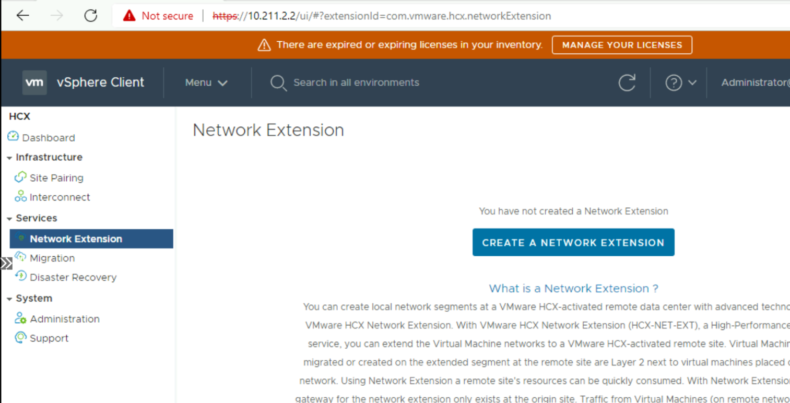

2.  Select the service mesh and segment to extend. In this lab, we will extend
    **workload-web**

    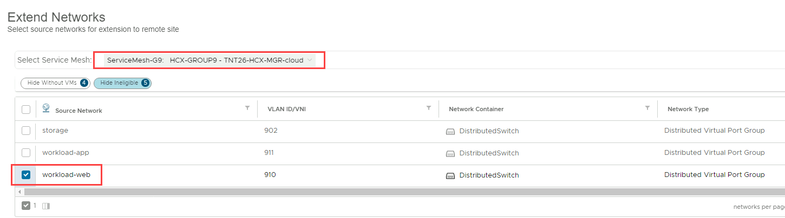

3.  Select the First Hop Router, in this Lab there is only 1 option –
    **TNTXX-TI**

4.  Enter the Workload Web Gateway IP as 192.168.10**X**.1/25 or
    192.168.1**XX**.1/25 (Group 10+)

    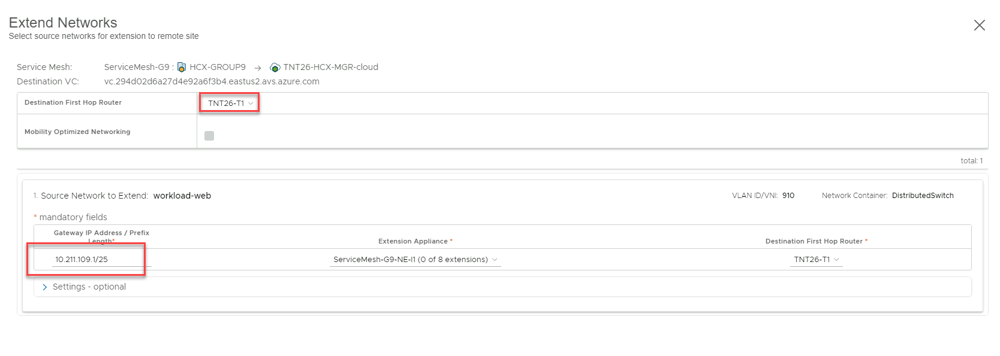

5.  Submit, this will start the process of extending the network by creating a
    remote stretch record and network bridges on the remote AVS side. This will
    take about 3-5 minutes to complete

    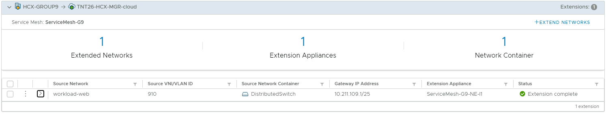

## **Task 13: Migrate a VM using HCX and vMotion**

Now that the Service Mesh appliances have been deployed successfully, we can now
migrate workloads from on-premises to AVS. In this lab, we will migrate a Test
VM using vMotion

As part of the on-premises lab, you will see a VM folder named **Workloads** and
a VM called **SampleApp-AppA-Standalone** already connected to our
**workload-web** network

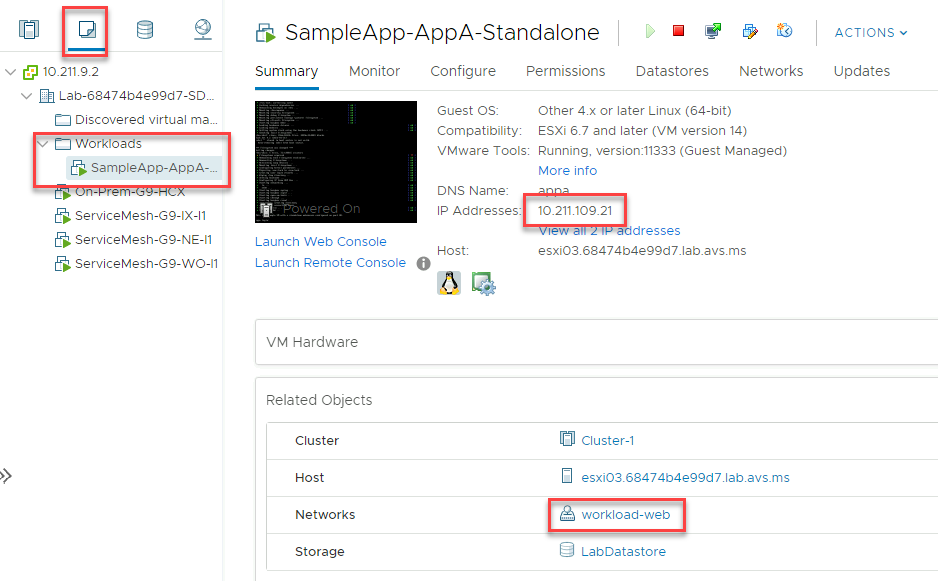

1.  **To test a migration of this VM, from the HCX Menu, select Migration and
    the Migrate button**

    

2.  **Select the SampleApp-AppA-Standalone VM and Add**

    

3.  Here we have to specify our destination AVS settings and where to migrate this VM

    3.1.  Computer Container: **Select Cluster-1**

    3.2.  Destination Folder: **Any folder**

    3.3.  Destination Storage: **vsanDatastore**

    3.4.  Migration Profile: **vMotion**

    

4.  Validation step, expand **VM for Migration**, note the Network Adapter is automatically filled in. This is the network extension adapter that was created in the previous task (optional)

    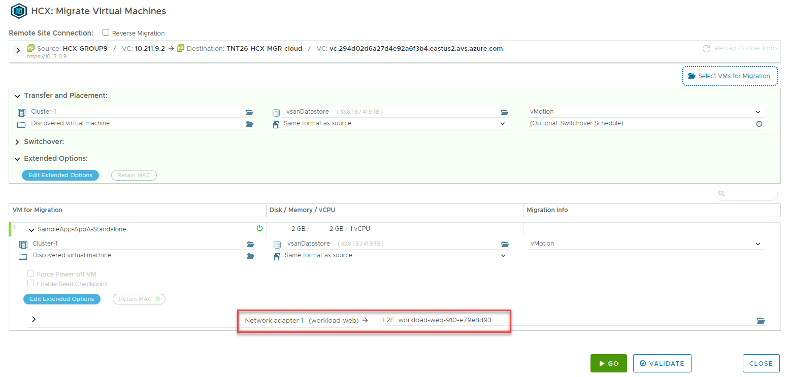

5.  Select Validate and Go – This will migrate the VM to AVS. Since this is vMotion, there is no downtime experienced and the VM is moved without any disruption
