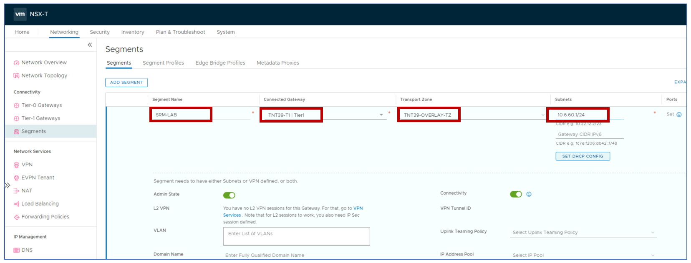
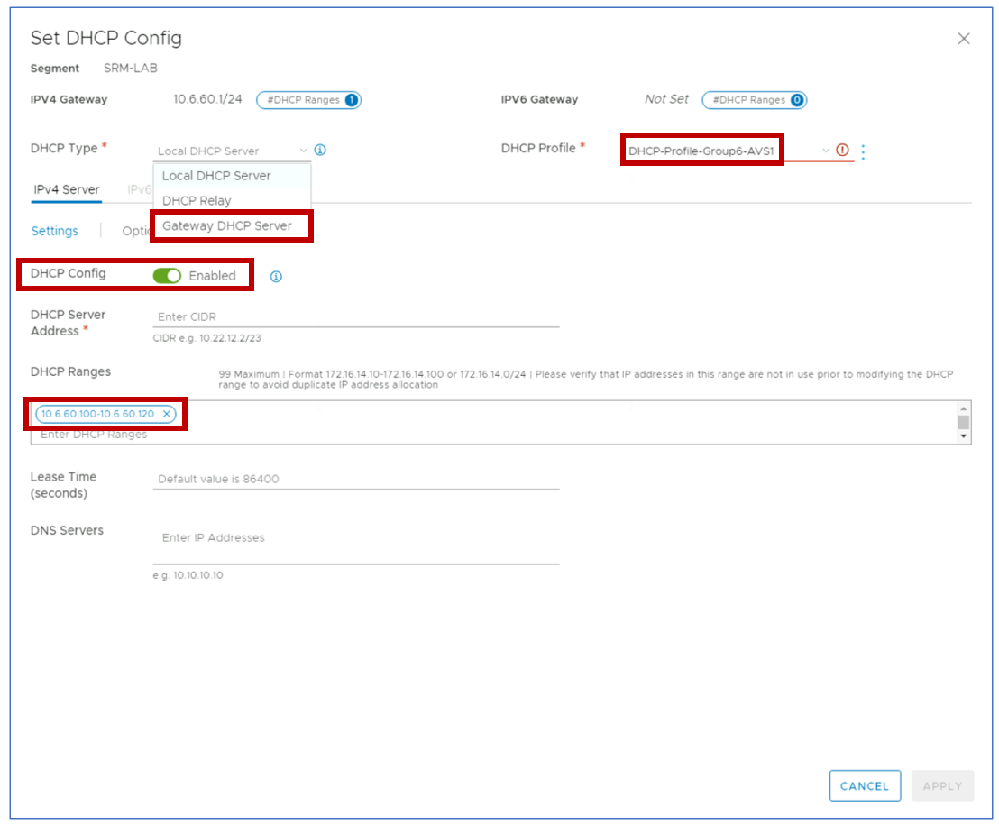

## Task 1: Configure the production site (GROUPX-AVS-SDDC)

> **ONLY ONE PERSON IN THE GROUP CAN PERFORM THIS TASK. FEEL FREE TO GO THROUGH THE STEPS FOR LEARNING PURPOSES BUT ONLY ONE PERSON IN THE GROUP WILL BE ABLE TO FULLY COMPLETE THIS STEP.**

Remember X is your group number, Y is your participant number, Z is the SDDC you've been paired with.

In this task you will create a network segment in the production site and deploy
a test VM to be protected with Site Recovery Manager.

*This task requires a DHCP profile to be available in the private cloud. DHCP
profiles have been configured in Module 1 for both GPSUS-NAMEX-AVS-SDDC and
GPSUS-NAMEZ-SDDC (The other group should have configured this). If you did not complete the corresponding steps in Module 1, please go back to it and configure DHCP profiles before proceeding.*

Log into NSX-T client for the protected/primary site GPSUS-NAMEX-SDDC. Click on
the **Segments** item in the left-hand menu and then click the **ADD SEGMENT**
button in the main tile. Enter the following configuration settings:

-   Segment Name: **SRM-LAB-GROUP-XY**

-   Connected gateway: Select the private cloud’s default Tier1 gateway

-   Transport Zone: Select the private cloud’s default **overlay** transport
    zone

-   Gateway CIDR IPv4: **10.XY.60.1/24** (For Participant 10 use 21 for group 1, 22 for group 2, 23 for group 3, etc. in lieu of XY)

Click on the **SET DHCP CONFIG** button and provide the following settings:

-   DHCP Type: **Gateway DHCP Server**

-   DHCP Profile: Select the profile created in Module 1

-   DHCP Config: Set the toggle to **Enabled**

-   DHCP Ranges: **10.XY.60.100-10.XY.60.120**

When done, click on the **APPLY** button to close the DHCP Configuration window.
Then scroll down and click on the **SAVE** button to commit the segment
configuration.

Click **NO** to close the configuration window. Confirm the segment is
successfully configured by checking that it appears in the segments list.

Optionally, you can confirm that the newly created segment is also visible in
the Azure portal. It may take up to 2-3 mins to show up in the portal.

Navigate to GPSUS-NAMEX-SDDC AVS Private Cloud and select the **Segments** item
in the Workload Networking menu on the left-hand side.

## Next Steps

[Module 3, Task 2](module-3-task-2.md)

[Module 3 Index](module-3-index.md)

[Main Index](index.md)
