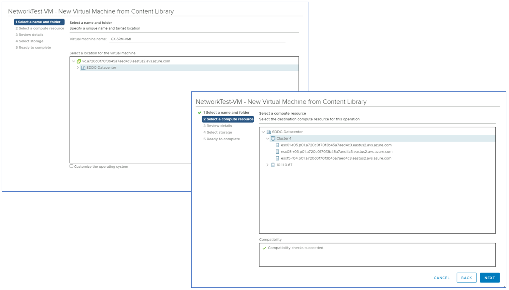

## Task 2: Create a VM in the protected site

Remember X is your group number, Y is your participant number, Z is the SDDC you've been paired with.

In this task you will create a test VM in the protected site.

*This task requires a VM template file to be available in the private cloud. A
template has been added to the private cloud’s Local Library in Module 1. If you
did not complete the corresponding steps in Module 1, please go back to it and
add a template to your protected site’s Local Library.*

Log into vCenter for the protected site GROUPX-AVS-SDDC. From the main menu
select **Content Libraries** and then click on **Local Library**. In the **Templates**
section, find the template **NetworkTest-VM**, right-click on it and select **New
VM from This Template** from the context menu.

Follow the steps in the VM configuration wizard. First, set the VM name to **G-XY-SRM-VM1** and select the location **SDDC-Datacenter**.

Then, go through the **Review Details** step (no configuration is required here)
and, in the **Select storage** step, select **vSAN Default Storage Policy**.

Finally, attach the VM to the network segment created in Task1, by selecting
**SRM-LAB-GROUP-XY** in the **Destination Network** drop-down menu. Deploy the VM by clicking on the **Finish** button.

In the main vCenter menu, select **VMs and Templates** and then click on the newly
created VM **GXY-SRM-VM1**. Power it on by clicking on the green **Power On** icon.

When the VM starts, check that it has been assigned an IP address in the DHCP
range configured in Task 1.

Test your network configuration by pinging the VM from the jump-box you are
working on.

## Next Steps

[Module 3, , Task 3](module-3-task-3.md)

[Module 3 Index](module-3-index.md)

[Main Index](index.md)