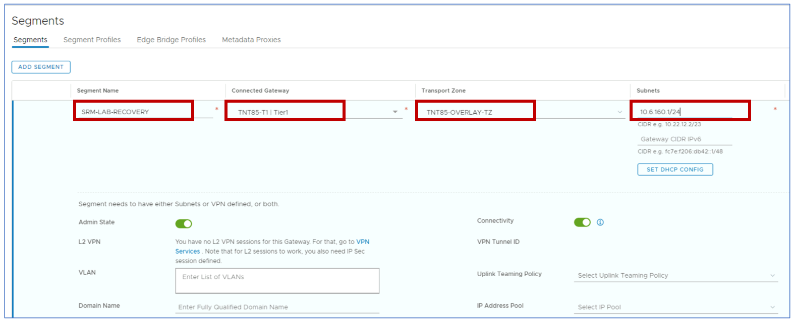
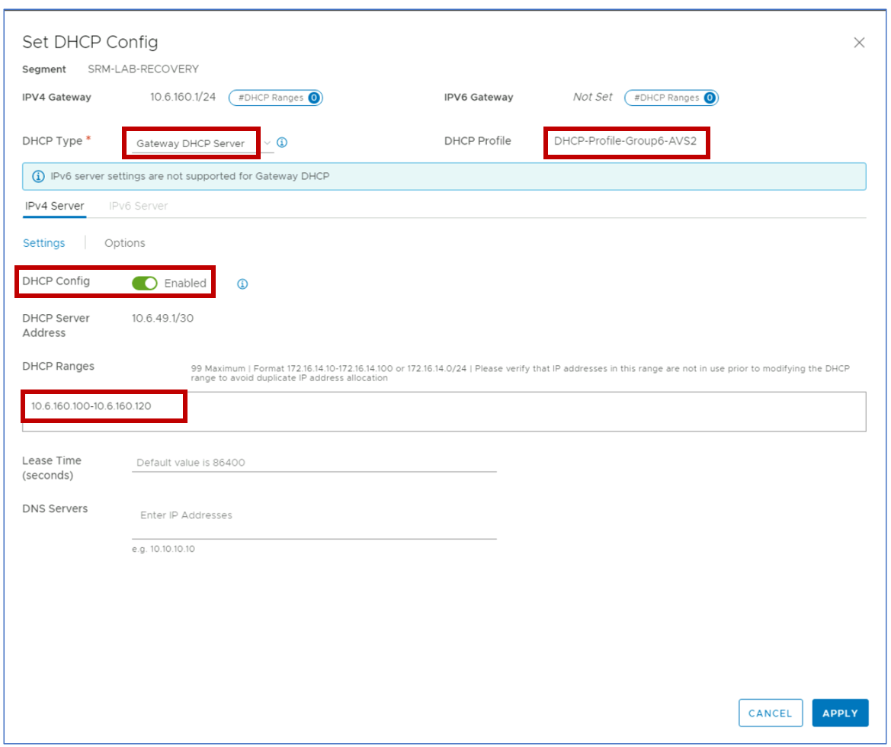
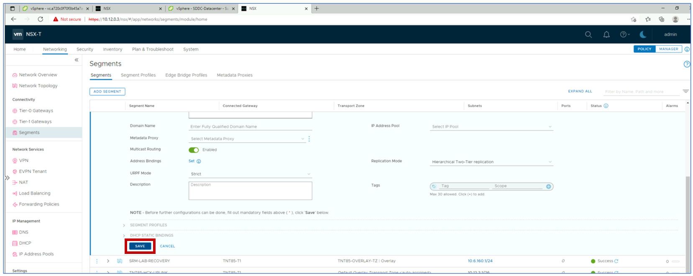
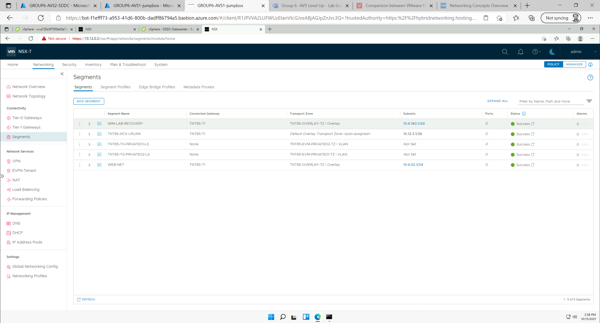
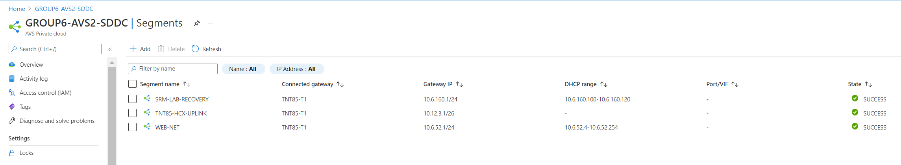

## Task 3: Create an NSX-T segment in the recovery site GROUPZ-AVS-SDDC

Remember X is your group number, Y is your participant number, Z is the SDDC you've been paired with.

In this task you will configure the recovery site GROUPZ-AVS-SDDC with a
network segment for the VMs moved by SRM from the primary site. In this lab, we
focus on a basic scenario where the VMs protected by SRM do not need to retain
their IP address when moved to the recovery site. A DHCP service is used both in
the protected and in the recovery site to assign IP addresses to VMs when they
boot.

*This task requires a DHCP profile to be available in the recovery private
cloud. DHCP profiles have been configured in Module 1 for both GROUPX-AVS-SDDC
and GROUPZ-AVS-SDDC. If you did not complete the corresponding steps in Module
1, please go back to it and configure DHCP profiles before proceeding.*

Log into NSX-T for the recovery site GROUPZ-AVS-SDDC. Please note that,
because of the AVS Interconnect connectivity that has been configured in Module 1
between the protected and the recovery private clouds, you can access vCenter
and NSX-T for both from the same jump-box.

Click on the **Network** menu item on the taskbar at the top of the window, select
**Segments** from the menu on the left and click the **ADD SEGMENT** button.

In the segment configuration tile, enter the following settings:

-   Segment Name: **SRM-LAB-RECOVERY-GROUP-XY** (Participant 10 please use 20 in lieu of XY)

-   Connected gateway: Select the private cloud’s default Tier1 gateway

-   Transport Zone: Select the private cloud’s default overlay transport zone

-   Gateway CIDR IPv4: **10.XY.160.1/24** (please note that this IP subnet is not
    the same as the primary site’s) - Participant 10 please use 21 in lieu of XY for Group 1, 22 for Group 2 and so on.

Click on the **SET DHCP CONFIG** button and provide the following settings:

-   DHCP Type: **Gateway DHCP Server**

-   DHCP Profile: Select the profile created in Module 1

-   DHCP Config: Set the toggle to **Enabled**

-   DHCP Ranges: **10.XY.160.100-10.XY.160.120** - Participant 10 please use 21 in lieu of XY for Group 1, 22 for Group 2 and so on.

When done, click on the **APPLY** button to close the DHCP Configuration window.
Then scroll down and click on the **SAVE** button to commit the segment
configuration.

Confirm that the segment has been created successfully.

Optionally, you can confirm that the newly created segment is also visible in
the Azure portal (navigate to GROUPZ-AVS-SDDC Private Cloud and select the
**Segments** item in the Workload Networking menu on the left-hand side.

## Next Steps

[Module 3, Task 4](module-3-task-4.md)

[Module 3 Index](module-3-index.md)

[Main Index](index.md)