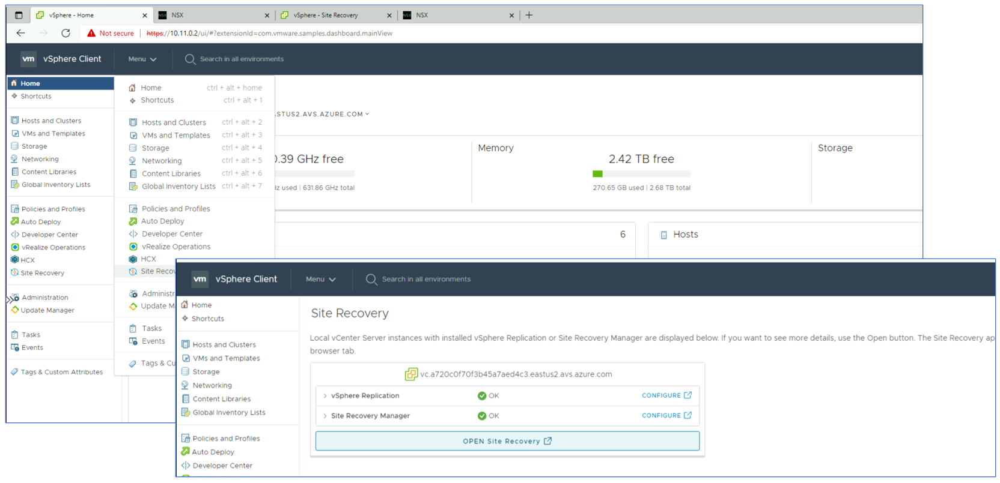

## Task 4: Configure a Site Pairing in Site Recovery Manager

Remember X is your group number, Y is your participant number, Z is the SDDC you've been paired with.

In this task you will pair the protected site GPSUS-NAMEX-SDDC and the recovery
site GPSUS-NAMEZ-SDDC.

Site pairing can be configured from vCenter on either the primary or the
recovery private cloud. You will work on the primary site’s vCenter. If needed,
log into vCenter in the primary AVS private cloud GPSUS-NAMEX-SDDC and select
**Site Recovery** from the main menu. Click on the **OPEN Site Recovery** button.

Site Recovery Manager opens in a new browser tab.

>**Note: Web page may perpetually get stuck into loading status. In this case, go
back to main page and click **Open Site Recovery** button again.**

Click on the **NEW SITE PAIR** button to launch the configuration wizard.

Select the local vCenter server that you want to pair. The only option is the
protected site’s vCenter (GPSUS-NAMEX-SDDC). Provide the IP address and the
credentials of the recovery site’s vCenter (GPSUS-NAMEZ-SDDC), which can be
obtained from the Azure portal. Ensure that you remove *https and/or any
slashes* after pasting the vCenter value.

Click on the **NEXT** button. The security alert(s) that you receive are due to
the usage of certificates issued by an untrusted CA in the lab. In real,
production environments certificates issued by a trusted CA should be used
instead. In this lab, you can ignore the security warning and click on the
**CONNECT** button.

Configure the site pairing with both the SRM and the vSphere replication
services. Again, you can ignore the security warnings due to untrusted
certificates and proceed by clicking on the **CONNECT** button.

When the configuration process completes, the SRM main page displays the new
site pairing.

## Next Steps

[Module 3, Task 5](module-3-task-5.md)

[Module 3 Index](module-3-index.md)

[Main Index](index.md)
