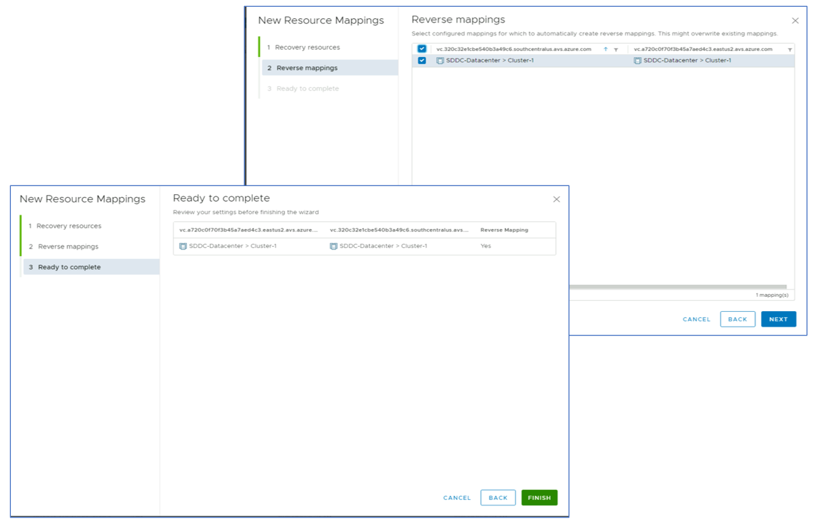

# Task 5: Configure Inventory Mappings

Remember X is your group number, Y is your participant number, Z is the SDDC you've been paired with.

In this task you will configure inventory mappings, which define the resources
(networks, folders, compute resources, storage policies) that VMs must use when
moved to the recovery site. It is also possible to define reverse mappings,
which control resource allocation for failback processes.

## Network mappings

Open the **Site Pair** configuration pane in SRM and select **Network Mappings** in
the **Configure** section of the left-hand-side menu. Then click on the **NEW**
button to launch the configuration wizard.

Select **Prepare mappings manually** to define a custom mapping between the
network segments created for the SRM lab module in the previous tasks. Then
click on the **NEXT** button and map the **SRM-LAB-GROUP-XY** segment in the protected site
to the **SRM-LAB-RECOVERY-GROUP-XY** segment in the recovery site. Click on the **ADD
MAPPINGS** button to confirm.

In the **Reverse Mapping** step, enable the suggested reverse mapping.

In **Test Networks** step, accept the default setting. When later in the module
you will test your recovery plan, the protected VM will be instantiated in an
isolated network segment automatically created at the beginning of the test (and
automatically removed when the recovery plan test is cleaned up).

Click on the **NEXT** button and then commit your configuration by clicking on the
green **FINISH** button.

## Folder Mappings

Open the **Site Pair** configuration pane in SRM and select **Folder Mappings** in
the **Configure** section of the left-hand-side menu. Then click on the **NEW**
button to launch the configuration wizard.

Select **Automatically prepare mappings for folders with the same name**, then
click on the **NEXT** button. Select **SDDC-Datacenter** on both sides of the
mapping and click on the **ADD MAPPINGS** button. Accept the automatically
prepared mappings.

On step 3 **Reverse Mappings** accept the mappings proposed by the wizard. Then
click on the **NEXT** button and commit your configuration by clicking on the
green **FINISH** button.

## Resource Mappings

Open the **Site Pair** configuration pane in SRM and select **Resource Mappings** in
the **Configure** section of the left-hand-side menu. Then click on the **NEW**
button to launch the configuration wizard.

On step 1 **Recovery Resources** expand the **SDDC-Datacenter** nodes on both the
primary and the recovery side and select **Cluster 1**. Click on the **ADD
MAPPINGS** button to confirm.

Accept the reverse mapping proposed by the wizard, click on the **NEXT** button
and then confirm your settings by clicking on the green **FINISH** button.

## Storage Policy Mappings

Open the **Site Pair** configuration pane in SRM and select **Storage Policy
Mappings** in the **Configure** section of the left-hand-side menu. Then click on
the **NEW** button to launch the configuration wizard.

Select **Automatically prepare mappings for storage policies with the same name**,
then click on the **NEXT** button. Select **vSAN Default Storage Policy** on both
sides of the mapping and click on the **ADD MAPPINGS** button. Accept the
automatically prepared mappings. Accept the automatically discovered mappings.

Accept the reverse mapping proposed by the wizard, click on the **NEXT** button
and then confirm your settings by clicking on the green **FINISH** button.

## Placeholder Datastores

When vSphere Replication is configured for a VM, a **placeholder VM** is created
in the target recovery site. Placeholder VMs represent, in the recovery site,
VMs that will be instantiated when a recovery plan is run. SRM requires you to
define which datastore to use for placeholder VMs. If you plan to use SRM for
failback, you need to define placeholder datastores at both the protected and
the recovery sites.

Open the **Site Pair** configuration pane in SRM and select **Placeholder
Datastores** in the **Configure** section of the left-hand-side menu. In the
**Placeholder Datastores** configuration tile, select your primary site’s vCenter
server (its FQDN ends with the suffix ****eastus2**.avs.azure.com**).

Click on the **NEW** button to add a datastore. Select **vSAN Datastore** and click
on the **ADD** button.

Repeat the same steps for the recovery site’s vCenter (its FQDN ends with the
suffix ****brazilsouth**.avs.azure.com**).

Click on the **NEW** button to add a datastore. Select **vSAN Datastore** and click
on the **ADD** button.

## Next Steps

[Module 3, Task 6](module-3-task-6.md)

[Module 3 Index](module-3-index.md)

[Main Index](index.md)