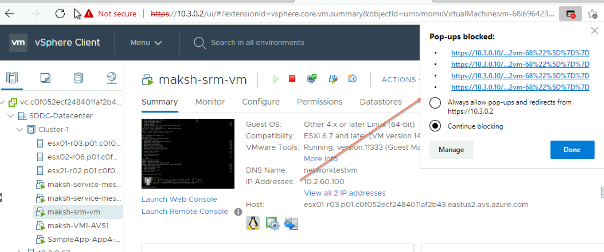
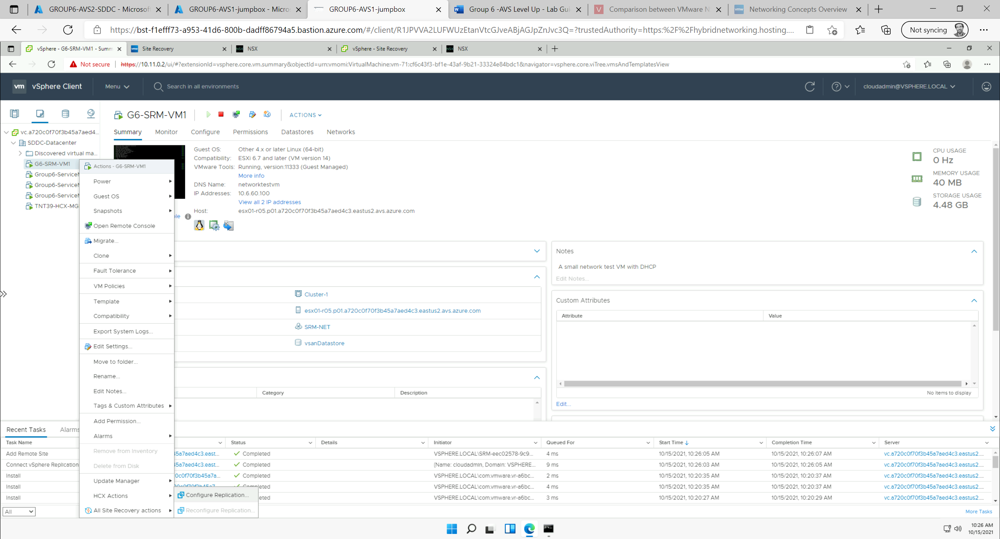
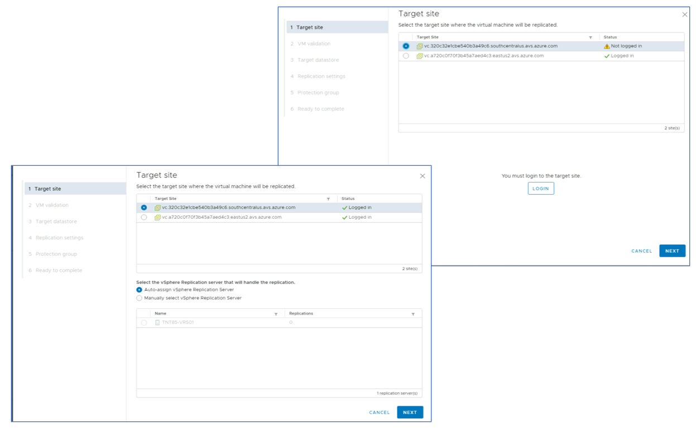
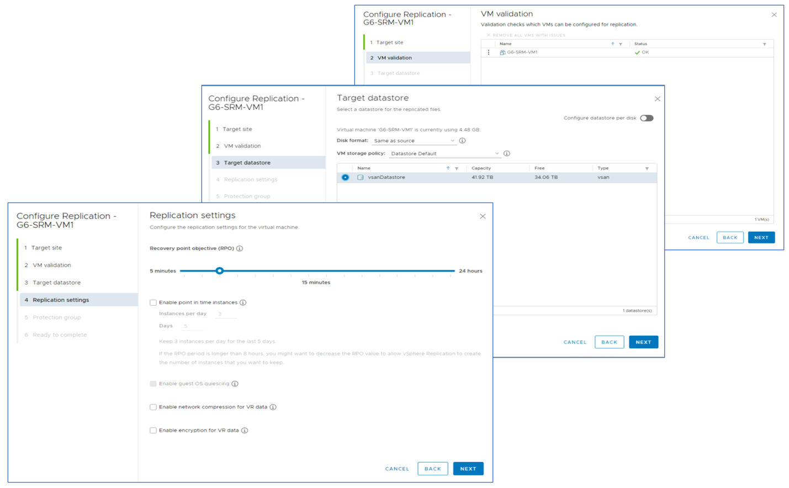
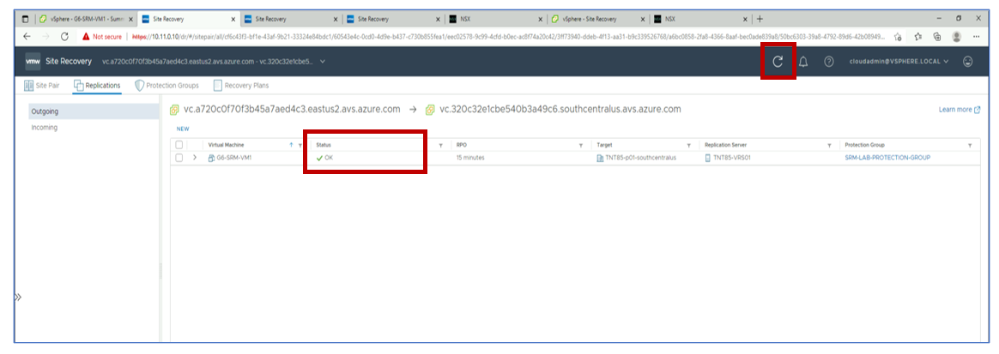
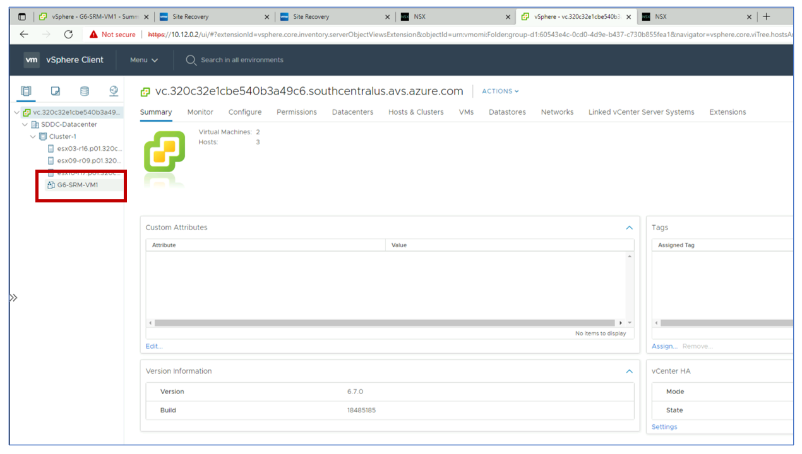

# Task 6: Configure vSphere Replication and Recovery Plan

In this task you will configure vSphere replication for the test VM created in
Task 2 and a recovery plan to protect it. This task is performed from the
primary site’s vCenter client. In the main menu, select **VM and Templates** and
then right-click on your test VM named GX-SRM-VM1. From the context menu, select
**All Site Recovery Actions** and then **Configure replication**.

>*Note: Check pop-up blocker if stuck.*

## vSphere Replication

Follow the steps in the configuration wizard. Select the recovery site (FDQN
ending with the suffix **southcentralus.avs.azure.com**) as the target site.
Provide credentials for the recovery site’s vCenter. The credentials are
available in the Azure portal. Select **Auto-assign replication server**.

Check that the test VM is ready for replication, then click on the **NEXT** button
and select **vSAN Datastore** as the target datastore. In the **Replication
Settings** step, select the RPO you want to have for the protected VM (15 mins in
the screenshot below).

## SRM Protection Group and Recovery Plan

The last two steps in the configuration wizard allow you to create an SRM
Protection Group and a Recovery Plan. Please note that this is needed because
you are configuring SRM protection for the first VM. Additional VMs can leverage
existing protection groups and recovery plans. In step 5 **Protection Group**
enter a name for your protection group, such as **SRM-LAB-PROTECTION-GROUP**. In
step 6 **Recovery Plan** enter a name for your recovery plan, such as
**SRM-LAB-REC-PLAN**. Confirm your settings by clicking on the green **FINISH**
button.

Wait until the replication status for your test VM is reported to be **OK** (use
the **Refresh** button in SRM’s console).

To confirm that replication and SRM protection have been successfully
configured, log into the recovery site’s vCenter and check that a placeholder VM
has been created.

## Next Steps

[Module 3, Task 7](module-3-task-7.md)

[Module 3 Index](module-3-index.md)

[Main Index](index.md)