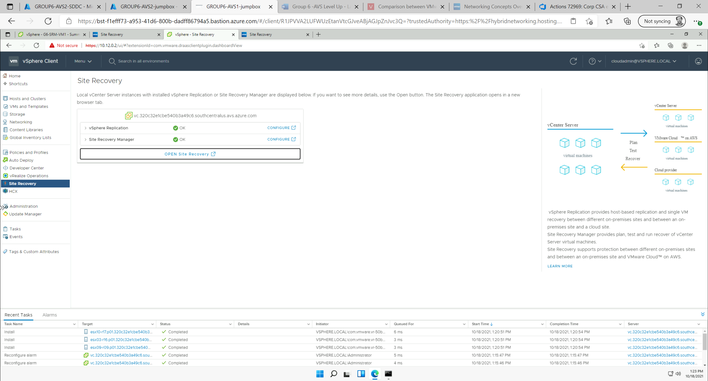
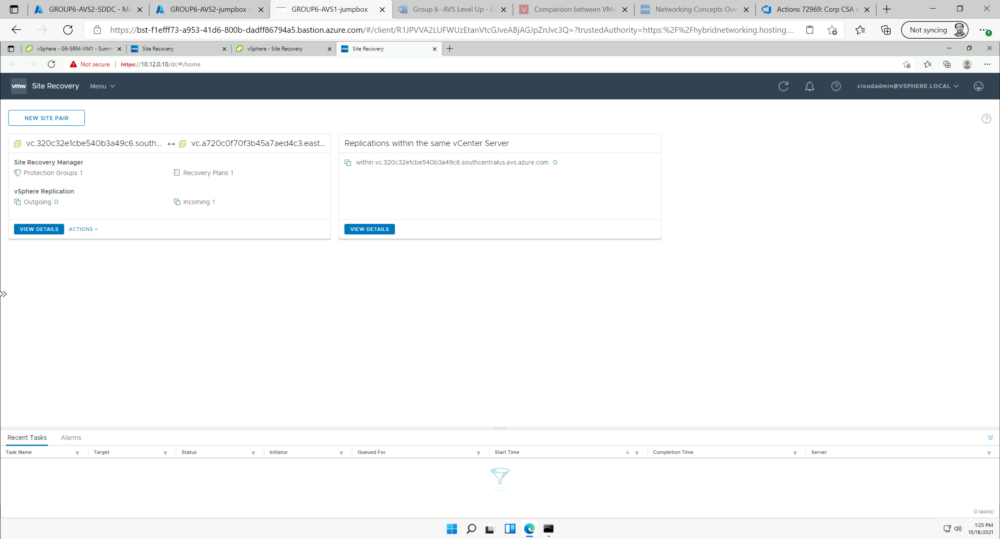
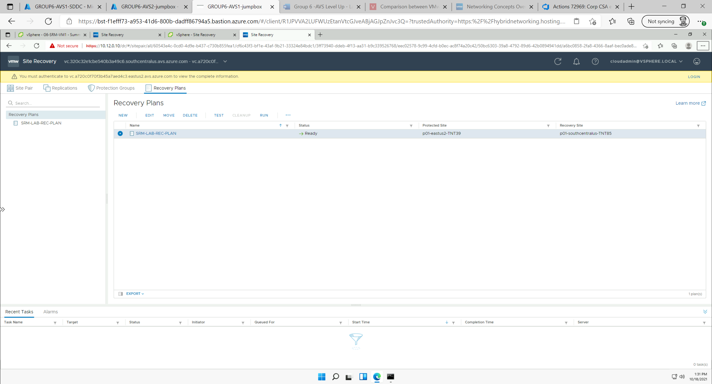
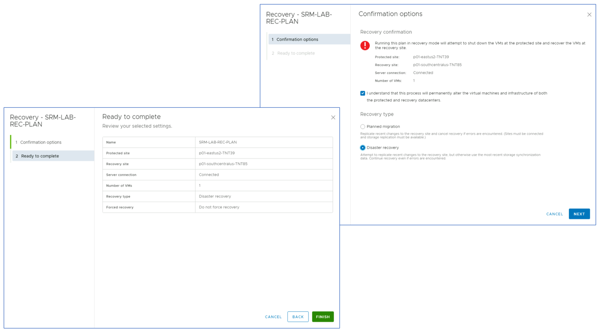
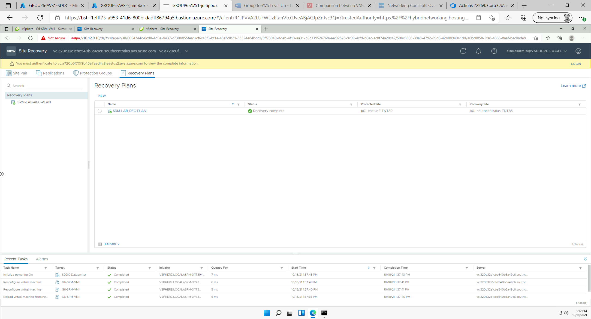
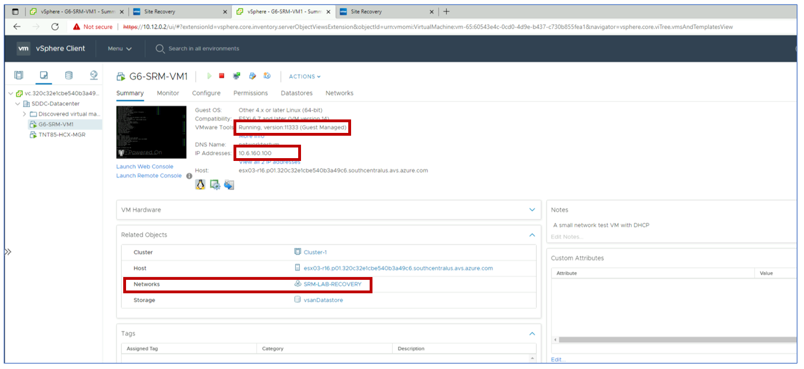

# Task 8: Run Recovery Plan

In this task you will execute the recovery plan you configured in the previous
tasks. For planned migrations, a recovery plan can be run from either the
primary or the protected site. In case of an actual disaster at the protected
site, it must be triggered from the recovery site (the only one that is still
online). The steps to run a recovery plan are the same in both cases. In this
task, we will run a recovery plan from the recovery site to simulate a disaster
recovery scenario.

Log into the recovery site’s vCenter, select **Site Recovery** from the main menu
and then click on the **OPEN SITE RECOVERY** button.

In the SRM console, open the already configured site pair by clicking on the
**VIEW DETAILS** button.

When prompted for the credentials to log into the protected site, click on the
**CANCEL** button – we are assuming that the protected site is no longer online,
because of a disaster.

Select **Recovery Plans** tab, select the recovery plan defined in the previous
tasks and click on the **RUN** button.

Follow the steps in the wizard. Select **Disaster recovery** as the recovery type.

Monitor progress in the SRM console.

When the recovery process is marked complete, go to the recovery site’s vCenter
and verify that the test VM GX-SRM-VM1 is powered on and attached to the
**SRM-LAB-RECOVERY** network segment.

Confirm that the VM migrated to the recovery site is functional by pinging it
from your jump-box. The VM’s IP address is shown in vCenter (it might be not the
same as the one shown in the screenshots).

## Next Steps

[Module 3](module-3-task-9)

[Module 3 Index](module-3-index)

[Main Index](index)