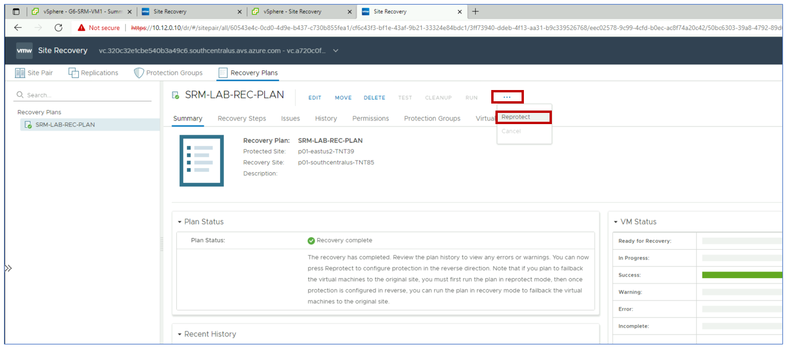
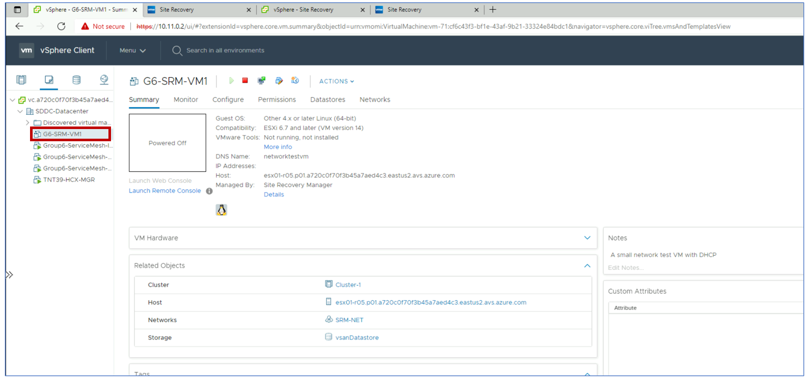

# Task 9: Reprotect the Migrated VM

In this task, we assume that the primary site has been brought back online.
Reprotection is the SRM feature that allows migrated VMs in the recovery site to
be synchronized back to the protected site.

In the recovery site’s SRM console, select your recovery plan. Click on **…** in
the actions bar to display additional available actions and select **Reprotect**.

Follow the steps in the wizard.

Monitor progress. When the reprotection process completes, go to the protected
site’s vCenter and confirm that a placeholder VM has been created.

## Next Steps

[Module 3](module-3-task-10.md)

[Module 3 Index](module-3-index.md)

[Main Index](index.md)