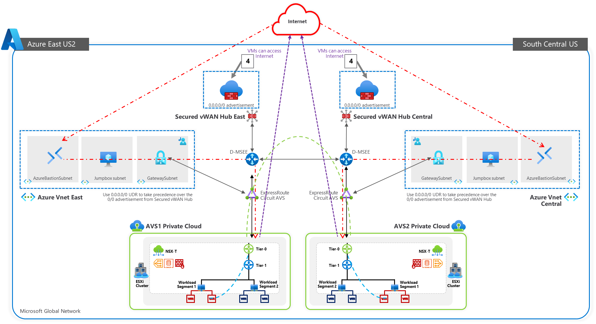
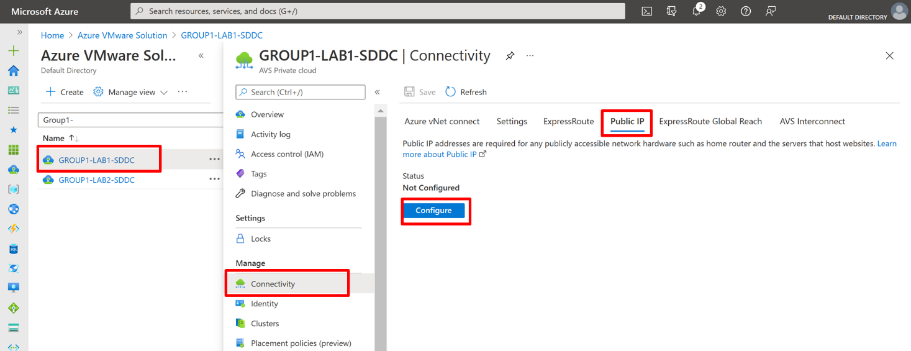
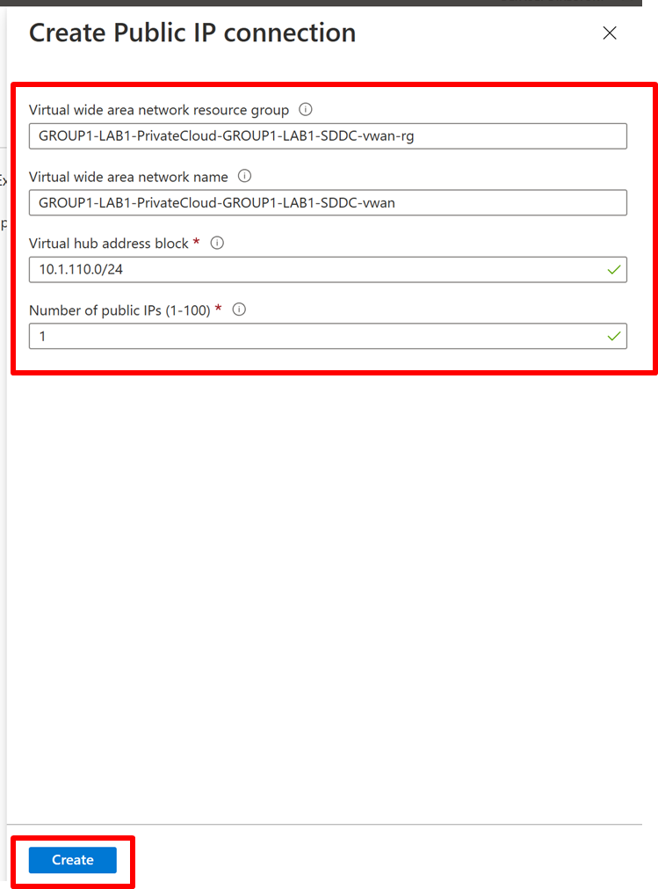
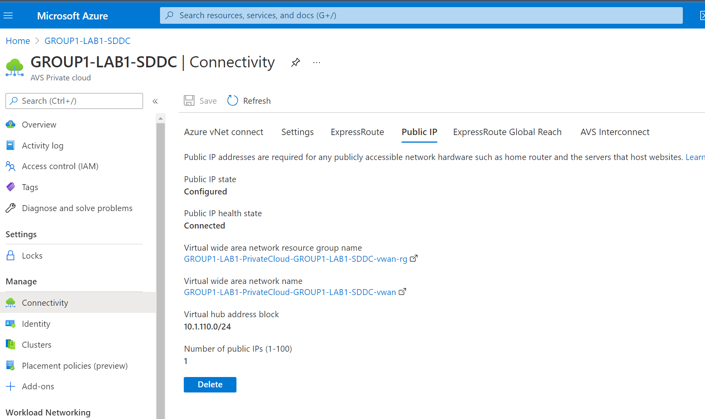
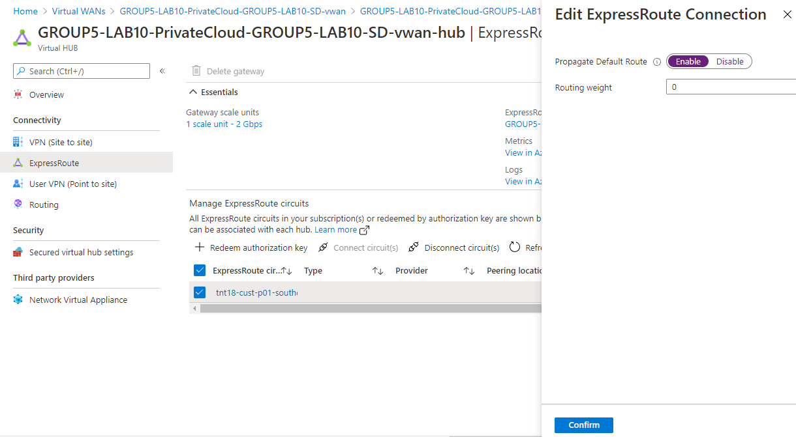
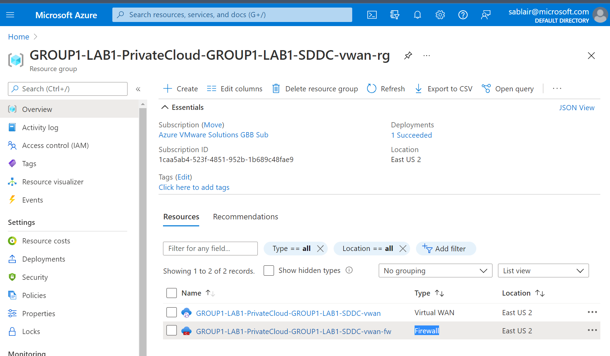
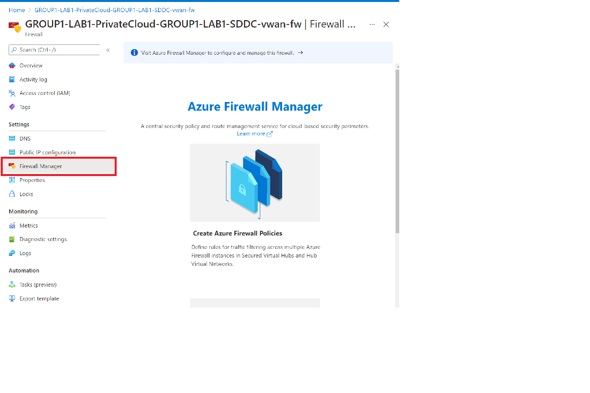
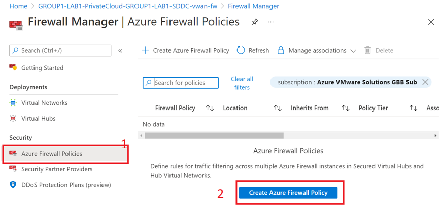
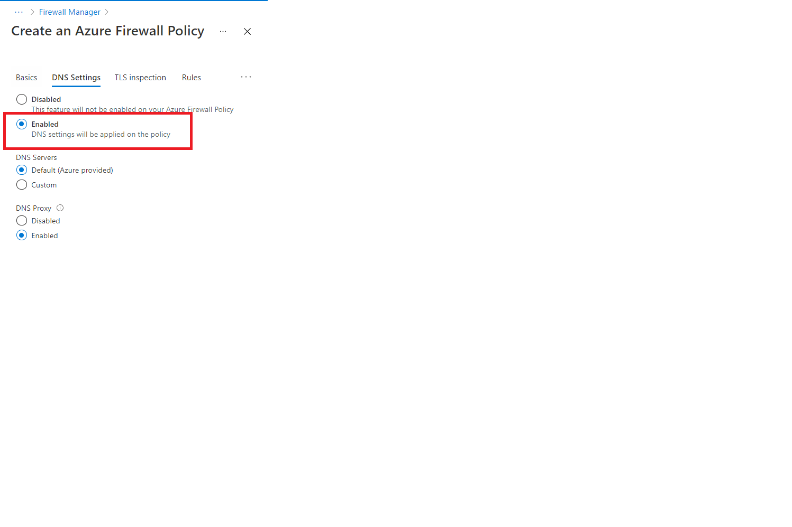
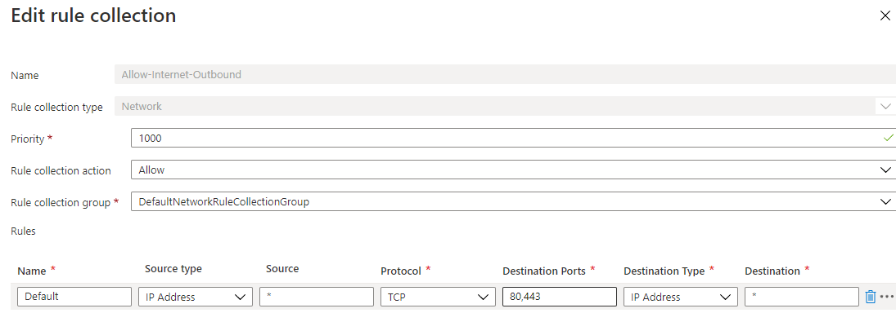

# Module 4: Create and configure a Secure Hub to route traffic to the internet

**Section Overview:**

Now that the Tier-0 and Tier-1 routers are configured, it’s time to see if
workloads can access the internet. The key takeaway here is to setup a Secured
vWAN Hub to allow internet egress and ingress (if necessary) for the VMs on AVS.

In this section you will learn how to:

-   Create a secure VWAN hub

-   Configure Azure Firewall with a public IP

-   Configure Azure Firewall

Before we start the steps, let’s validate if the AVS VMs can access internet. In
the previous section, you accessed VM1 from the vCenter portal. Verify that from
VM1 that you can not

-   Access [www.google.com](http://www.google.com) by name. On the server,
    type:     
    `wget www.google.com`

-   Access [www.google.com](http://www.google.com) by IP. On the server, type:

    `wget https://142.250.9.101`

You may also use utilities such as ping or nslookup to validate.

**Deployment Steps:**

## Task 1: Deploy Virtual WAN

1.  Sign into the Azure portal and then search for and select Azure VMware
    Solution.

2.  Select the Azure VMware Solution private cloud.

3.  Under Manage, select Connectivity.

4.  Select the Public IP tab and then select Configure.

    

5.  Accept the default values, modify the Virtual hub address block and Number
    of Public Ips fields. Select Create.

    | Field                         | Value                                                                                                                 |
    |-------------------------------|-----------------------------------------------------------------------------------------------------------------------|
    | Virtual WAN resource group    | Auto-populated and can not be modified in the poral                                                                   |
    | Virtual WAN name              | Leave default auto-populated                                                                                          |
    | Virtual hub address block     | Use the following value 10.**[Your Group Number]**.4.0/24 to avoid conflict with other networks used in this training |
    | Number of public IPs (1-100): | 1                                                                                                                     |

    

    It takes about one hour to complete the deployment of all components. This
    deployment only must occur once to support all future public IPs for this Azure
    VMware Solution environment.

    

## Task 2: Configure Public IP Option

1.  

## Task 3: Configure Azure Firewall policies

Once Azure vWAN is configured, you will see both Azure Firewall

1.  In the Azure portal, search for and select **Firewall**.

2.  Select a deployed firewall and then select **Visit Azure Firewall Manager to
    configure and manage this firewall**.

    

3.  Select **Azure Firewall Policies** and then select **Create Azure Firewall Policy**.
    

4.  Under the **Basics** tab, provide the required details.

    | Field          | Value                        |
    |----------------|------------------------------|
    | Subscription   | Auto-populated               |
    | Resource Group | Leave default auto-populated |
    | Name           | “Internet Enabled”           |
    | Region         | Pre-Populated                |
    | Policy Tier    | Standard                     |
    | Parent Policy  | None                         |

5.  Select Next: DNS Settings.

6.  Under the **DNS** tab, select **Enable**. For **DNS Servers** Select the
    Default (Azure provided). For the **DNS Proxy** select **Enabled**

    

7.  and then select Next: **Rules**.

4.  Select **Add a rule collection**, provide the below details, and select Add.

    | Field                  | Value                                    |
    |------------------------|------------------------------------------|
    | Name                   | “Internet Outbound Enabled”              |
    | Rule collection type   |  Network                                 |
    | Priority               | Select a numeric value between 100-65000 |
    | Rule collection action | Allow                                    |
    | Rule collection group  | Pre-populated                            |
    | Name of Rule           | Optional                                 |
    | Source Type            | IPaddress                                |
    | Source                 | \*                                       |
    | Protocol               | TCP                                      |
    | Destination port       | 80,443                                   |
    | Destination Type       | IP Address                               |
    | Destination            | \*                                       |

****

10.  Select Next: **Tags**.

12.  (Optional) Create name and value pairs to categorize your resources.

13.  Select Next: **Review** + **create** and then select **Create**.

Log back into vCenter and retest VM1’s internet connectivity
